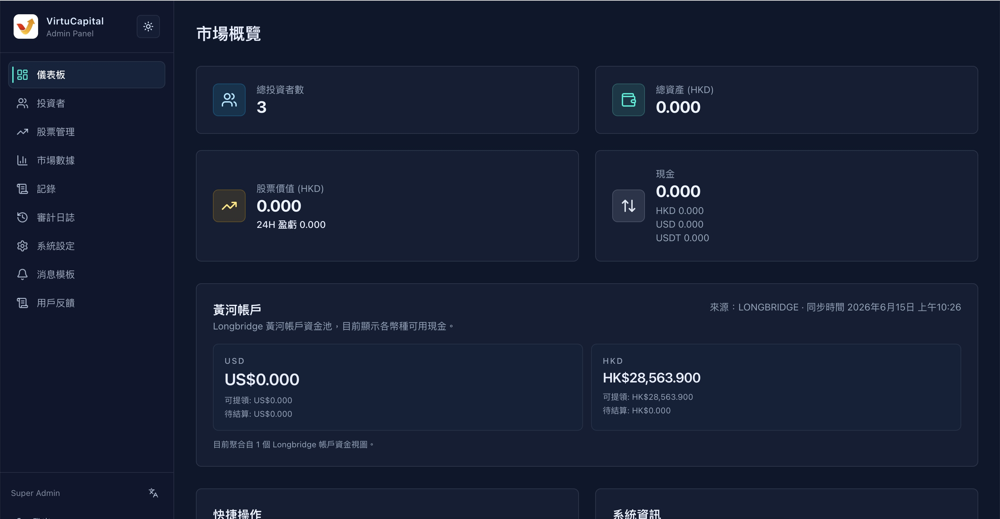

## 2. 仪表盘概览

仪表盘是管理员登录后的默认首页，提供平台核心数据的**实时监控**。

### 2.1 市场概览卡片

| 指标 | 说明 |
|------|------|
| **总投资者数** | 平台注册投资者的总人数 |
| **总资产（HKD）** | 所有投资者资产的总和（按当前汇率折算为港币） |
| **股票价值（HKD）** | 所有投资者持有股票的市值总和 |
| ├─ W/L 24小时盈亏 | 最近24小时内股票市值的盈亏变化 |
| **现金** | 各币种的现金余额汇总 |
| ├─ HKD | 港币现金余额 |
| ├─ USD | 美元现金余额 |
| └─ USDT | USDT 余额 |

> 💡 **用途**：快速掌握平台整体资产规模和资金分布情况。
> 

### 2.2 黄河账户

显示平台自有资金的账户余额：
- **美元余额**
- **港元余额**

> ⚠️ **注意**：黄河账户用于平台资金调配，操作需谨慎。

### 2.3 快捷操作

提供常用功能的快速入口：
1. **管理投资者** → 跳转至投资者列表页
2. **管理股票分配** → 跳转至股票管理页
3. **查看市场数据** → 跳转至市场数据页
4. **配置消息模板** → 跳转至消息模板页

### 2.4 系统信息

| 项目 | 说明 |
|------|------|
| 应用程序 | 系统名称（Virtu Capital） |
| 版本 | 当前系统版本号 |
| 环境 | 运行环境（生产环境/测试环境） |

---
---
title: 仪表盘概览
sidebar_position: 3
---
