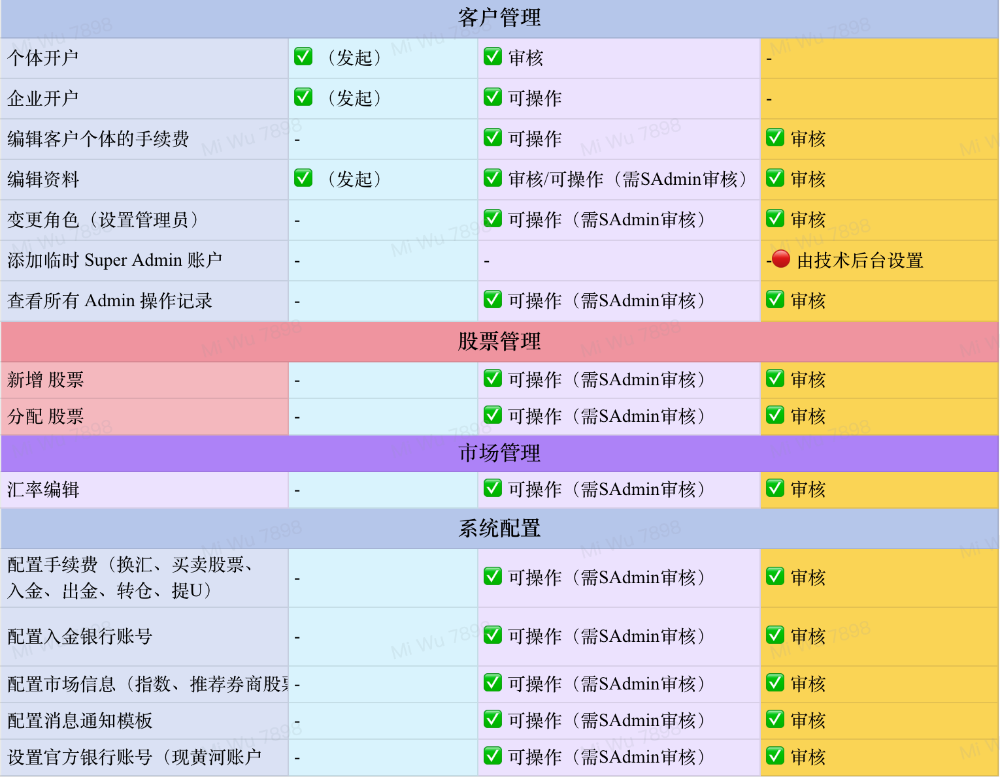

## 角色权限与操作边界

下表汇总了客户端、管理员端里管理员和超级管理员的操作权限范围。\
管理员处理业务时，先确认自己是发起、初审还是执行配置；标注“需超级管理员审核”的操作，完成后必须等待复审。
### 客户端角色操作权限

### 管理员端角色操作权限

实际权限还会受到组织授权、账号状态和部署版本影响；\
页面权限与图片不一致时，以系统操作边界为准。

:::warning 高风险操作
角色变更、系统设定、汇率和资金或持仓相关操作、初审和终审不得由同一人绕过审批链完成。
:::

#### 审计与追溯

- 角色变更、审核和配置操作完成后，可以在审计日志中核对记录。
- 使用操作人、目标用户、资源 ID、结果和时间范围缩小查询；
- 失败记录也应保留并调查原因。

##### 权限回收

- 出现岗位变更、离职、账号共用、异常登录或授权到期时，应立即通过组织审批流程降权。
- 不要通过删除用户来代替角色变更权限回收。

## 联系支持

| 问题类型 | 联系方式 |
| --- | --- |
| 技术故障 | tech-support@virtucapital.com |
| 业务咨询 | operations@virtucapital.com |
| 紧急事件 | 24 小时热线：+852-xxxx-xxxx |

提交问题时建议提供：

- 发生时间、环境和当前路由；
- 当前账号角色（不要提供密码或验证码）；
- 可复现步骤与页面错误文字；
- 相关业务记录 ID 或审计日志 ID；
- 已脱敏的截图或日志。
