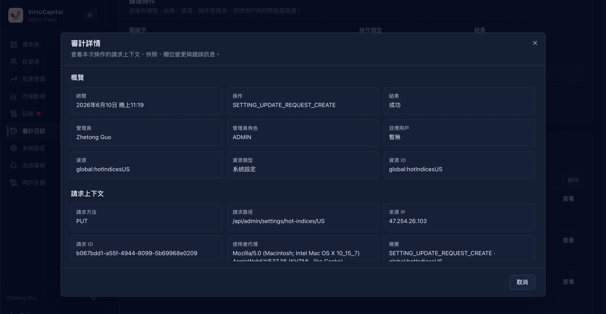

## 7. 审计日志

**操作路径**：左侧导航栏 → 「审计日志」

审计日志记录所有管理员的操作行为，用于安全审计和问题追溯。

### 7.1 筛选条件

| 条件 | 说明 |
|------|------|
| **关键字** | 搜索操作内容中的关键词 |
| **操作类型** | 创建 / 修改 / 删除 / 审核 等 |
| **结果** | 成功 / 失败 |
| **资源类型** | 用户 / 股票 / 订单 / 配置 等 |
| **资源ID** | 具体资源的唯一标识 |
| **管理员用户ID** | 执行操作的管理员 |
| **目标用户ID** | 被操作影响的用户 |
| **开始时间** | 筛选时间范围起点 |
| **结束时间** | 筛选时间范围终点 |

### 7.2 日志表格

| 字段 | 说明 |
|------|------|
| **时间** | 操作执行时间 |
| **操作** | 具体操作描述 |
| **管理员** | 执行操作的管理员账号 |
| **目标用户** | 被操作影响的用户（如适用） |
| **结果** | 操作是否成功 |
| **摘要** | 操作内容的简要说明 |

> 💡 **用途**：当出现问题时，可通过审计日志追溯是谁、在何时、做了什么操作。

---
---
title: 审计日志
sidebar_position: 2
---
