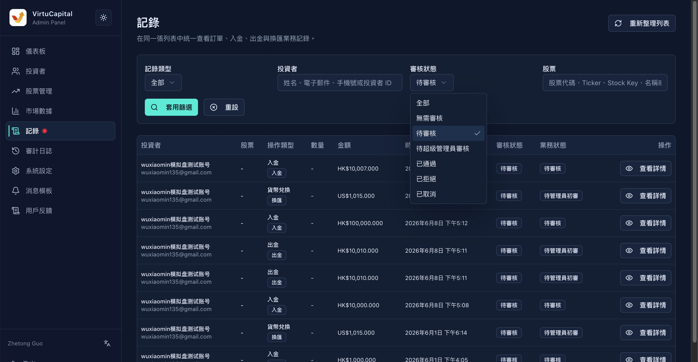

## 6. 记录审核

**操作路径**：左侧导航栏 → 「记录」

记录页面用于在同一张列表中统一查看并审核投资者提交的各类业务记录，包括**订单、入金、出金、换汇、股票转让和转仓**。


> 🔔 **红点提示**：当有「待审核」记录时，菜单会显示红点提醒。





### 6.1 检索功能

支持多维度组合筛选：

#### 记录类型

| 类型 | 说明 |
|------|------|
| **全部** | 显示所有类型的记录 |
| **订单** | 股票买入/卖出订单 |
| **入金** | 投资者充值记录 |
| **出金** | 投资者提现记录 |
| **换汇** | 币种兑换记录 |
| **转仓** | 转仓记录 |
| **后台操作** | 管理员在后台执行的操作记录 |

#### 投资者筛选

| 条件 | 说明 |
|------|------|
| **姓名** | 投资者姓名 |
| **电子邮件** | 注册邮箱 |
| **手机号** | 注册手机号 |
| **投资者ID** | 系统分配的唯一ID |
#### 审核状态筛选

| 条件 | 说明 |
|------|------|
| **无需审核** | 不需要管理员审核的记录如订单 |
| **待审核** | 需要管理员审核的记录如出入金 |
| **待超级管理员审核** | 需要超管理员审核的操作如出金 |
| **已通过** | 审核已通过 |
| **已拒绝** | 审核已拒绝 |
| **已取消** | 投资者取消了原操作 |

#### 股票筛选

| 条件 | 说明 |
|------|------|
| **股票代码** | 如 00700 |
| **Ticker** | 股票交易代码 |
| **Stock Key** | 系统内部标识 |
| **名称** | 股票名称 |
| **订单号** | 具体订单编号 |

#### 其他筛选条件【暂定】

| 条件 | 说明 |
|------|------|
| **日期** | 按日期范围筛选（接日期筛选组件） |
| **审核状态** | 无需审核 / 待审核 / 待超级管理员审核 / 审核通过 / 审核拒绝 |
| **业务状态** | 已提交 / 已撤销 / 管理员已通过 / 超级管理员已通过 / 已拒绝 / 已入账 / 已打款 |

> 💡 **操作**：设置好条件后，点击「套用筛选」执行搜索，点击「重设」清空条件。


### 6.2 表格结构

| 字段 | 说明 |
|------|------|
| **投资者** | 提交该记录的投资者 |
| **股票** | 涉及的股票（如适用） |
| **操作类型** | 入金 / 出金 / 转入 / 转出 / 转让 / 资料变更 / 用户删除 |
| **数量** | 交易数量（如适用） |
| **金额** | 涉及金额 |
| **时间** | 记录提交时间 |
| **审核状态** | 当前审核进度 |
| **业务状态** | 业务处理进度 |
| **查看详情** | 查看完整信息并执行审核操作 |

### 6.3 各类型记录详情与审核

#### 入金记录审核

**入金详细字段**：

| 字段 | 示例值 | 说明 |
|------|--------|------|
| **入金单号** | 6a159…… | 系统生成的唯一单号 |
| **使用者** | mi | 投资者账号 |
| **入金方式** | 本地（香港）汇款 / 国际汇款 | 资金转入方式 |
| **入金币种** | HKD | 充值币种 |
| **金额** | HK$100,000.00 | 充值金额 |
| **手续费** | HK$0.00 | 扣除的手续费 |
| **总额** | HK$100,000.00 | 实际到账金额 |
| **入金时间** | 2026年5月26日 晚上9:07 | 用户提交时间 |
| **审核状态** | 已通过 | 审核进度 |
| **资金状态** | 已入账 | 资金到账状态 |
| **审核时间** | 2026年5月26日 下午3:03 | 管理员审核时间 |
| **入账时间** | 2026年5月26日 下午3:03 | 资金实际入账时间 |

**入金凭证**：
- 查看投资者上传的转账截图/凭证

**审核操作**：

| 操作 | 说明 |
|------|------|
| **审核通过** | 确认入金有效，资金入账 |
| **拒绝原因** | 如拒绝，需填写拒绝原因 |
| **拒绝申请** | 确认拒绝该入金申请 |

**关联入账流水**：
入账流水关联账户：黄河（暂定，后续是否改为VC独立的银行账户？）

| 字段 | 说明 |
|------|------|
| **流水ID** | 系统生成的流水号 |
| **状态** | 成功 / 失败 / 处理中 |
| **币种** | 流水币种 |
| **金额** | 流水金额 |
| **入账前余额** | 入账前账户余额 |
| **入账后余额** | 入账后账户余额 |


#### 出金记录审核

审核流程与入金类似，重点关注：
- 出金账户余额是否充足
- 出金账户信息是否正确
- 手续费计算是否准确
- **并且，管理员审核通过后，需要超级管理员二次审核**

#### 买入/卖出/转入/转出/转让/订单

- 检查投资者持仓/资金是否充足，手续费和价格是否合理
- 确认市场是否开放交易
- **并且，转仓需要管理员审核、超级管理员二次审核**

#### 资料变更审核

- 核对变更前后的信息
- 确认变更申请人为本人
- 涉及敏感信息（如银行卡）需额外验证

#### 用户删除审核

- 确认该用户无未结清资产
- 确认删除原因合理
- **此操作不可逆**，需特别谨慎

### 6.4 审核状态流转

```
已提交
  ├── 已撤销（用户主动取消）
  ├── 待审核 → 管理员已通过 → 超级管理员已通过 → 已入账/已打款
  │              ├── 已拒绝（管理员拒绝）
  │              └── 待超级管理员审核
  │                         ├── 超级管理员已通过
  │                         └── 已拒绝（超级管理员拒绝）
  └── 无需审核（系统自动处理）
```

---
---
title: 记录审核
sidebar_position: 1
---
