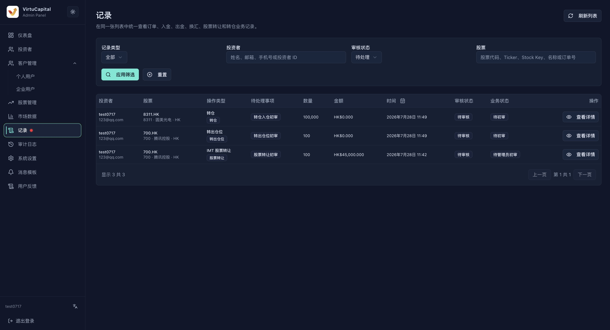

**操作路径**：左侧导航栏 → 「记录」

记录页统一展示订单、入金、出金、换汇、股票转让和转仓等业务。\
菜单出现红点时，表示存在待处理记录。

## 检索与审核记录

管理人员的记录列表中默认的审核状态为「**待处理**」，\
以便管理人员优先处理需要自己跟进的业务。\
**点击查看详情，可以审核自己需要处理的记录**\
如果需要查询其他记录，再按审核状态、记录类型、投资者和时间进行搜索与筛选。
## 待处理记录包括什么

- **核心业务审核**：开户审核、转仓、股票转让、出金等需要管理员处理或继续提交复审的事项；
- **用户资料变更**：姓名、联系方式、身份资料等用户信息的修改；
- **系统信息变更**：平台手续费、单个用户手续费、消息中心提示语、开户协议、转仓协议等配置或文档变更。

## 如何筛选其他记录
点击「套用筛选」执行查询，「重设」清空条件，「刷新」获取最新状态。\
列表展示投资者、股票、操作类型、待处理事项、数量、金额、时间、审核状态、业务状态和详情入口，并支持分页。

| 筛选条件 | 说明 |
|------|------|
| **审核状态** | **待处理**（默认）、全部、无需审核、待审核、待超级管理员审核、已通过、已拒绝、已取消 |
| **记录类型** | 开户、订单、入金、出金、换汇、转仓、股票转让；资用户资料、手续费、官方账户、消息中心提示语及开户协议、转仓协议等文档变更等等 |
| **投资者** | 按姓名、邮箱、手机号或 VC User ID 搜索，准确定位相关用户 |
| **股票** | 按股票代码、Ticker、Stock Key 或名称搜索 |
| **时间** | 设置开始时间和结束时间，按记录发生时间筛选，定位特定时段的操作 |

## 如何进行审核
进入记录详情后，先确认自己拥有的操作权限，再按业务要求执行通过、拒绝、提交复审或其他可用操作。
### 通用审核原则
- 打开详情，核对申请人、金额或数量、附件及关联账户；
- 检查冻结资金或持仓是否足够，手续费是否正确；
- 对照生命周期、关联交易和操作日志确认状态一致；
- 审核通过前再次确认关键数据；拒绝时填写明确原因；
- 出金和转仓等高风险操作在管理员通过后，仍需超级管理员二次审核。
### 审核示例
#### 股票转入审核
完整审核流程包括：用户提交申请-〉管理员初审-〉超级管理员复审-〉与对方券商沟通转仓-〉股票到账后标记已转仓

:::warning 审核要点
- 详情页显示转仓单号、操作类型、业务与审核状态、投资者、目标券商、原始券商、来源账户、结算参与者代码、转入股票及数量、附件、生命周期、操作日志和审核入口。
- 核对原券商转出确认、来源账户、目标券商、股票代码、数量和申请文件是否一致。
- 附件或资料不完整时不要通过；
- 填写明确审核意见后执行通过或拒绝，并继续检查生命周期是否进入下一状态。
- 标记已转仓为最后一步
:::

#### 股票转出审核
完整审核流程包括：用户提交申请-〉管理员初审-〉超级管理员复审-〉释放股票转出

:::warning 审核要点
- 详情页重点包括接收券商、接收账户、联系人、转出股票与数量、冻结持仓、手续费、市值、申请附件、生命周期、关联资金记录和操作日志。
- 审核时确认接收资料完整、冻结数量足够、费用正确，且申请表、签名和券商结单与申请一致。
- 管理员通过后按流程等待超级管理员复核；
- 最终状态为持仓释放。
:::

####  股票转让审核
完整审核流程包括：用户提交申请-〉管理员初审-〉超级管理员复审-〉系统发起转让股票-〉对方接收股票转让

:::warning 审核要点
股票转让详情展示转出方与接收方、股票、数量、协定价格、协定金额、币种、**BSN**、冻结持仓、关联交易和操作日志。
- 重点核对双方身份、数量、价格及金额计算，确认转出方持仓已正确冻结，且不存在重复或冲突交易，再执行通过或拒绝。
- 审查BSN是否存在，是否由管理员上传
:::

#### 出金审核
**当前业务出金功能为**：给客户出USDT/USDC。管理员可设置转账计划。\
**完整出U审核流程包括**：用户提交申请-〉签名确认钱包地址-〉管理员初审（设置转账计划）-〉超级管理员复审-〉系统完成转账后-〉管理员/系统 标记已打款；

**设置转账计划**

管理员初审时，可根据业务需要设置转账计划：

- 总金额：本次出金的法币总金额，金额固定。
- 分笔金额：将总金额拆分为多笔转账，每笔金额通常不低于 1 万，最高可达数百万元，具体金额可按实际情况调整。
- 转账笔数：由管理员自主设定分为多少笔，系统根据总金额和笔数生成转账计划。
- 确认金额、笔数和收款信息无误后，点击「**发送转账**」。

:::warning
- 当前业务出金功能为给客户出USDT/USDC。管理员可设置转账计划
- 审核需要核对收款账户、可用余额、冻结金额、手续费和附件；
- 出U审核通过打款后，系统会留存OSL水单和链上转账记录，管理员可以下载或重发给客户。
:::

#### 信息更改变更审核
客户资料变更、市场汇率变更、系统设定如官方账户、出入金手续费、市场指数、消息模板变更等等，由管理员更改后，超级管理员复审。
- **资料变更**：比较变更前后信息，敏感资料需额外验证；
- **后台操作**：核对操作人、目标资源、变更摘要和执行结果。

#### 其他记录
- **现金入金**：核对入金方式、币种、金额、手续费、付款账户与凭证；通过后核对关联入账流水及余额变化；
- **现金出金**：核对收款账户、可用余额、冻结金额、手续费和附件。
- **订单、买卖、换汇**：核对可用资金或持仓、价格、手续费和市场状态；

:::tip
- 典型审核状态为：已提交 → 待审核 → 管理员已通过 → 待超级管理员审核 → 已完成；
- 任一审核环节均可能因资料不符转为已拒绝，用户主动取消则显示已取消。
:::
