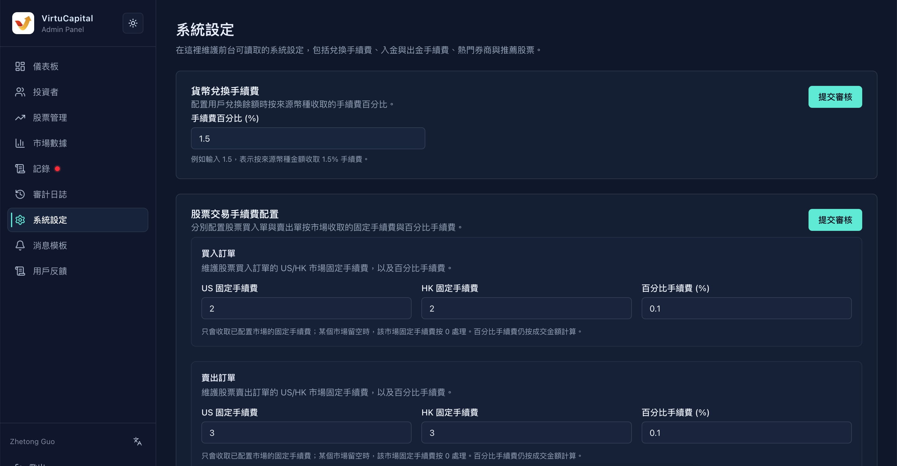
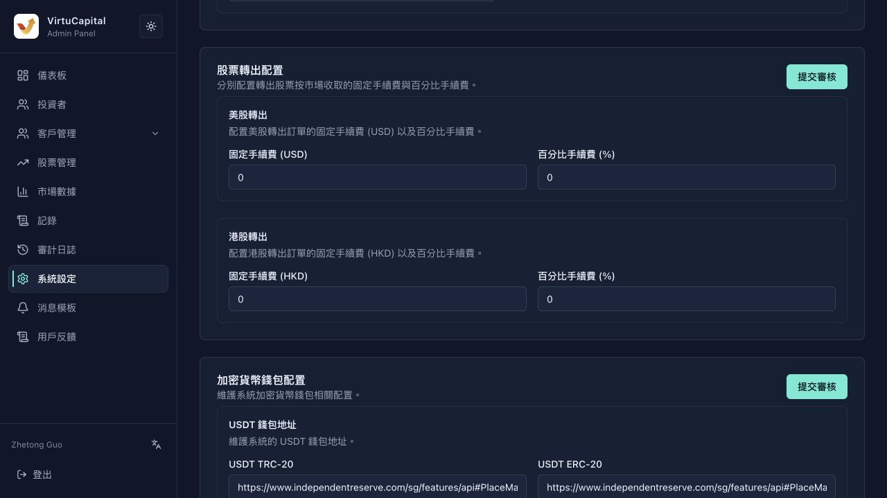

## 8. 系统设定

**操作路径**：左侧导航栏 → 「系统设定」

> ⚠️ **重要提示**：系统设定的所有修改都需要**提交审核**，审核通过后才会生效。

### 8.1 货币兑换手续费

| 字段 | 说明 |
|------|------|
| **手续费百分比** | 币种兑换时收取的手续费比例 |

**操作步骤**：
1. 输入新的手续费百分比
2. 点击「提交审核」
3. 等待超级管理员审核

### 8.2 股票交易手续费

#### 买入订单手续费

| 字段 | 说明 |
|------|------|
| **US固定手续费** | 美股买入的固定手续费金额 |
| **HK固定手续费** | 港股买入的固定手续费金额 |
| **百分比手续费** | 按交易金额百分比收取的手续费 |

#### 卖出订单手续费

| 字段 | 说明 |
|------|------|
| **US固定手续费** | 美股卖出的固定手续费金额 |
| **HK固定手续费** | 港股卖出的固定手续费金额 |
| **百分比手续费** | 按交易金额百分比收取的手续费 |

> 💡 **计算规则**：实际手续费 = max(固定手续费, 交易金额 × 百分比手续费)

### 8.3 入金配置

#### 国际电汇

| 字段 | 说明 | 示例 |
|------|------|------|
| **收款银行** | 收款银行名称 | HSBC Hong Kong |
| **SWIFT代码** | 银行SWIFT代码 | HSBCHKHHXXX |
| **账户名称** | 收款账户名 | Virtu Capital Limited |
| **账户号码** | 收款账号 | 123-456789-001 |
| **手续费百分比** | 入金手续费比例 | 0% |
| **银行地址** | 收款银行地址 | 1 Queen's Road Central, HK |

#### 本地（香港）汇款

| 字段 | 说明 |
|------|------|
| **银行代码** | 香港银行代码（3位数字） |
| **分行代码** | 分行代码（3位数字） |
| **账户名称** | 收款账户名 |
| **账户号码** | 收款账号 |
| **FPS转数快识别码** | FPS识别码（支持快速转账） |
| **手续费百分比** | 入金手续费比例 |

#### USDT

| 字段 | 说明 |
|------|------|
| **手续费百分比** | USDT入金手续费比例 |

### 8.4 出金配置

| 出金方式 | 配置项 | 说明 |
|---------|--------|------|
| **国际电汇** | 手续费占比 | 提现金额的手续费比例 |
| **本地（香港）转账** | 手续费占比 | 本地转账的手续费比例 |
| **USDT** | 手续费占比 | USDT提现的手续费比例 |

### 8.5 股票转出配置

配置用户发起股票转出时按市场收取的固定手续费与百分比手续费。

| 市场 | 固定手续费币种 | 百分比手续费 |
|------|----------------|--------------|
| **美股转出** | USD | 按转出订单金额百分比收取 |
| **港股转出** | HKD | 按转出订单金额百分比收取 |

> 💡 **说明**：固定手续费用于收取每笔转出订单的基础费用，百分比手续费按成交或转出金额计算。修改后点击「提交审核」，审核通过后生效。

### 8.6 加密货币钱包配置

| 钱包类型 | 说明 |
|---------|------|
| **USDT TRC-20** | 波场链USDT钱包地址配置 |
| **USDT ERC-20** | 以太坊链USDT钱包地址配置 |

> ⚠️ **安全警告**：钱包地址配置错误可能导致资金永久丢失，请仔细核对。

### 8.7 开户协议配置

管理客户端开户时需要阅读和同意的协议。管理员可上传 Markdown 格式协议文件；上传后需经超级管理员审核通过，才会对客户端生效。

| 字段 | 说明 |
|------|------|
| **协议标识** | 协议唯一标识 |
| **协议标题** | 客户端展示的协议名称 |
| **语言版本** | 协议对应语言 |
| **是否必签** | 是否为开户必读必签协议 |
| **排序** | 客户端展示顺序 |

### 8.8 企业开户展示信息配置

配置企业账户开户相关的引导文案、在线客服链接、客服邮箱、电话以及工作时间说明。

| 字段 | 说明 |
|------|------|
| **引导文案** | 支持英文、简体中文、繁体中文；中文为空时回退到英文 |
| **在线客服显示文本** | 客户端展示的客服入口文案 |
| **在线客服 DeepLink** | 跳转客服聊天的直链或 App 自定义 Schema URL |
| **客服电话** | 展示给企业用户的联系电话 |
| **工作时间** | 客服服务时间说明 |

### 8.9 热门指数配置

配置APP市场页展示股票市场指数的列表。
例如港股的恒生指数
例如美股的纳斯达克指数
**操作步骤**：
1. 选择要配置的市场
2. 搜索并添加推荐指数
3. 调整展示顺序（拖拽排序）
4. 点击「提交审核」

### 8.10 推荐券商和股票推荐配置

| 配置项 | 说明 |
|--------|------|
| **热门券商配置** | APP 市场页展示的热门券商，最多可配置 4 个 |
| **港股推荐配置** | 市场展示的港股推荐列表 |
| **美股推荐配置** | 市场展示的美股推荐列表 |
| **沪深股票推荐配置** | 市场展示的A股推荐列表 |
| **港股指数推荐配置** | 市场页展示的港股指数列表 |
| **美股指数推荐配置** | 市场页展示的美股指数列表 |

**操作步骤**：
1. 选择要配置的市场
2. 搜索并添加推荐股票
3. 调整展示顺序（拖拽排序）
4. 点击「提交审核」

---
