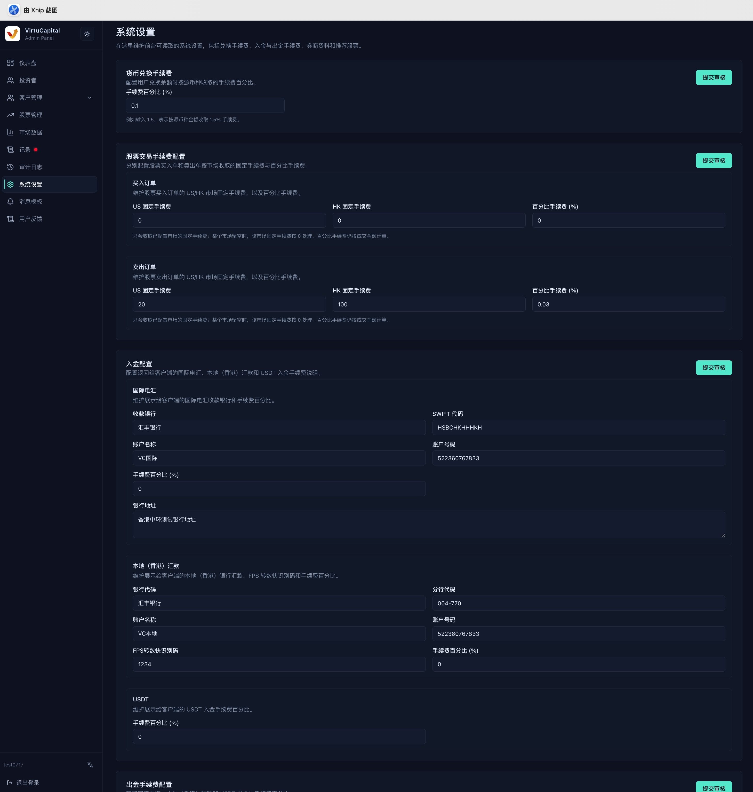

## 8. 系统设定

**操作路径**：左侧导航栏 → 「系统设定」

> ⚠️ 系统设定会影响全体用户。修改后必须点击「提交审核」，待超级管理员通过后才会生效。

### 8.1 汇兑、交易与入金配置

| 配置 | 可维护内容 |
|------|------------|
| **货币兑换手续费** | 换汇手续费百分比 |
| **买入订单手续费** | 美股固定手续费、港股固定手续费、百分比手续费 |
| **卖出订单手续费** | 美股固定手续费、港股固定手续费、百分比手续费 |
| **国际电汇入金** | 银行名称、SWIFT、账户名称与号码、银行地址、手续费 |
| **香港本地入金** | 银行与分行代码、账户资料、FPS 识别码、手续费 |
| **USDT 入金** | 入金手续费比例 |

交易手续费按系统页面配置的固定费用与比例规则计算。银行资料修改后，应由另一名管理员逐项复核。

### 8.2 出金、转仓、钱包与协议

- **出金配置**：维护国际电汇、香港本地转账和 USDT 出金手续费；
- **股票转出配置**：分别维护美股与港股的固定手续费和百分比手续费；
- **加密货币钱包**：维护 USDT TRC-20 与 ERC-20 收款地址；
- **开户协议**：上传协议文件，并设置协议标识、标题、语言、是否必签及展示顺序。

> 🚨 钱包链类型或地址错误可能造成资产永久损失。提交前应复制回查完整地址，并由第二人复核。

协议新增或替换后同样需要审核。多语言协议应使用一致的协议标识，并检查客户端展示顺序和必签状态。

### 8.3 企业开户展示与市场内容

#### 企业开户展示信息

- 分别维护英文、简体中文和繁体中文引导文案；
- 配置在线客服显示文字与 DeepLink；
- 配置客服邮箱、电话和工作时间；
- 中文未填写时，客户端可能回退显示英文内容。

#### 推荐券商

可新增、编辑、删除和调整券商顺序。变更前确认名称、图标及跳转资料准确，删除前确认客户端不再使用。

#### 推荐指数与市场内容

在港股、美股等标签中搜索并添加推荐指数，移除不再展示的项目并调整顺序，最后提交审核。股票推荐配置同样按市场维护；展示数量及顺序以后台当前限制为准。

### 8.4 提交前检查

1. 核对币种、单位、比例和固定金额；
2. 核对银行、钱包、客服链接及多语言文案；
3. 检查推荐内容有无重复、缺失或顺序错误；
4. 点击「提交审核」，记录变更原因；
5. 审核通过后回到页面确认生效值，并在审计日志中核对操作记录。
