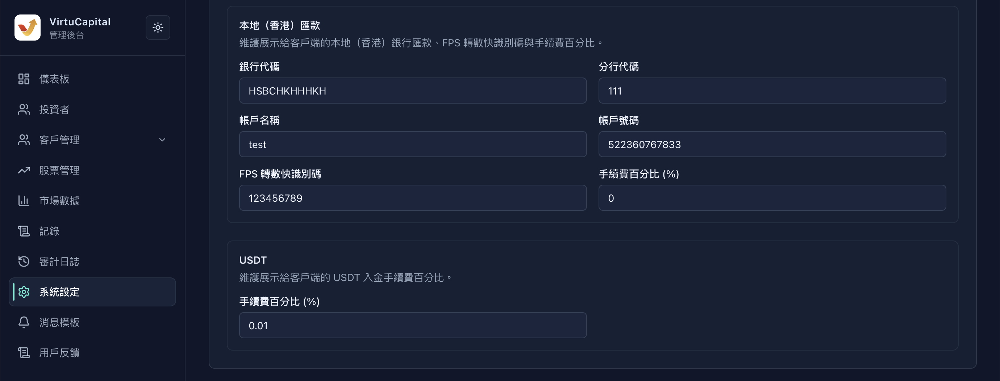
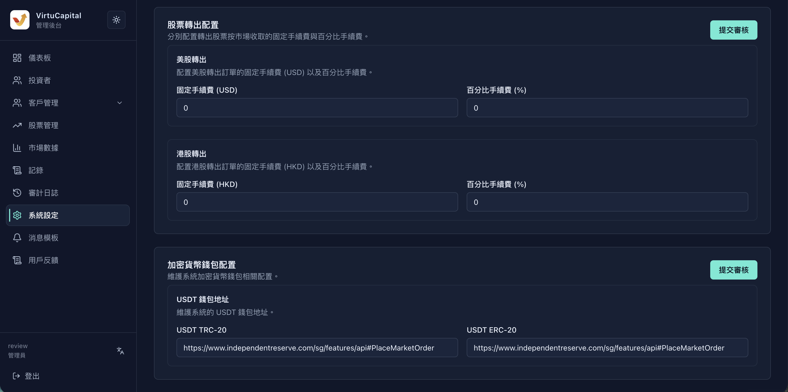
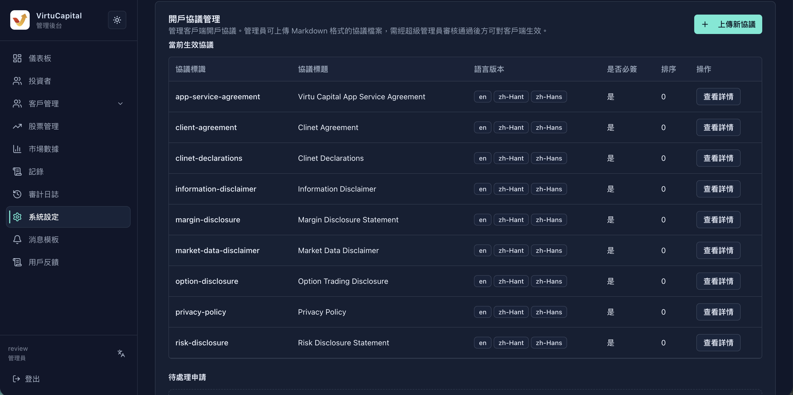
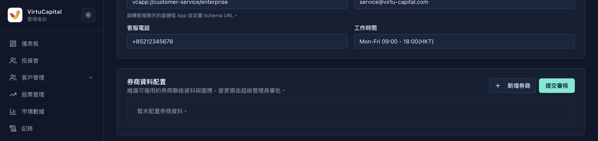
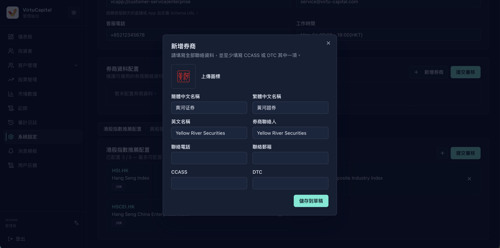
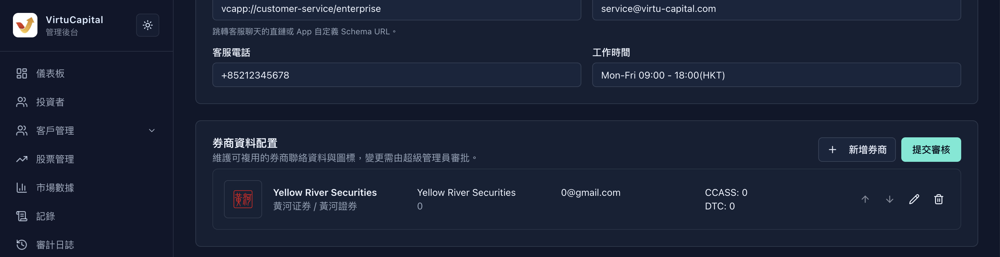
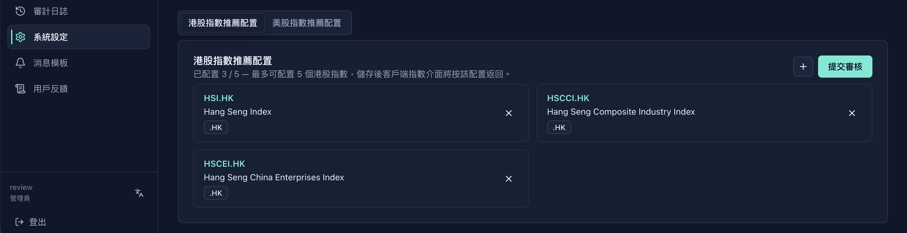
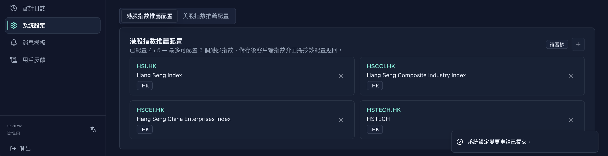
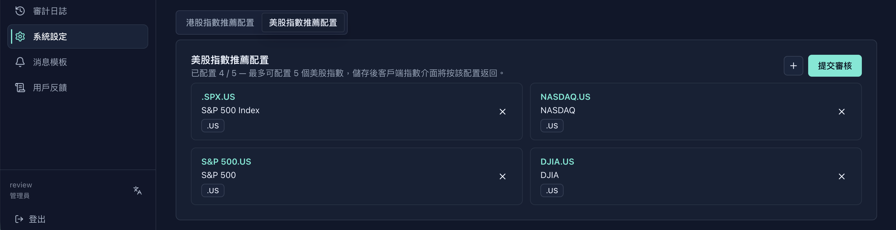
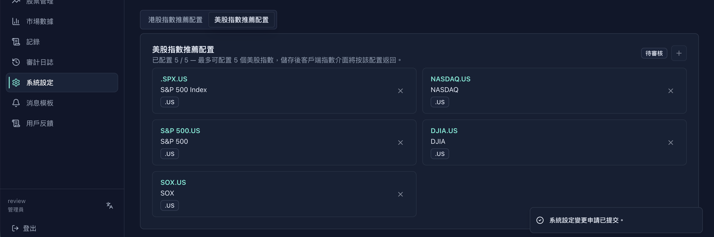

## 审核流程和导航

**操作路径**：左侧导航栏 → 「系统设定」。

:::warning 角色与生效顺序
1. **步骤 1：管理员**修改系统设定并点击「提交审核」。管理员可维护配置和发起审核，但不能直接使变更生效。
2. **步骤 2：超级管理员**在待审核记录中核对并审核通过；只有通过后，配置才会在客户端生效。
:::

## 手续费与资金配置

### 货币兑换和股票交易手续费

此部分用于维护货币兑换，以及股票买入和卖出的 US、HK 固定手续费与百分比手续费。

填写兑换手续费百分比；分别填写买入和卖出订单的 US 固定手续费、HK 固定手续费及百分比手续费，复核后在对应卡片提交审核。

:::warning 百分比不是小数比例
字段标签为「手续费百分比 (%)」；例如输入 `1.5` 表示收取 1.5%，不是 0.015%。固定手续费必须与对应的 US 或 HK 市场币种一致。
:::

### 国际电汇入金资料

此部分用于填写国际电汇的收款银行、SWIFT 代码、账户名称、账户号码、手续费百分比和银行地址。

逐项更新收款资料与手续费百分比，核对无误后点击页面右上角「提交审核」。

### 香港本地与 USDT 入金手续费

此部分用于维护本地（香港）汇款的银行及 FPS 资料，并设置本地和 USDT 入金手续费。

填写银行代码、分行代码、账户资料、FPS 转数快识别码和本地手续费；在 USDT 区域填写手续费百分比，再提交审核。

:::warning 银行资料必须逐项复核
收款银行、SWIFT 代码、银行／分行代码、账户号码和 FPS 转数快识别码错误会使客户向错误资料汇款。提交前由第二名管理员逐项核对，勿从截图示例复制账户资料。
:::

### 出金手续费

此部分用于分别设置国际电汇、本地（香港）转账和 Web3 提款的「手续费百分比 (%)」。

为三种出金方式逐项填写手续费百分比，复核币种和单位后点击「提交审核」。

### 股票转出手续费

此部分用于维护美股转出的固定手续费（USD）与百分比手续费，以及港股转出的固定手续费（HKD）与百分比手续费。

先填写美股两项费用，再填写港股两项费用；确认市场和币种对应后提交审核。

### 加密货币钱包地址

此部分用于维护 USDT TRC-20 和 USDT ERC-20 的收款钱包地址。

分别粘贴完整地址，复制回查后提交审核；「待审核」期间不得假定客户端已使用新值。

:::warning 钱包网络和地址不可混用
TRC-20 与 ERC-20 地址必须填入对应字段。错误的网络或地址可能造成资产永久损失；提交前复制回查完整地址，并由第二名管理员独立复核。
:::

## 开户协议

### 开户协议管理列表

此部分用于查看当前协议的协议标识、标题、语言版本、是否必签和排序。

在列表逐项确认协议标识、标题、语言版本、是否必签和排序，再确认客户端生效结果。

### 上传新开户协议

此部分用于上传新的 Markdown 开户协议，并填写协议标识、标题、版本和可选简介。

点击「上传新协议」，填写仅含小写字母、数字和连字符的标识，选择对应 Markdown 协议档案（.md）后点击「储存」。

:::warning 替换协议前保留兼容性
错误的协议标识、语言版本或必签状态会影响客户签署流程。新增或替换前，确认标识、版本、Markdown 文件和语言内容相互对应；不要覆盖仍供客户端使用的协议。
:::

## 企业开户展示与券商资料

### 企业开户展示信息

此部分用于设置引导文案、在线客服显示文本、DeepLink、客服邮箱、电话和工作时间。

分别填写页面要求的多语言内容及客服资料，确认 DeepLink 为客服聊天直链或 App 自定义 Schema URL 后提交审核。

### 券商资料空列表

此部分用于查看券商资料列表，并从「新增券商」开始建立资料。

点击「新增券商」进入表单；列表中可检查已有记录并使用页面提供的操作按钮。

### 新增券商表单

此部分用于新增券商图标、三种语言名称、联系人、电话、电邮及结算代码。

上传图标，填写所需资料，并至少填写 CCASS 或 DTC 其中一项；完成后点击「储存到草稿」。

### 已保存券商资料

此部分用于复核已保存券商的名称、联系资料和结算代码。

检查保存内容；需修改时使用编辑图标，需移除时使用删除图标，并只使用页面提供的上下移动操作。

### 券商待审核状态

此部分用于确认券商资料已提交并处于「待审核」状态。

点击「提交审核」后，出现「待审核」及「查看待审记录」时等待超级管理员通过，再确认客户端展示。

:::warning 删除券商前确认没有客户端依赖
删除操作会移除该券商资料。先确认客户端、活动页面和客服流程都不再引用该券商；草稿保存并不等于已审核通过。
:::

## 推荐指数

### 港股推荐指数列表

此部分用于查看港股推荐指数及当前「已配置 x / 5」数量。

选择「港股指数推荐配置」，核对数量、代码、名称和 `.HK` 市场标记。

### 新增港股推荐指数

此部分用于新增一个港股推荐指数。

点击加号，在弹窗输入指数标的代码（示例为 `HSI.HK`），再点击「新增」。

### 港股推荐指数待审核状态

此部分用于确认港股指数变更已经提交审核。

复核新增项目后点击「提交审核」；出现「待审核」和提交提示后等待审核通过。

:::warning 不要超出推荐上限或重复添加
页面明确显示每个市场最多 5 个推荐指数。新增前核对代码和市场标记，避免重复；界面未提供拖拽排序功能，请勿假定可以调整顺序。
:::

### 美股推荐指数列表

此部分用于查看美股推荐指数及当前「已配置 x / 5」数量。

选择「美股指数推荐配置」，核对数量、代码、名称和 `.US` 市场标记。

### 新增美股推荐指数

此部分用于新增一个美股推荐指数。

点击加号，在弹窗输入指数标的代码（示例为 `SOX.US`），再点击「新增」。

### 美股推荐指数待审核状态

此部分用于确认美股指数变更已经提交审核。

复核新增项目后点击「提交审核」，状态变为「待审核」后等待超级管理员通过并确认客户端指数界面。

:::warning 按市场维护推荐指数
港股和美股的上限分别计算。请使用与所选市场相符的代码和市场标记；页面只显示新增和移除操作，未显示拖拽排序功能。
:::

## 提交前检查

:::warning 提交前检查
1. 复核币种、固定金额和所有「手续费百分比 (%)」字段。
2. 复核银行资料、钱包网络和完整地址，并完成第二人复核。
3. 复核协议标识、版本、语言文件和必签状态，以及企业开户的多语言内容与客服入口。
4. 复核券商资料和推荐指数的代码、市场标记、数量限制及「待审核」状态。
5. 点击相应区域的「提交审核」；超级管理员通过后，回到客户端与审计日志确认生效结果。
:::
