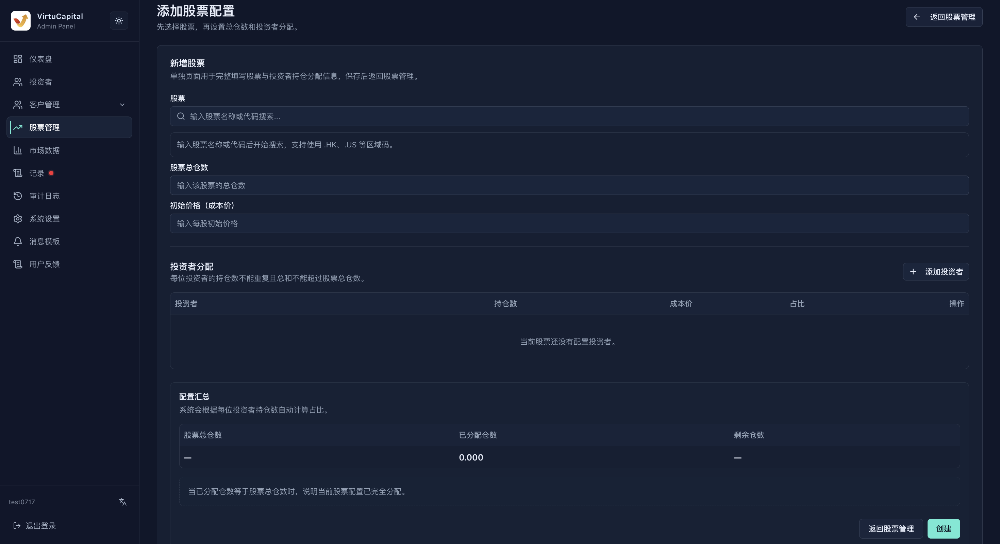

## 4. 股票管理

**操作路径**：左侧导航栏 → 「股票管理」

### 4.1 持仓概览与列表

页面汇总持仓股票数、总设定仓数、已分配仓数、可分配仓数、涉及投资者及超分配股票。出现超分配时，应立即核对对应股票。

列表支持按股票名称、股票代码和市场检索。

| 字段 | 说明 |
| --- | --- |
| **股票** | 股票名称和代码 |
| **市场** | 港股、美股或页面支持的其他市场 |
| **总仓数** | 后台为该股票设定的总数量 |
| **已分配仓数** | 已分配给投资者的数量合计 |
| **剩余仓数** | 总仓数减去已分配仓数 |
| **投资者数** | 当前持有该股票的投资者数量 |
| **建立时间** | 股票记录建立时间 |
| **操作** | 当前角色可见的管理入口 |

<!-- screenshot-slot: stocks-overview; status: placeholder -->
> 📷 **截图待补：股票管理概览、检索和列表。**

发现「超分配」时先停止新增分配，核对该股票的总仓数及每位投资者数量；不要通过新增一条股票记录来掩盖异常。

### 4.2 新增股票与分配

点击「新增股票」，按以下顺序配置：

1. 按地区或股票代码搜索并选择股票；
2. 填写股票总数量和初始成本价；
3. 点击「添加投资者」，为一个或多个投资者填写分配数量与成本价；
4. 核对自动计算的分配占比、已分配数量和可用持仓；
5. 确认配置摘要后创建股票。

| 校验规则 | 说明 |
|----------|------|
| **投资者不可重复** | 同一股票不能重复添加同一投资者 |
| **数量不能超限** | 所有投资者的分配数量合计不得超过股票总数量 |
| **占比自动计算** | 占比按投资者数量 ÷ 股票总数量计算 |
| **可用持仓联动** | 修改或删除分配行后，可用持仓和摘要实时更新 |

### 4.3 完成分配

当已分配数量等于股票总数量时，页面显示已全部分配，可用持仓为 0。此时仍应逐行检查投资者、数量和成本价，再点击创建。

> ⚠️ 初始成本价和投资者成本价会影响持仓成本展示。创建前请依据实际交割数据核对，避免用估算值代替。

### 4.4 创建前核对

1. 股票代码、名称和市场相互一致；
2. 股票总数量与实际交割或持仓资料一致；
3. 投资者没有选错同名账号，VC User ID 已核对；
4. 各行数量合计不超过总数量，成本价币种正确；
5. 未分配数量符合业务预期；
6. 创建完成后回到列表检查总仓数、已分配仓数和投资者数。

### 4.5 异常处理

- **搜索不到股票**：先检查市场和代码格式，再确认市场数据是否已同步；
- **无法添加投资者**：确认用户存在、状态允许分配且没有重复添加；
- **数量超限**：减少分配数量或先核实总仓数，不要绕过校验；
- **创建后数据不一致**：停止继续分配，记录股票代码与操作时间，并结合审计日志排查。
