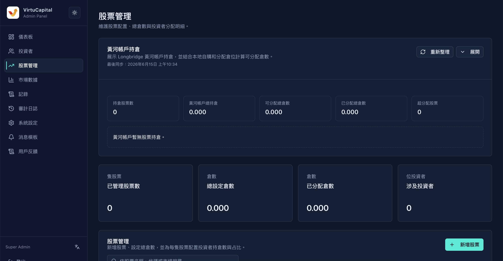

## 4. 股票管理

### 4.1 黄河账户持仓概览

**操作路径**：左侧导航栏 → 「股票管理」

顶部展示平台整体持仓情况：

| 指标 | 说明 |
|------|------|
| **持仓股票数** | 平台管理的股票种类数量 |
| **黄河账户总持仓** | 平台自有账户的总持仓市值 |
| **可分配持仓数** | 尚未分配给投资者的持仓数量 |
| **已分配持仓数** | 已分配给投资者的持仓数量 |
| **超分配股票** | 已分配数量超过总仓数的股票（风险指标） |
| **已管理股票数** | 当前正在管理的股票总数 |
| **总设定仓数** | 所有股票设定的总持仓数量 |
| **已分配仓数** | 已分配给投资者的仓数总和 |
| **涉及投资者** | 持有股票的投资者人数 |

> 🚨 **重点关注**：「超分配股票」表示分配异常，需立即核查。

### 4.2 股票管理列表

#### 检索功能

| 检索条件 | 说明 |
|---------|------|
| **股票名称** | 输入股票中文/英文名称 |
| **股票代码** | 输入股票代码（如 00700） |
| **市场搜索** | 按市场筛选（港股/美股/A股） |

#### 表格字段说明

| 字段 | 说明 |
|------|------|
| **股票** | 股票名称 |
| **市场** | 所属市场（港股HK/美股US/A股CN） |
| **总仓数** | 该股票设定的总持仓数量 |
| **已分配仓数** | 已分配给投资者的持仓数量 |
| **剩余仓数** | 总仓数 - 已分配仓数 |
| **投资者数** | 持有该股票的投资者人数 |
| **建立时间** | 该股票加入系统的时间 |
| **操作** | 编辑/删除等操作 |

### 4.3 新增股票

**操作路径**：股票管理页 → 点击「新增股票」按钮

#### 步骤一：配置股票信息

| 字段 | 说明 | 必填 |
|------|------|------|
| **股票** | 搜索并选择股票（支持名称/代码搜索） | ✅ |
| **股票总仓数** | 设定该股票的总持仓数量 | ✅ |
| **初始价格（成本价）** | 该股票的初始成本价格 | ✅ |

#### 步骤二：投资者分配

为投资者分配持仓：

| 字段 | 说明 |
|------|------|
| **投资者** | 选择要分配的投资者 |
| **持仓数** | 分配给该投资者的持仓数量 |
| **成本价** | 该投资者的持仓成本价 |
| **占比** | 该投资者持仓占总仓数的比例（自动计算） |
| **操作** | 删除该分配行 |

> 💡 **提示**：可添加多行，为多个投资者同时分配。

#### 步骤三：配置摘要

系统自动计算并展示：
- **股票总仓数**：设定的总持仓数
- **已分配仓数**：当前已分配的持仓总数
- **剩余仓数**：总仓数 - 已分配仓数

> ⚠️ **校验规则**：已分配仓数不能超过总仓数。

---
