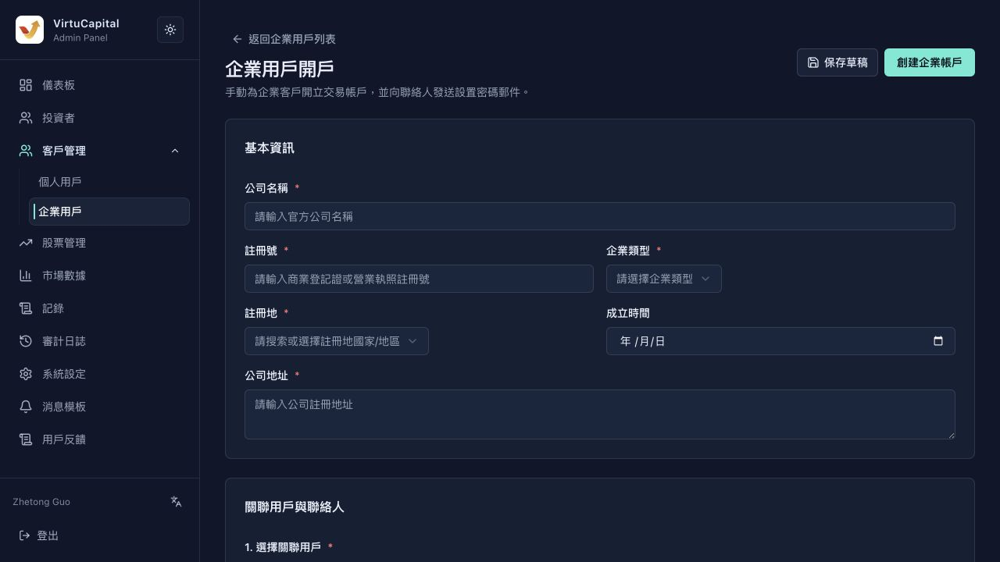

## 客户管理

**操作路径**：左侧导航栏 → 「客户管理」→「个人用户 / 企业用户」

客户管理用于查看开户资料、KYC / KYB 状态和企业开户资料。与「投资者」列表相比，本模块更偏向开户资料、身份审核材料和客户类型管理。

### 个人用户

支持按**姓名、手机号、邮箱、VC 用户 ID**搜索，并可按开户状态筛选。

| 字段 | 说明 |
|------|------|
| **用户资讯** | 用户姓名、VC 用户 ID、内部用户 ID |
| **联络方式** | 手机号与邮箱 |
| **语言** | 用户首选语言 |
| **开户状态** | 未开户 / 已开户 |
| **Sumsub 状态** | 未提交 / 已通过等 KYC 状态 |
| **资料预览** | 国籍、证件类型等摘要 |
| **注册时间** | 用户注册时间 |
| **操作** | 查看详情 |

**查看详情**

点击「查看详情」后，可查看：
- 基础资料：姓名、手机、邮箱、国籍、证件类型、税务居住地址、首选语言等；
- 开户影像资料：证件正反面、活体认证照片、上传时间；
- 就业与财务资讯：职业类别、投资经验、年收入范围、资产规模；
- 系统资讯：用户 ID、VC 用户 ID、角色、客户类型、最近更新时间；
- 开户状态：开户状态、Sumsub 审核状态、Applicant ID、Inspection ID、申请平台、IP 国家等。

### 企业用户

企业用户页用于查看公司客户资料，支持按**公司名称、注册号、联系人、邮箱、手机号、VC 用户 ID**搜索。

| 字段 | 说明 |
|------|------|
| **公司资讯** | 公司名称、注册号、VC 用户 ID |
| **联络资讯** | 企业联系人、邮箱、手机号 |
| **类型 / 注册地** | 企业类型与注册地 |
| **资料状态** | 企业资料是否已开户或仍为草稿 |
| **开户状态** | 企业账户开户状态 |
| **注册时间** | 企业资料创建时间 |
| **操作** | 根据状态查看、继续编辑或创建企业开户资料 |

**企业开户**

点击「企业开户」进入企业用户开户表单。该功能用于管理员手动为企业客户开立交易账户，并向联系人发送设置密码邮件。

| 区域 | 字段 |
|------|------|
| **基本资讯** | 公司名称、注册号、企业类型、注册地、成立时间、公司地址 |
| **关联用户与联系人** | 选择关联用户、企业联系人姓名 |
| **企业资质文件** | 营业执照 / 商业登记证、公司印章授权书、董事会决议、受益所有人证明 |

> 💡 **说明**：营业执照 / 商业登记证为创建企业账户必填文件；其他资质文件可按业务需要补充。页面支持「保存草稿」和「创建企业账户」两种操作。

---
---
title: 个人与企业客户管理
sidebar_position: 2
---
