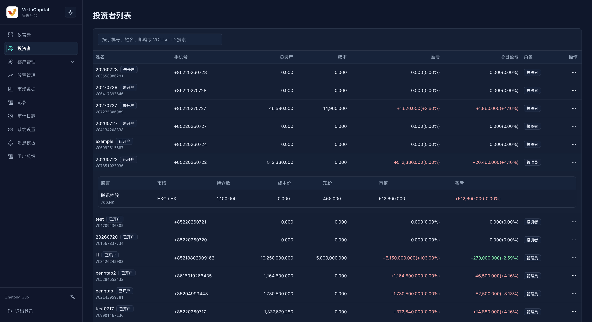
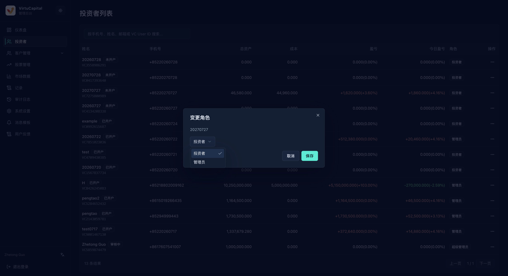

## 投资者列表

**操作路径**：左侧导航栏 → 「投资者」

使用搜索框可按手机号、姓名、电子邮件或 VC User ID 查找用户。操作前先核对姓名、手机号和 VC User ID，避免选错账号。

### 列表信息

| 字段 | 说明 |
| --- | --- |
| **姓名 / VC User ID** | 用户名称、开户状态和平台用户编号 |
| **手机号** | 注册手机号 |
| **总资产 / 成本** | 当前资产总额和持仓成本 |
| **盈亏 / 今日盈亏** | 累计及当日盈亏金额与比例 |
| **角色** | 投资者、管理员或超级管理员 |
| **操作** | 点击查看持仓、查看详情、编辑用户、变更角色或删除用户 |

## 查看持仓

在投资者列表中展开用户，可快速查看改用户持有的股票、所在市场、持仓数、成本价、现价、市值和盈亏。需要查看完整账户资料时，再进入「查看详情」。

## 用户操作
点击目标用户右侧的「操作」按钮，选择需要执行的功能。
### 查看详情

点击用户右侧的「操作」→「查看详情」，可查看用户资料、角色、资产、各币种余额和持仓情况。该页面适合核对账号及资产信息。

:::warning 敏感资料
详情页包含联系方式、资产和持仓信息，只在业务需要范围内查看和使用。
:::

### 编辑用户

可修改姓名、邮箱和手机号。确认资料属于当前用户后再保存；编辑用户不会改变其资产或角色。

### 变更角色

可在页面提供的角色中选择并保存。角色会影响后台访问权限，操作前必须核对用户并确认已经获得授权。

### 删除用户

删除入口位于用户右侧的「操作」菜单中。执行前必须再次核对姓名、手机号、VC User ID、资产和持仓情况。

:::danger 不要轻易删除用户
删除用户不是日常整理操作。只有在确认目标账号、相关资产和持仓已经妥善处理，并取得明确授权后才可执行。无法确认时，立即取消，不要删除。
:::
