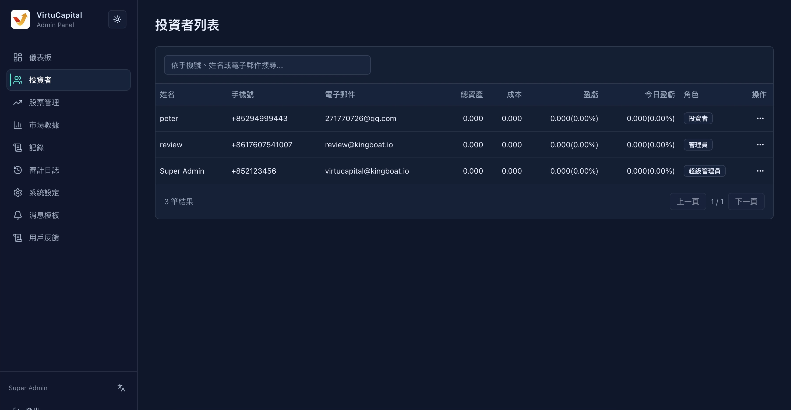

## 3. 投资者管理

### 3.1 投资者列表

**操作路径**：左侧导航栏 → 「投资者」

#### 检索功能

支持多维度检索投资者：
- **手机号**：输入完整或部分手机号
- **姓名**：输入投资者姓名
- **电子邮件**：输入注册邮箱

> 🔍 **技巧**：支持模糊搜索，输入部分信息即可匹配。

#### 表格字段说明

| 字段 | 说明 |
|------|------|
| **姓名** | 投资者真实姓名 |
| **手机号** | 注册手机号 |
| **电子邮件** | 注册邮箱地址 |
| **总资产** | 该投资者的股票市值 + 现金余额 |
| **成本** | 该投资者的历史投入成本 |
| **盈亏** | 累计盈亏金额及涨跌幅百分比 |
| **今日盈亏** | 当日盈亏金额及涨跌幅百分比 |
| **角色** | 用户权限级别 |
| **操作** | 可执行的管理操作 |

#### 角色类型

| 角色 | 权限范围 |
|------|---------|
| **投资者** | 普通用户，可进行交易、查看持仓等 |
| **管理员** | 可管理投资者、审核记录、查看数据 |
| **超级管理员** | 拥有全部权限，包括系统设定、角色变更等 |

### 3.2 投资者操作

点击「操作」列的按钮，可执行以下操作：

#### 查看详情
- 查看该投资者的完整资料
- 包括：个人信息、持仓明细、交易记录、资金流水等

#### 编辑用户
- 修改投资者的基本信息（姓名、联系方式等）
- 修改投资者的账户设置

#### 变更角色
- 将投资者升级为管理员
- 将管理员降级为投资者
- **超级管理员**才能执行此操作

> ⚠️ **风险提示**：变更角色前请确认用户身份，避免权限滥用。

#### 删除用户
- 永久删除该投资者账户
- **此操作不可逆**，删除前系统会要求二次确认
- 删除前请确认已完成必要的数据核对与业务留痕

