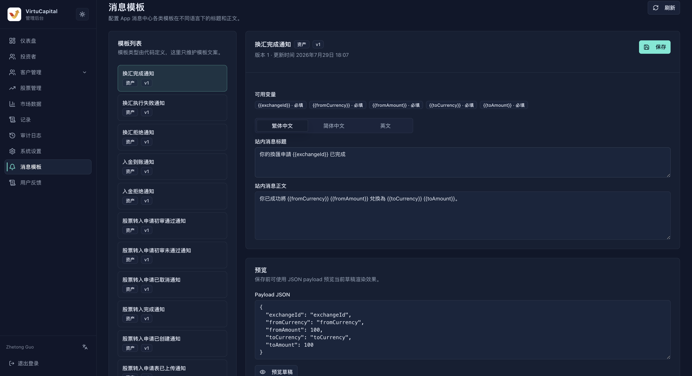
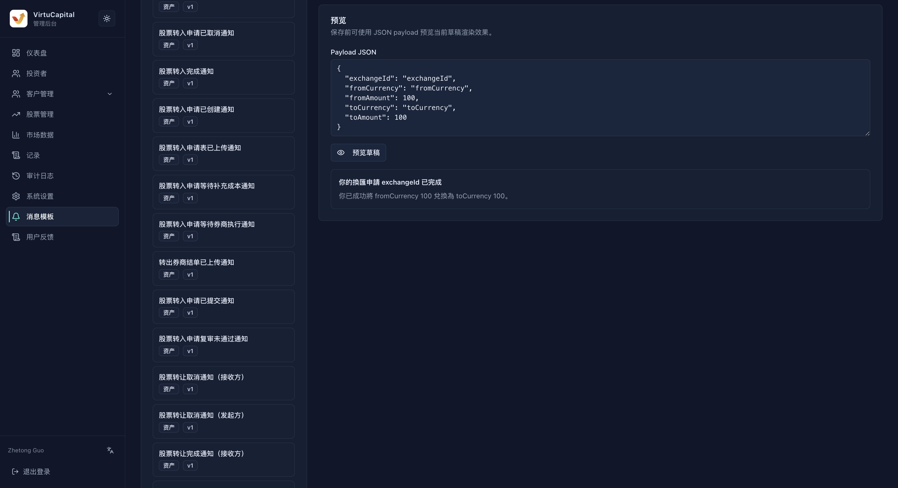

##

**Navigation**: Left sidebar → “Message Templates”

The system includes business templates for the App message center. Template types are defined by the system. Administrators can select templates, maintain multilingual titles and bodies, verify variables, preview drafts, and save content.

### Template List

The template list on the left shows the template name, business category, and version. Select a template by business event, then check the template name, category, version, and update time in the title area on the right so you do not edit a similarly named template with a different trigger target.

Common categories include:

| Category | Typical Events |
| --- | --- |
| **Currency exchange** | Submission, completion, execution failure, or rejection |
| **Deposit / Withdrawal** | Credit, approval, rejection, or request for supplementary information |
| **Stock transfer / Share transfer** | Submission, first review, final review, pending recipient confirmation, completion, cancellation, or refusal |
| **Orders** | Execution, cancellation, or rejection |
| **Account security** | Email, login-password, or trading-password change reminders |
| **System** | System announcements and other platform events |

“Refresh” reloads the system-defined template list. After using it, select the target template again and confirm that you have not switched to another version.

### Edit a Template

1. Select the target template on the left.
2. Review “Available Variables” and distinguish required variables from optional ones.
3. Select the Traditional Chinese, Simplified Chinese, or English tab.
4. Edit the “In-App Message Title” and “In-App Message Body.”
5. Compare the other languages and verify that meanings, amounts, currencies, and statuses are consistent.
6. Preview using a test Payload.
7. After a final review, click “Save.”

### Variable Rules

- Use each variable’s complete name and brace format exactly as shown on the page, for example `{{exchangeId}}`.
- Variables marked “Required” must be retained, or actual messages may omit critical information.
- Do not rename or translate variables, and do not add variables that the back office does not provide.
- The same variable must have the same meaning in the title and body.
- Use only fictional test values in the example Payload; never paste real user, order, or account information.

### Preview a Draft

In Payload JSON, provide test values for the variables listed on the page, then click “Preview Draft.” A preview checks only how the current draft renders; it does not mean that a message has been sent.

Check that:

1. The JSON is valid and field names match the variables exactly.
2. No unresolved `{{variable}}` remains in the preview.
3. Amounts, currencies, quantities, user forms of address, and status copy read naturally.
4. None of the three languages is truncated, mistranslated, or mixed with another language.
5. The title and body describe the same business outcome.

### Save Boundaries

“Save” changes template copy and may affect future real notifications. Complete the organization’s copy-review process before saving. This page is not used to send an individual message to a user manually. If the preview is incorrect, fix the variables or Payload first; do not repeatedly save unverified versions.
