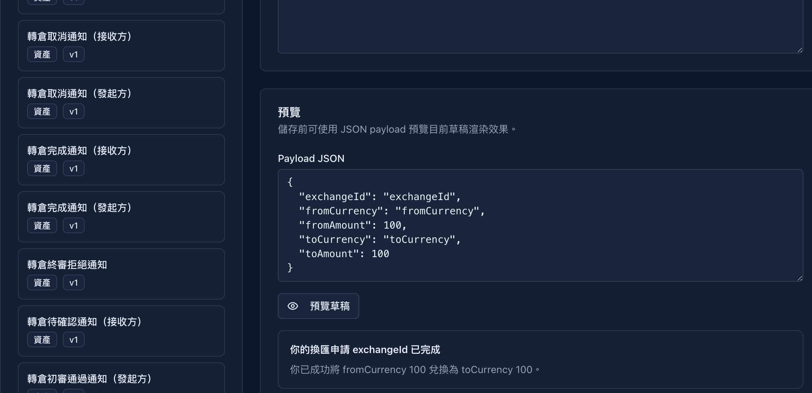

## 9. Message template management

**Operation path**: Left navigation bar → "Message Template"

The system has built-in App message center templates for a variety of business scenarios, and administrators can maintain titles and bodies in different languages. The template type is defined by the system code, and the background is mainly responsible for copywriting editing, variable checking and draft preview.

### 9.1 Template list

| Template name | Trigger scene |
|---------|---------|
| **Currency exchange completion notification** | Currency exchange successful |
| **Exchange execution failure notification** | Currency exchange failure |
| **Exchange Rejection Notice** | Currency exchange application rejected |
| **Deposit notification** | Deposit approved and credited |
| **Deposit Rejection Notice** | Deposit application rejected |
| **Rollover cancellation notification (receiver)** | Stock rollover canceled (receiver) |
| **Rollover cancellation notification (initiator)** | Stock rollover canceled (initiator) |
| **Rollover completion notification (receiver)** | Stock rollover completion (receiver) |
| **Notice of completion of transfer (initiator)** | Completed transfer of stock (initiator) |
| **Notice of final rejection of transfer** | The final review of the transfer application was rejected |
| **Notification of transfer pending confirmation (receiver)** | Waiting for the receiver to confirm the transfer |
| **Notice of passing the preliminary review of the transfer (initiator)** | Passing the preliminary review of the transfer application |
| **Notice of rejection of initial review for transfer** | The initial review of transfer application was rejected |
| **Notice of transfer pending final review** | Transfer application pending final review |
| **Transfer rejection confirmation (receiver)** | Receiver confirmation of rejection |
| **Notice of rejection of transfer (initiator)** | Notify the initiator of rejection |
| **Transfer Submission Notice** | The transfer application has been submitted |
| **Withdrawal approval notification** | Withdrawal application approved |
| **Withdrawal rejection notification** | Withdrawal application rejected |
| **E-mail change reminder** | User changes email address |
| **Login password change reminder** | User changes login password |
| **Transaction password change reminder** | User changes transaction password |
| **System Announcement** | Platform Release Announcement |
| **Order Cancellation Notification** | Trading order canceled |
| **Order transaction notification** | Transaction order transaction |
| **Order Rejection Notification** | Trading order rejected |
| **Stock transfer notification** | Stock transfer submission, preliminary review, final review, completion, cancellation, rejection and other nodes |
| **Stock Transfer Notification** | Data upload, cost to be replenished, completion, rejection and other nodes of the stock transfer process |

### 9.2 Template editing

**Operating steps**:
1. Click the template name to enter the editing page
2. Select the language tab (Traditional Chinese / Simplified Chinese / English)
3. Modify the title and text of messages on the site
4. Check the "Available Variables" list to confirm that the required variables have been reserved
5. Enter the test data in Payload JSON and click "Preview Draft"
6. Click "Save" to save the template

> 💡 **Variable description**: The `{变量名}` part in the template will be automatically replaced with the actual value when sending.

---
