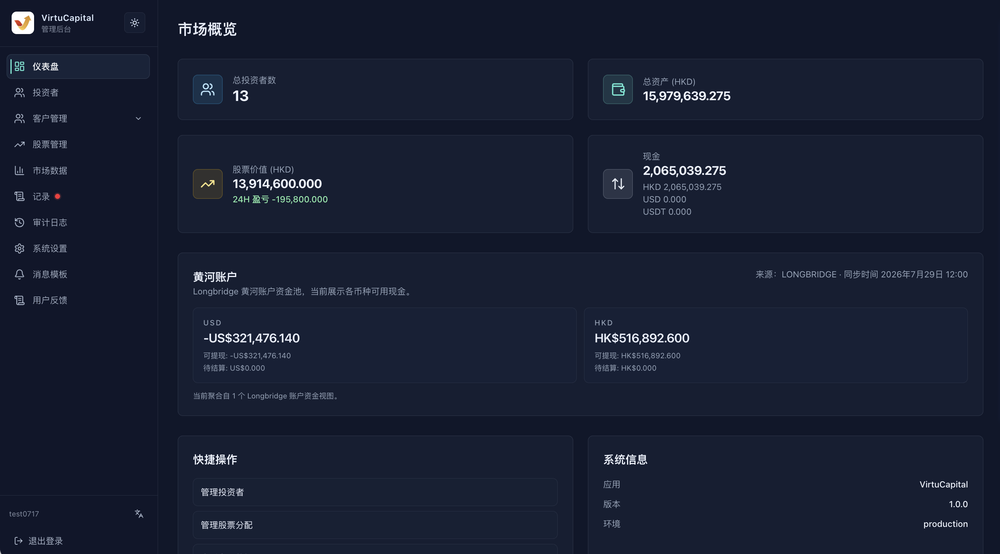
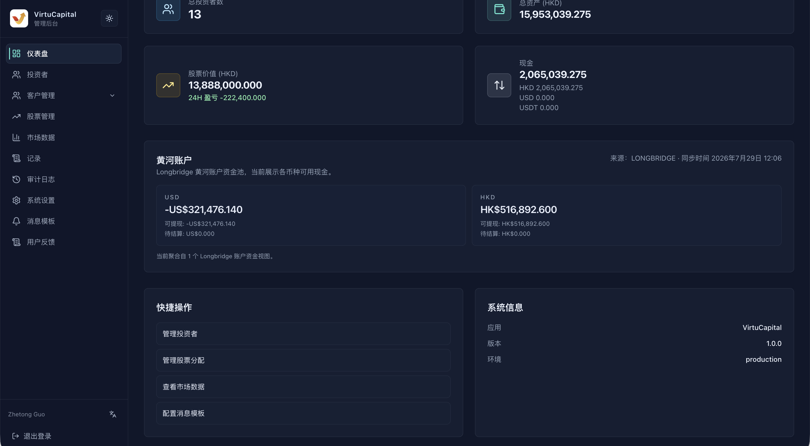

##

The dashboard is the administrator’s default home page after login and provides **real-time monitoring** of the platform’s core data.

### Market Overview Cards

| Metric | Description |
| --- | --- |
| Total investors | Total number of investors registered on the platform |
| Total assets (HKD) | Sum of all investor assets, converted to HKD at the current exchange rate |
| Stock value (HKD) | Total market value of all stocks held by investors |
| ├── W/L 24-hour P/L | Change in profit or loss on stock holdings over the past 24 hours |
| Cash | Aggregate cash balances by currency |
| ├── HKD | HKD cash balance |
| ├── USD | USD cash balance |
| └── USDT | USDT balance |

:::tip Purpose
Quickly understand the platform’s overall asset scale and distribution of funds.
:::

### Yellow River Account

Displays the visible currency balances of the platform account.
- USD balance
- HKD balance\
Balances are for viewing and reconciliation only. Perform actual transfers, credits, or debits through the corresponding business workflow.

### Quick Actions

Quick-action cards open frequently used pages such as Investors, Stock Management, Market Data, and Message Templates. After clicking, confirm that the page title matches the intended destination before acting. Using the browser Back button does not automatically undo content that has already been saved or submitted.

### System Information

| Item | Description |
| --- | --- |
| **Application** | Current back-office application name |
| **Version** | Current deployment version, used for troubleshooting |
| **Environment** | Current runtime environment; never mix test and production data |

### Daily Inspection Recommendations

1. Confirm that total assets, stock value, and cash have no unexplained sudden changes.
2. Check whether platform account balances agree with recently completed fund records.
3. Check whether a pending-task indicator appears beside “Records.”
4. Check the latest market-data synchronization status.
5. When reporting a problem, include the page, time, environment, and version, but do not attach customer data that has not been redacted.
