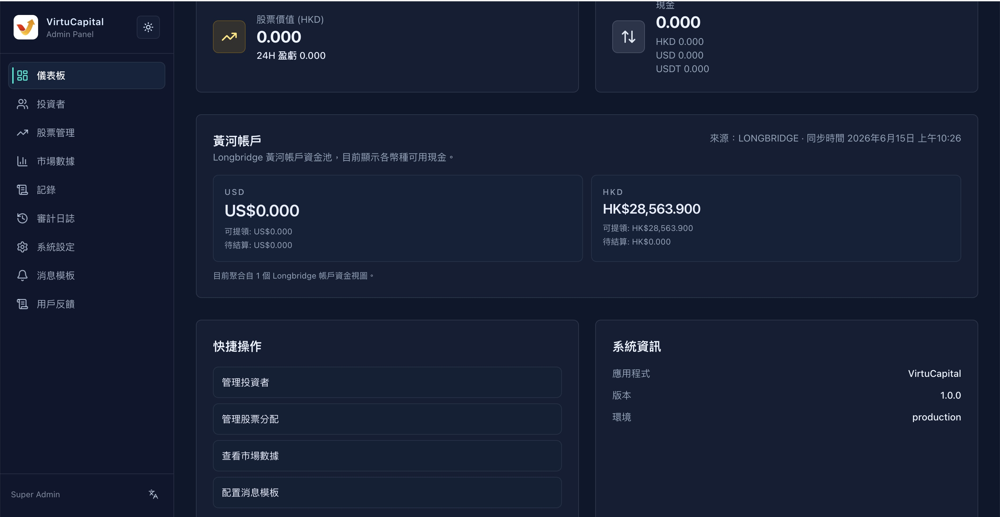

## 2. Dashboard Overview

The dashboard is the default homepage after the administrator logs in, providing **real-time monitoring** of the platform's core data.

### 2.1 Market Overview Card

| Indicator | Description |
|------|------|
| **Total number of investors** | Total number of registered investors on the platform |
| **Total Assets (HKD)** | Sum of all investor assets (converted to HKD at current exchange rate) |
| **Stock Value (HKD)** | The sum of the market value of stocks held by all investors |
| ├─ W/L 24-hour profit and loss | Changes in profit and loss of stock market value in the last 24 hours |
| **Cash** | Summary of cash balances by currency |
| ├─ HKD | Hong Kong Dollar Cash Balance |
| ├─ USD | USD Cash Balance |
| └─ USDT | USDT Balance |

> 💡 **Purpose**: Quickly grasp the overall asset size and fund distribution of the platform.
>

### 2.2 Yellow River Account

Display the account balance of the platform’s own funds:
- **USD Balance**
- **HKD Balance**

> ⚠️ **Note**: Huanghe account is used for fund allocation on the platform, please operate with caution.

### 2.3 Quick operations

Provides quick access to commonly used functions:
1. **Manage Investors** → Jump to investor list page
2. **Manage Stock Allocation** → Jump to the stock management page
3. **View market data** → Jump to market data page
4. **Configure message template** → Jump to message template page

### 2.4 System information

| Project | Description |
|------|------|
| Application | System Name (Virtu Capital) |
| Version | Current system version number |
| Environment | Operating environment (production environment/test environment) |

---
