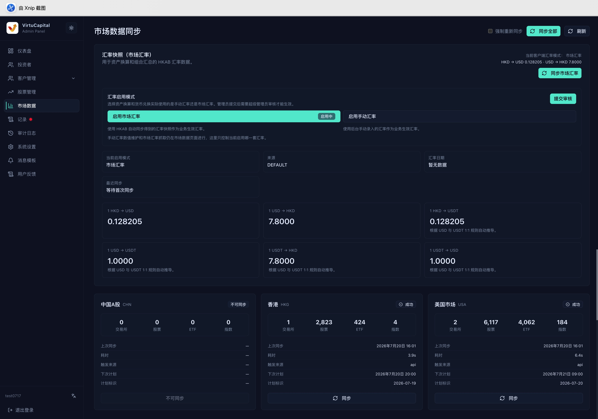
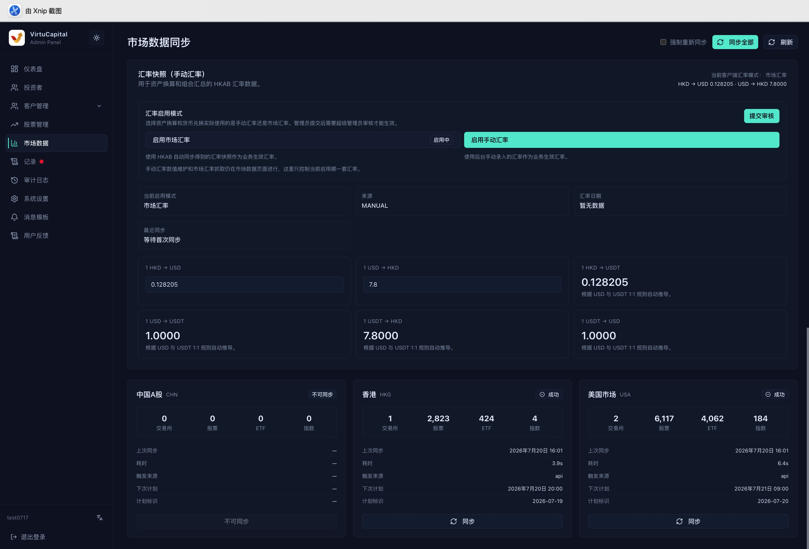

## Market Data Management

**Navigation**: Left sidebar → “Market Data”

The Market Data page manages exchange rates used by the business and shows synchronization status for China A-shares, Hong Kong stocks, and US stocks. The upper-right controls provide “Force Resync,” “Sync All,” and “Refresh”; each market can also be synchronized independently.

### Active Exchange-Rate Mode

Administrators can choose which exchange rates are used for client asset conversion and currency exchange:

| Mode | Description |
|------|------|
| **Market rates** | Uses exchange-rate snapshots synchronized automatically from HKAB |
| **Manual rates** | Uses business exchange rates entered in the back office |

After changing the mode, click “Submit for Review.” The change takes effect only after approval by a super administrator. The page also shows the currently active mode, data source, exchange-rate date, and latest synchronization time.

### Exchange-Rate Maintenance

The system supports the following six exchange-rate pairs:

| Exchange-Rate Pair | Exchange-Rate Pair |
|--------|--------|
| 1 HKD → USD | 1 USD → HKD |
| 1 HKD → USDT | 1 USD → USDT |
| 1 USDT → HKD | 1 USDT → USD |

In Market Rates mode, click “Sync Market Rates” to retrieve the latest snapshot. In Manual Rates mode, enter each exchange-rate value and submit it for review. The current business exchange rates do not change until the review is approved.

### Stock-Market Data Synchronization

Each market card shows:

| Field | Description |
|------|------|
| **Exchanges / Stocks / ETFs / Indices** | Amount of data currently synchronized |
| **Synchronization status** | Successful, failed, or unavailable |
| **Last synchronization / Duration** | Time and duration of the latest task |
| **Trigger source** | API, scheduled task, or manual back-office trigger |
| **Next schedule / Schedule identifier** | Automatic synchronization schedule information |

- “Sync” synchronizes only the corresponding market.
- “Sync All” synchronizes all supported markets in sequence.
- “Force Resync” ignores the existing state and retrieves all data again when required.
- If the current China A-share card shows “Unavailable,” its button is disabled and no repeated attempt is needed.

> ⚠️ A forced synchronization may take a long time. Before starting, confirm that no other synchronization task is running. When it finishes, use “Refresh” to view the latest status.
