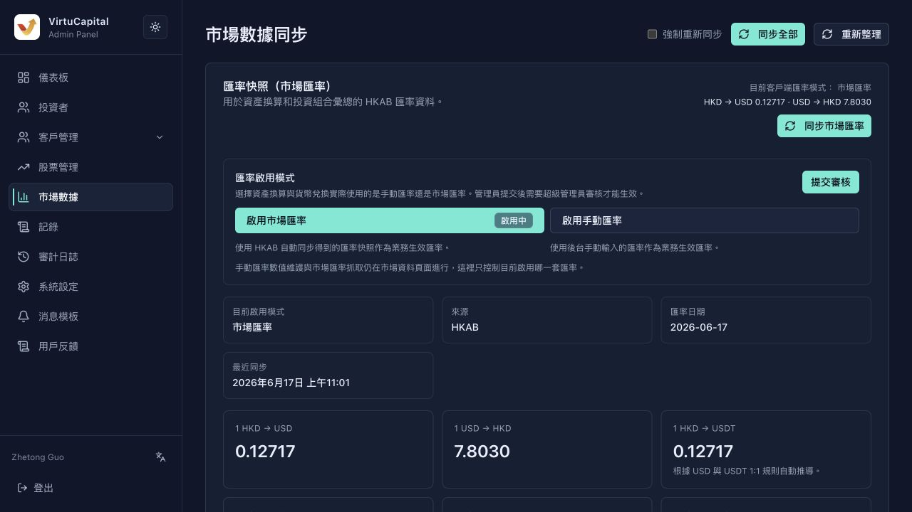
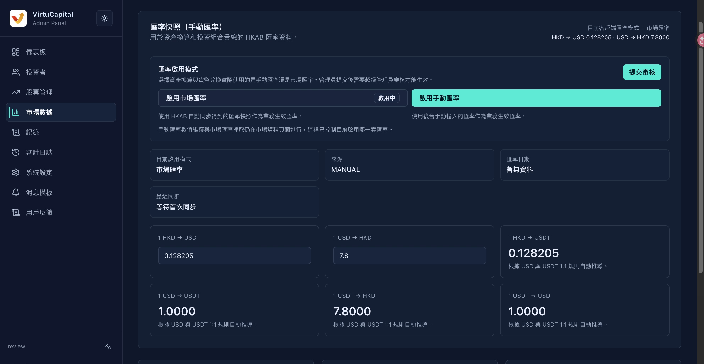
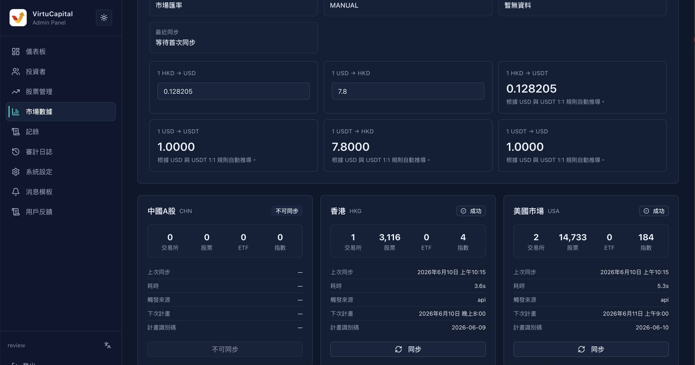

## 5. Market data management

### 5.1 Exchange Rate Snapshot

**Operation path**: Left navigation bar → "Market Data" → "Exchange Rate Snapshot"

The Market Data page now manages both **Market Rate Synchronization**, **Manual Rate Maintenance** and **Rate Enablement Mode**. The administrator can choose to use the actual market exchange rate or manual exchange rate for client asset conversion and currency exchange; it must be reviewed by the super administrator after submission.

#### Exchange rate list

| Field | Description |
|------|------|
| **Source** | Exchange rate data source |
| **Exchange Date** | The effective date of the current exchange rate |
| **Market exchange rate | Fixed exchange rate** | Switch exchange rate type |
| ├─ Automatic refresh | The system automatically obtains the latest exchange rate from the market |
| └─ Manual editing | The administrator manually enters the exchange rate (submit for review) |

#### Exchange rate enablement mode

| Mode | Description |
|------|------|
| **Market exchange rate** | Use the exchange rate snapshot automatically synchronized by HKAB as the effective business exchange rate |
| **Manual exchange rate** | Use the exchange rate manually entered in the background as the business effective exchange rate |

**Operating steps**:
1. Select market exchange rate or manual exchange rate in the "Exchange rate activation mode" area;
2. Click "Submit for review";
3. It will take effect after being approved by the super administrator.

> 💡 **Note**: Market exchange rate capture and manual exchange rate value maintenance are still performed on the market data page; the "Exchange Rate Enablement Mode" only controls which set of exchange rates is actually used for the current business.

#### Supported exchange rate pairs

| Exchange rate pair | Description |
|--------|------|
| 1 HKD → USD | Hong Kong Dollar to US Dollar |
| 1 USD → HKD | USD to HKD |
| 1 HKD → USDT | Hong Kong Dollar to USDT |
| 1 USD → USDT | USD to USDT |
| 1 USDT → HKD | USDT to HKD |
| 1 USDT → USD | USDT to USD |

> ⚠️ **Audit Requirements**: Manually edited exchange rates need to be submitted for review and will take effect after passing the review.

#### Steps to edit exchange rate

1. Click "Edit" in the corresponding exchange rate row
2. Enter the new exchange rate value
3. Click "Submit for Review"
4. Wait for approval by the super administrator

### 5.2 Stock market data

Display the data synchronization status of each market:

#### Hong Kong stock market information

| Field | Sample Value | Description |
|------|--------|------|
| **Exchange** | 1 | Number of exchanges |
| **Stocks** | 3,106 | Number of stocks synced |
| **Indices** | 4 | Number of synchronized indices |
| **Last sync** | May 25, 2026 7:53 pm | Last sync time |
| **Time consuming** | 4.0s | Last synchronization time |
| **Trigger Source** | api | Synchronous triggering method |
| **Next time plan** | May 25, 2026 8:00 pm | Next automatic synchronization time |
| **Plan ID** | 2026-05-24 | Synchronization task ID |

#### Supported markets

- **China A-shares**
- **Hong Kong Stocks**
- **US Stocks**

> 💡 **Note**: Stock market data is usually automatically synchronized by the system, and administrators generally do not need manual intervention. If you encounter data anomalies, you can contact the technical team to handle it.

---
---
title: Market Data Management
sidebar_position: 2
---
