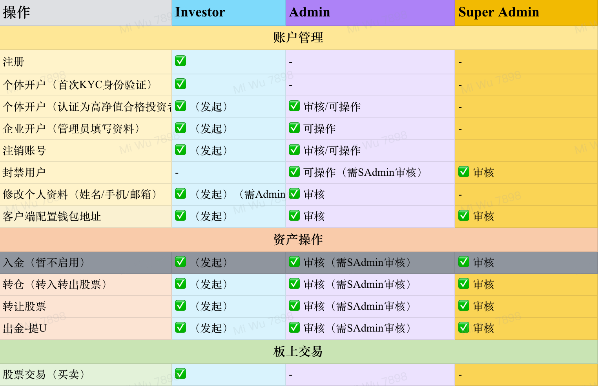

## Role Permissions and Operating Boundaries

The two tables below summarize what investors, administrators, and super administrators can do. Before acting, confirm whether your role is initiating a request, performing the first review, or changing a setting. Any action marked as requiring super-administrator review must wait for final approval.

Actual access also depends on organizational authorization, account status, and the deployed version. If the page and the tables differ, follow the stricter boundary.

### Role Changes

1. Locate the user precisely using the name, mobile number, and VC User ID.
2. Verify the current role, target role, and approval basis.
3. Grant only the minimum role required for the person’s responsibilities.
4. After the change, require the user to log in again and verify the visible menus.
5. Verify the operator, target user, time, and result in the audit log.

:::warning High-risk operations
Role elevation, system settings, exchange rates, and final reviews involving funds or positions must not be completed by one person circumventing the approval chain. The presence of a button does not mean that the current person has business authorization to use it.
:::

### Auditing and Traceability

After completing a role change, review, or configuration operation, verify the record in the audit log. Narrow the search using the operator, target user, resource ID, result, and time range. Failed records must also be retained and investigated.

### Permission Revocation

When a person changes roles, leaves the organization, shares an account, experiences an anomalous login, or reaches the end of an authorization period, promptly reduce or revoke access through the organization’s approval process and inspect recent audit logs. Do not use a display-name change as a substitute for revoking permissions.

### Contact Support

| Issue Type | Contact |
| --- | --- |
| Technical issue | tech-support@virtucapital.com |
| Business inquiry | operations@virtucapital.com |
| Emergency | 24-hour hotline: +852-xxxx-xxxx |

When submitting a problem, include:

- Time, environment, and current route;
- Current account role (never provide a password or verification code);
- Reproduction steps and page error text;
- Related business-record ID or audit-log ID;
- Redacted screenshots or logs.
