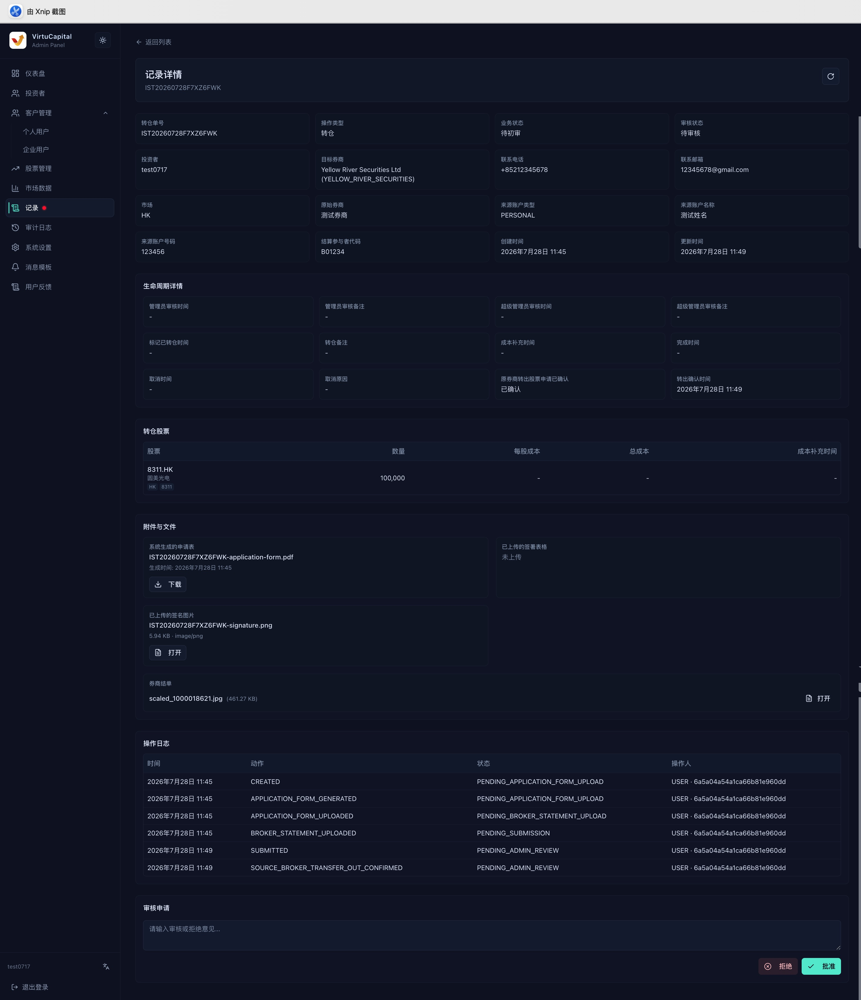

##

**Navigation**: Left sidebar → “Records”

The Records page presents orders, deposits, withdrawals, currency exchanges, share transfers, stock transfers, and other business activities in one place.\
A red dot on the menu means that records are awaiting action.

## Search and Review Records

The administrator’s record list uses **Pending Action** as the default review status,\
so administrators can deal with work that requires their attention first.\
**Click View Details to review a record that requires your action.**\
To find other records, filter by review status, record type, investor, and time.

## What Pending Records Include

- **Core business reviews**: Account-opening reviews, stock transfers, share transfers, withdrawals, and other items that require administrator action or escalation for final review.
- **User information changes**: Changes to names, contact details, identity information, or other user information.
- **System information changes**: Platform fees, per-user fees, message-center text, account-opening agreements, stock-transfer agreements, and other configuration or document changes.

## How to Filter Other Records

Click “Apply Filters” to run the query, “Reset” to clear the filters, and “Refresh” to retrieve the latest status.\
The list shows the investor, stock, operation type, pending task, quantity, amount, time, review status, business status, and a link to the details, with pagination.

| Filter | Description |
|------|------|
| **Review status** | **Pending Action** (default), All, No Review Required, Pending Review, Pending Super Administrator Review, Approved, Rejected, or Canceled |
| **Record type** | Account opening, orders, deposits, withdrawals, currency exchange, stock transfers, and share transfers; user information, fees, official accounts, message-center text, account-opening agreements, stock-transfer agreements, and other document changes |
| **Investor** | Search by name, email, mobile number, or VC User ID to locate the relevant user precisely |
| **Stock** | Search by stock code, Ticker, Stock Key, or name |
| **Time** | Set a start and end time to filter by record time and locate operations from a specific period |

## How to Review

Open the record details, confirm which actions your role can perform, and then approve, reject, submit for further review, or use another available action as required.

### General Review Principles

- Open the details and verify the applicant, amount or quantity, attachments, and related account.
- Check whether frozen funds or positions are sufficient and whether fees are correct.
- Compare the lifecycle, related transactions, and activity log to confirm that statuses agree.
- Reconfirm critical data before approval. When rejecting a request, provide a clear reason.
- High-risk operations such as withdrawals and stock transfers still require a second review by a super administrator after administrator approval.

### Review Examples

#### Inbound Stock-Transfer Review

Complete workflow: User submits the request → Administrator performs the first review → Super administrator performs the second review → Coordinate the transfer with the counterparty broker → Mark the transfer as completed after the stock arrives.

:::warning Review Points
- The details page shows the transfer number, operation type, business and review status, investor, destination broker, source broker, source account, settlement-participant code, inbound stocks and quantities, attachments, lifecycle, activity log, and review controls.
- Verify that the source broker’s transfer-out confirmation, source account, destination broker, stock codes, quantities, and application files agree.
- Do not approve a request with incomplete attachments or information.
- Enter a clear review note before approving or rejecting it, then confirm that the lifecycle advances to the next state.
- “Mark as Transferred” is the final step.
:::

#### Outbound Stock-Transfer Review

Complete workflow: User submits the request → Administrator performs the first review → Super administrator performs the second review → Release the stock for transfer out.

:::warning Review Points
- Important details include the receiving broker, receiving account, contact person, stocks and quantities being transferred, frozen positions, fees, market value, application attachments, lifecycle, related fund records, and activity log.
- Confirm that the receiving information is complete, the frozen quantity is sufficient, the fee is correct, and the application form, signature, and broker statement agree with the request.
- After administrator approval, wait for super-administrator review according to the workflow.
- The final status is position released.
:::

#### Share-Transfer Review

Complete workflow: User submits the request → Administrator performs the first review → Super administrator performs the second review → The system initiates the share transfer → The recipient accepts the share transfer.

:::warning Review Points
- Share-transfer details show the sender and recipient, stock, quantity, agreed price, agreed amount, currency, **BSN**, frozen position, related transactions, and activity log.
- Verify both parties’ identities, the quantity, price, and amount calculation. Confirm that the sender’s position has been frozen correctly and that no duplicate or conflicting transaction exists before approving or rejecting the request.
- Check that the BSN exists and was uploaded by an administrator.
:::

#### Withdrawal Review

**Current withdrawal function**: Send USDT/USDC to the customer. The administrator can set a transfer plan.\
**Complete withdrawal review workflow**: User submits the request → User signs to confirm the wallet address → Administrator performs the first review and sets the transfer plan → Super administrator performs the second review → The system completes the transfer → Administrator or system marks it as paid.

**Set the Transfer Plan**

During the first review, the administrator can set the transfer plan according to business needs:

- **Total amount**: The total fiat amount of this withdrawal. The total is fixed.
- **Amount per transfer**: Split the total into multiple transfers. Each transfer is usually no less than 10,000 and can be up to several million; the amount can be adjusted to the actual situation.
- **Number of transfers**: The administrator chooses how many transfers to make. The system generates the transfer plan from the total amount and number of transfers.
- After confirming the amount, number of transfers, and receiving information, click **Send Transfer**.

:::warning
- The current withdrawal function sends USDT/USDC to customers. Administrators can set the transfer plan.
- Verify the receiving account, available balance, frozen amount, fee, and attachments.
- After payment for an approved withdrawal, the system retains the OSL remittance advice and on-chain transfer record. The administrator can download them or resend them to the customer.
:::

#### Information-Change Review

Changes to customer information, market exchange rates, official accounts, deposit and withdrawal fees, market indices, message templates, and other system settings are edited by an administrator and reviewed by a super administrator.
- **Information changes**: Compare the information before and after the change; sensitive information requires additional verification.
- **Back-office operations**: Verify the operator, target resource, change summary, and execution result.

#### Other Records

- **Cash deposits**: Verify the deposit method, currency, amount, fee, payer account, and evidence. After approval, verify the related credit entry and balance change.
- **Cash withdrawals**: Verify the receiving account, available balance, frozen amount, fee, and attachments.
- **Orders, buys/sells, and currency exchanges**: Verify available funds or positions, price, fees, and market status.

:::tip
- A typical review lifecycle is: Submitted → Pending Review → Administrator Approved → Pending Super Administrator Review → Completed.
- Any review stage may become Rejected when information does not match; a user-initiated cancellation is shown as Canceled.
:::
