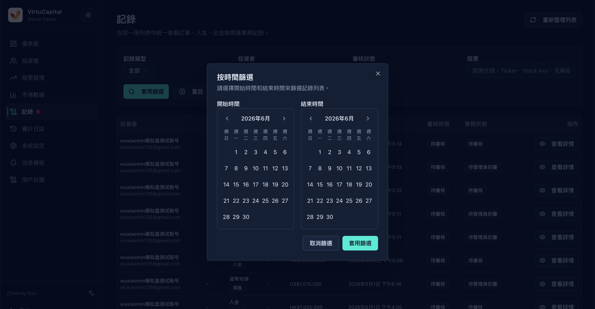
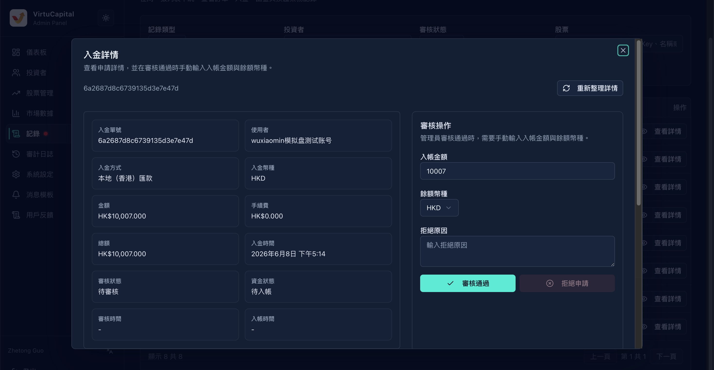

## 6. Record review

**Operation path**: Left navigation bar → "Record"

The record page is used to uniformly view and review various business records submitted by investors in the same list, including orders, deposits, withdrawals, currency exchange, stock transfers and position transfers**.


> 🔔 **Red dot reminder**: When there is a "pending review" record, the menu will display a red dot reminder.


### 6.1 Search function

Support multi-dimensional combination filtering:

#### Record type

| Type | Description |
|------|------|
| **All** | Show all types of records |
| **Order** | Stock Buy/Sell Order |
| **Deposit** | Investor deposit record |
| **Withdrawal** | Investor withdrawal record |
| **Exchange** | Currency exchange record |
| **Rollover** | Transfer record |
| **Background operations** | Records of operations performed by the administrator in the background |

#### Investor Screening

| Conditions | Description |
|------|------|
| **Name** | Investor name |
| **Email** | Registered Email |
| **Mobile phone number** | Register mobile number |
| **Investor ID** | Unique ID assigned by the system |
#### Review status filter

| Conditions | Description |
|------|------|
| **No review required** | Records that do not require administrator review such as orders |
| **To be reviewed** | Records that require administrator review such as deposits and withdrawals |
| **To be reviewed by the super administrator** | Operations that require review by the super administrator such as withdrawals |
| **Passed** | Review passed |
| **Rejected** | Review rejected |
| **Cancelled** | The investor canceled the original operation |

#### Stock Screening

| Conditions | Description |
|------|------|
| **Stock Code** | Such as 00700 |
| **Ticker** | Stock trading code |
| **Stock Key** | System internal identification |
| **Name** | Stock Name |
| **Order number** | Specific order number |

#### Other filter conditions [tentative]

| Conditions | Description |
|------|------|
| **Date** | Filter by date range (connected to date filter component) |
| **Audit status** | No review required / Pending review / Pending review by super administrator / Review passed / Review rejected |
| **Business Status** | Submitted / Withdrawn / Admin passed / Super Admin passed / Rejected / Deposited / Payment made |

> 💡 **Operation**: After setting the conditions, click "Apply Filter" to perform the search, and click "Reset" to clear the conditions.



### 6.2 Table structure

| Field | Description |
|------|------|
| **Investor** | The investor who submitted this record |
| **Stocks** | Stocks involved (if applicable) |
| **Operation Type** | Deposit / Withdraw / Transfer In / Transfer Out / Transfer / Data Change / User Deletion |
| **Quantity** | Transaction quantity (if applicable) |
| **Amount** | Amount involved |
| **Time** | Record submission time |
| **Review Status** | Current review progress |
| **Business Status** | Business processing progress |
| **View details** | View complete information and perform review operations |

### 6.3 Details and review of various types of records

#### Deposit record review

**Deposit detailed fields**:

| Field | Sample Value | Description |
|------|--------|------|
| **Deposit order number** | 6a159...... | The unique order number generated by the system |
| **User** | mi | Investor account |
| **Deposit method** | Local (Hong Kong) remittance / international remittance | Fund transfer method |
| **Deposit currency** | HKD | Deposit currency |
| **Amount** | HK$100,000.00 | Recharge amount |
| **Handling Fee** | HK$0.00 | Deducted handling fee |
| **Total** | HK$100,000.00 | Actual amount received |
| **Deposit time** | May 26, 2026 9:07 pm | User submission time |
| **Audit status** | Passed | Audit progress |
| **Fund status** | Already credited | Fund arrival status |
| **Review time** | May 26, 2026 3:03 pm | Administrator review time |
| **Account Time** | May 26, 2026 3:03 pm | Actual time of funds being credited |

**Deposit Voucher**:
- View transfer screenshots/vouchers uploaded by investors

**Audit operation**:

| Operation | Description |
|------|------|
| **Audit Passed** | Confirm that the deposit is valid and the funds are credited |
| **Reason for rejection** | If rejected, please fill in the reason for rejection |
| **Rejection of application** | Confirm rejection of the deposit application |

**Associated accounting flow**:
The account associated with the recorded transaction: Huanghe (tentative, will it be changed to a separate bank account for the VC in the future?)

| Field | Description |
|------|------|
| **Serial ID** | Serial number generated by the system |
| **Status** | Success / Failure / Processing |
| **Currency** | Running currency |
| **Amount** | Turnover amount |
| **Balance before entry** | Account balance before entry |
| **Balance after deposit** | Account balance after deposit |




#### Withdrawal record review

The review process is similar to that of deposit, focusing on:
- Whether the balance in the withdrawal account is sufficient
- Is the withdrawal account information correct?
- Is the handling fee calculation accurate?
- **And, after the administrator passes the review, a second review by the super administrator is required**

#### Buy/Sell/Transfer/Transfer/Transfer/Order

- Check whether investors’ positions/funds are sufficient, and whether handling fees and prices are reasonable
- Confirm if the market is open for trading
- **Furthermore, transfer requires administrator review and super administrator secondary review**

#### Data change review

- Check the information before and after the change
- Confirm that the applicant for change is himself/herself
- Sensitive information (such as bank cards) requires additional verification

#### User deletion review

- Confirm that the user has no outstanding assets
- Confirm that the reason for deletion is reasonable
- **This operation is irreversible**, please be careful

### 6.4 Review status transfer

```
已提交
  ├── 已撤销（用户主动取消）
  ├── 待审核 → 管理员已通过 → 超级管理员已通过 → 已入账/已打款
  │              ├── 已拒绝（管理员拒绝）
  │              └── 待超级管理员审核
  │                         ├── 超级管理员已通过
  │                         └── 已拒绝（超级管理员拒绝）
  └── 无需审核（系统自动处理）
```

---
