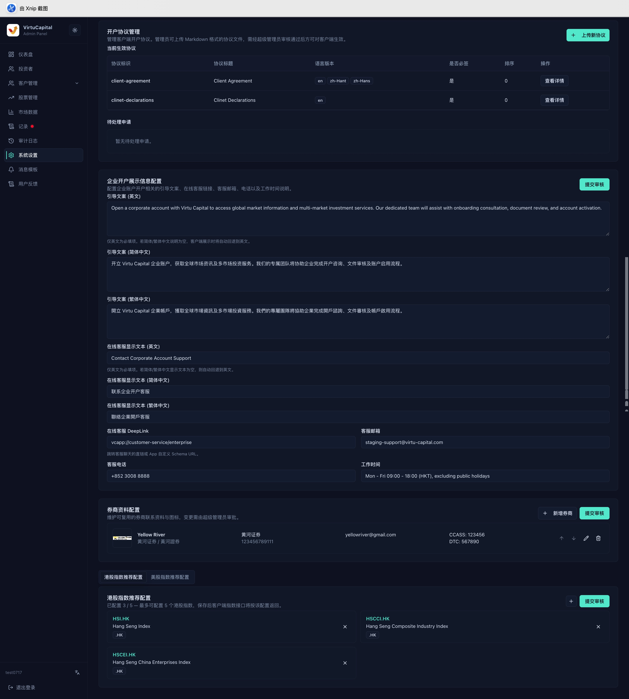

## 8. System Settings

**Navigation**: Left sidebar → “System Settings”

> ⚠️ System settings affect all users. After a change, you must click “Submit for Review”; it takes effect only after approval by a super administrator.

### 8.1 Currency Exchange, Trading, and Deposit Configuration

| Configuration | Maintainable Content |
|------|------------|
| **Currency-exchange fee** | Percentage fee for currency exchange |
| **Buy-order fee** | Fixed US-stock fee, fixed Hong Kong-stock fee, and percentage fee |
| **Sell-order fee** | Fixed US-stock fee, fixed Hong Kong-stock fee, and percentage fee |
| **International-wire deposit** | Bank name, SWIFT, account name and number, bank address, and fee |
| **Hong Kong local deposit** | Bank and branch codes, account information, FPS identifier, and fee |
| **USDT deposit** | Deposit-fee percentage |

Trading fees are calculated according to the fixed-fee and percentage rules configured on the system page. After bank information is changed, another administrator should verify each item.

### 8.2 Withdrawals, Stock Transfers, Wallets, and Agreements

- **Withdrawal configuration**: Maintain fees for international-wire, Hong Kong local-transfer, and USDT withdrawals.
- **Outbound stock-transfer configuration**: Maintain fixed and percentage fees separately for US and Hong Kong stock transfers.
- **Cryptocurrency wallets**: Maintain USDT TRC-20 and ERC-20 receiving addresses.
- **Onboarding agreements**: Upload agreement files and set the agreement identifier, title, language, whether signing is mandatory, and display order.

> 🚨 An incorrect wallet chain type or address may cause permanent asset loss. Before submission, copy and verify the full address and have a second person check it.

New or replaced agreements also require review. Multilingual agreements should use the same agreement identifier, and their client display order and mandatory-signing status must be checked.

### 8.3 Enterprise-Onboarding Display and Market Content

#### Enterprise-Onboarding Display Information

- Maintain guidance copy separately in English, Simplified Chinese, and Traditional Chinese.
- Configure the online customer-service display text and DeepLink.
- Configure the customer-service email, telephone number, and working hours.
- If Chinese content is empty, the client may fall back to displaying the English content.

#### Recommended Brokers

Add, edit, delete, and reorder brokers. Before changing anything, confirm that the name, icon, and destination information are accurate. Before deletion, confirm that the client no longer uses the broker.

#### Recommended Indices and Market Content

Under Hong Kong stock, US stock, and other tabs, search for and add recommended indices, remove items that should no longer appear, and adjust the order before submitting for review. Maintain stock recommendations by market in the same way. Follow the current back-office limits for display quantity and order.

### 8.4 Pre-Submission Checklist

1. Verify currencies, units, percentages, and fixed amounts.
2. Verify bank information, wallet addresses, customer-service links, and multilingual copy.
3. Check recommended content for duplicates, omissions, and ordering errors.
4. Click “Submit for Review” and record the reason for the change.
5. After approval, return to the page to confirm the effective value and verify the action in the audit log.
