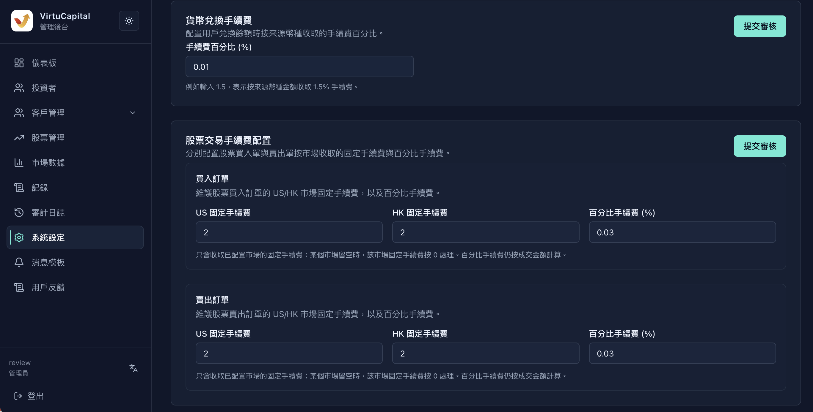
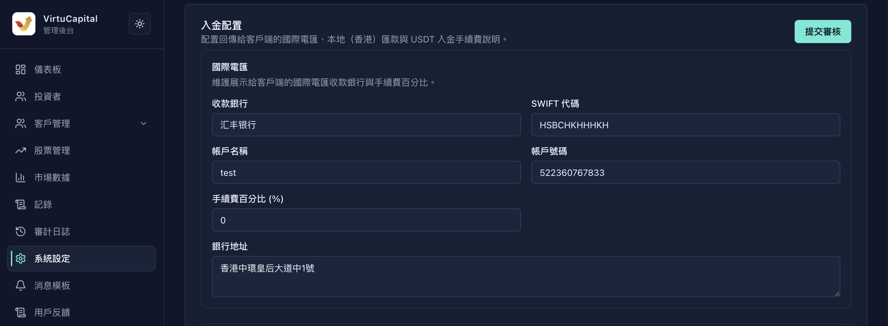
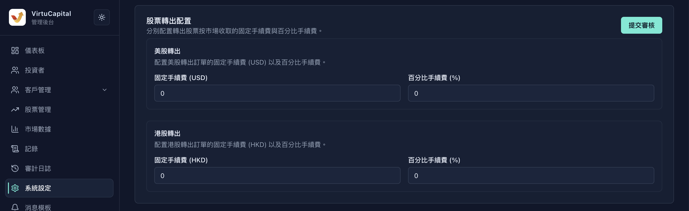
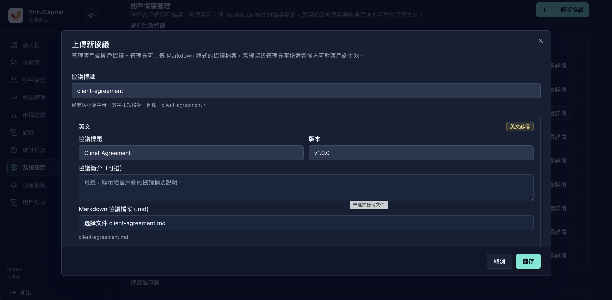
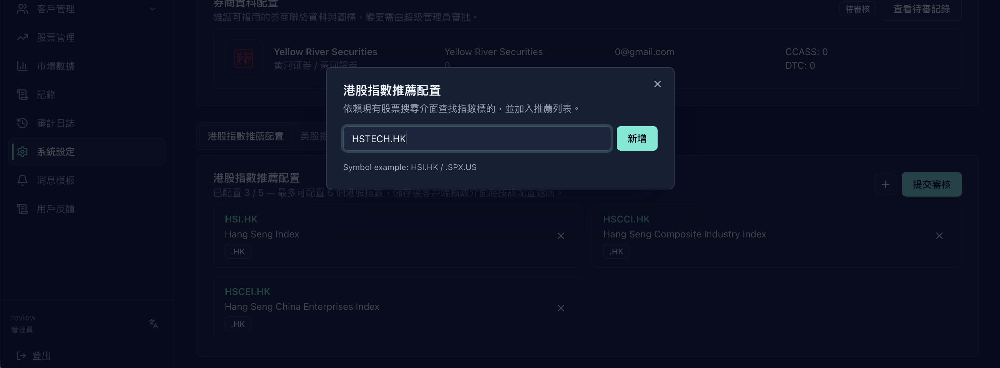
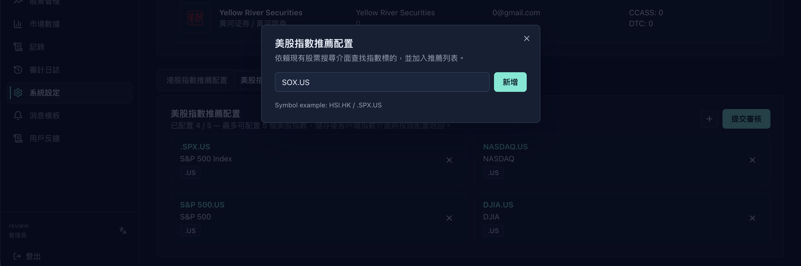

## Review Workflow and Navigation

**Navigation**: Left sidebar → “System Settings”.

:::warning Roles and effective-order sequence
1. **Step 1: Administrator** changes System Settings and clicks “Submit for Review”. Administrators can maintain settings and initiate review, but cannot make a change effective directly.
2. **Step 2: Super Administrator** verifies the change in the pending-review records and approves it. Settings are reflected in the client after approval.
:::

## Fees and Funding Configuration

### Currency Exchange and Stock-Trading Fees

This section explains how to maintain currency-exchange fees and the US and HK fixed and percentage fees for stock buys and sells.

Enter the exchange fee percentage, then enter the US fixed fee, HK fixed fee, and percentage fee for buy and sell orders; review each card and submit it for review.

:::warning A percentage is not a decimal fraction
The field is labelled “Fee Percentage (%)”; for example, `1.5` means a 1.5% charge, not 0.015%. Fixed fees must use the currency for the corresponding US or HK market.
:::

### International-Wire Deposit Details

This section explains how to enter the receiving bank, SWIFT code, account name, account number, fee percentage, and bank address for international-wire deposits.

Update each receiving detail and the fee percentage, verify them, then click “Submit for Review” at the upper right.

### Hong Kong Local and USDT Deposit Fees

This section explains how to maintain local (Hong Kong) transfer banking and FPS details, plus local and USDT deposit fees.

Enter the bank code, branch code, account details, FPS identifier, and local fee; enter the fee percentage in the USDT area, then submit for review.

:::warning Review bank details field by field
An incorrect receiving bank, SWIFT code, bank or branch code, account number, or FPS identifier can cause customers to remit to incorrect details. Have a second administrator review every field before submission; do not copy account details from screenshot examples.
:::

### Withdrawal Fees

This section explains how to set “Fee Percentage (%)” separately for international wire, local (Hong Kong) transfer, and Web3 withdrawals.

Enter a fee percentage for each withdrawal method, verify the currency and unit, then click “Submit for Review”.

### Outbound Stock-Transfer Fees

This section explains how to maintain the US-stock fixed fee (USD) and percentage fee, and the Hong Kong-stock fixed fee (HKD) and percentage fee.

Enter the two US-stock fees followed by the two Hong Kong-stock fees, confirm the market and currency match, then submit for review.

### Cryptocurrency Wallet Addresses

This section explains how to maintain the receiving wallet addresses for USDT TRC-20 and USDT ERC-20.

Paste each complete address, copy it back to verify it, then submit for review; while the status is “Pending Review”, do not assume the client uses the new value.

:::warning Do not mix wallet networks and addresses
TRC-20 and ERC-20 addresses must be entered in their respective fields. An incorrect network or address can cause permanent asset loss; copy and verify the complete address before submission, and have a second administrator independently review it.
:::

## Account-Opening Agreements

### Account-Opening Agreement Management List

This section explains how to view each current agreement’s identifier, title, language versions, required-signing status, and order.

In the list, verify the agreement identifier, title, language versions, required-signing status, and order, then confirm the result in the client.

### Upload a New Account-Opening Agreement

This section explains how to upload a new Markdown account-opening agreement and enter its identifier, title, version, and optional summary.

Click “Upload New Agreement”, enter an identifier containing only lowercase letters, numbers, and hyphens, select the matching Markdown agreement file (.md), then click “Save”.

:::warning Preserve compatibility before replacing an agreement
An incorrect agreement identifier, language version, or required-signing status can interrupt the customer signing flow. Before creating or replacing an agreement, ensure the identifier, version, Markdown file, and language content match; do not overwrite an agreement still used by the client.
:::

## Enterprise-Onboarding Display and Brokerage-Firm Details

### Enterprise-Onboarding Display Information

This section explains how to set guidance copy, online customer-service display text, DeepLink, support email, telephone number, and working hours.

Enter the multilingual content and support details required on the page, confirm the DeepLink is a customer-service chat URL or app custom Schema URL, then submit for review.

### Empty Brokerage-Firm Details List

This section explains how to view brokerage-firm records and begin a record with “Add Brokerage Firm”.

Click “Add Brokerage Firm” to open the form; use the list to inspect existing records and the actions provided on the page.

### Add Brokerage-Firm Form

This section explains how to add the brokerage icon, names in three languages, contact, telephone, email, and settlement codes.

Upload an icon, enter the required details, and provide at least one of CCASS or DTC; then click “Save as Draft”.

### Saved Brokerage-Firm Details

This section explains how to review a saved brokerage firm’s name, contact details, and settlement codes.

Check the saved record; use the edit icon to change it, the delete icon to remove it, and only the move controls provided on the page.

### Brokerage-Firm Pending-Review Status

This section explains how to confirm that brokerage-firm details have been submitted and are “Pending Review”.

Click “Submit for Review”; when “Pending Review” and “View Pending Review Records” appear, wait for super-administrator approval, then confirm the client display.

:::warning Confirm that no client dependency remains before deletion
Deletion removes that brokerage-firm record. First confirm that the client, campaign pages, and customer-service flows no longer reference it; saving a draft does not mean it is approved.
:::

## Recommended Indices

### Hong Kong Recommended-Index List

This section explains how to view Hong Kong recommended indices and the current “Configured x / 5” count.

Select “Hong Kong Index Recommendation Configuration” and check the count, symbol, name, and `.HK` market tag.

### Add a Hong Kong Recommended Index

This section explains how to add one Hong Kong recommended index.

Click the plus icon, enter an index symbol in the dialog (the example is `HSI.HK`), then click “Add”.

### Hong Kong Recommended-Index Pending-Review Status

This section explains how to confirm that a Hong Kong-index change has been submitted for review.

Review the added item and click “Submit for Review”; when the pending status and submission notice appear, wait for approval.

:::warning Do not exceed the recommendation limit or add duplicates
The page explicitly limits each market to five recommended indices. Check the symbol and market tag before adding to avoid duplicates. The interface does not provide drag-and-drop ordering, so do not assume an order can be changed.
:::

### US Recommended-Index List

This section explains how to view US recommended indices and the current “Configured x / 5” count.

Select “US Index Recommendation Configuration” and check the count, symbol, name, and `.US` market tag.

### Add a US Recommended Index

This section explains how to add one US recommended index.

Click the plus icon, enter an index symbol in the dialog (the example is `SOX.US`), then click “Add”.

### US Recommended-Index Pending-Review Status

This section explains how to confirm that a US-index change has been submitted for review.

Review the added item and click “Submit for Review”; after the status becomes “Pending Review”, wait for super-administrator approval and confirm the client index screen.

:::warning Maintain recommended indices by market
Hong Kong and US limits are counted separately. Use a symbol and market tag that match the selected market. The page shows only add and remove operations, not drag-and-drop ordering.
:::

## Pre-Submission Checklist

:::warning Pre-Submission Checklist
1. Review currencies, fixed amounts, and every “Fee Percentage (%)” field.
2. Review bank details, wallet networks, and complete addresses, and complete the second-person check.
3. Review agreement identifiers, versions, language files, and required-signing status, plus enterprise-onboarding multilingual content and customer-service entry points.
4. Review brokerage-firm details and recommended-index symbols, market tags, quantity limits, and “Pending Review” status.
5. Click “Submit for Review” in the relevant area. After super-administrator approval, confirm the effective result in the client and audit log.
:::
