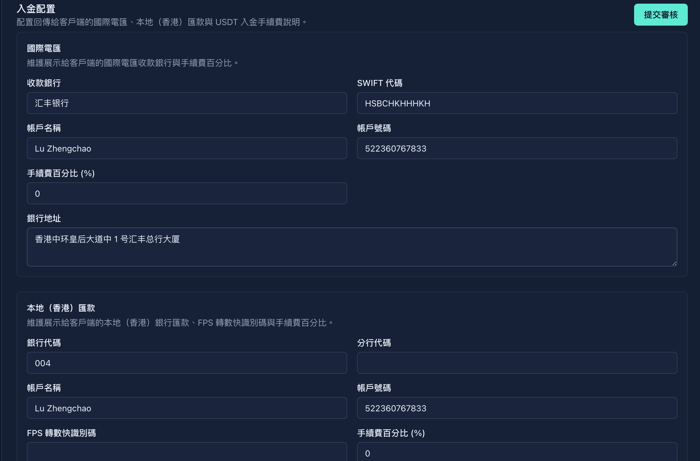

## 8. System settings

**Operation path**: Left navigation bar → "System Settings"

> ⚠️ **IMPORTANT NOTE**: All modifications to system settings need to be **submitted for review** and will not take effect until approved.

### 8.1 Currency conversion fee

| Field | Description |
|------|------|
| **Percentage of handling fees** | Proportion of handling fees charged when currency exchange |

**Operating steps**:
1. Enter the new commission percentage
2. Click "Submit for Review"
3. Wait for super administrator review

### 8.2 Stock transaction fees

#### Buy order handling fee

| Field | Description |
|------|------|
| **US fixed handling fee** | Fixed handling fee amount for buying US stocks |
| **HK Fixed Handling Fee** | Fixed handling fee amount for buying Hong Kong stocks |
| **Percent handling fee** | Handling fee charged as a percentage of the transaction amount |

#### Selling order handling fee

| Field | Description |
|------|------|
| **US fixed handling fee** | Fixed handling fee amount for selling US stocks |
| **HK Fixed Handling Fee** | Fixed handling fee amount for selling Hong Kong stocks |
| **Percent handling fee** | Handling fee charged as a percentage of the transaction amount |

> 💡 **Calculation rules**: Actual handling fee = max (fixed handling fee, transaction amount × percentage handling fee)

### 8.3 Deposit configuration

#### International wire transfer

| Field | Description | Example |
|------|------|------|
| **Beneficiary Bank** | Beneficiary Bank Name | HSBC Hong Kong |
| **SWIFT code** | Bank SWIFT code | HSBCHKHHXXX |
| **Account Name** | Receiving Account Name | Virtu Capital Limited |
| **Account number** | Collection account number | 123-456789-001 |
| **Fees Percent** | Deposit Fee Percent | 0% |
| **Bank Address** | Beneficiary Bank Address | 1 Queen's Road Central, HK |

#### Local (Hong Kong) Remittance

| Field | Description |
|------|------|
| **Bank Code** | Hong Kong Bank Code (3 digits) |
| **Branch code** | Branch code (3 digits) |
| **Account Name** | Benefit Account Name |
| **Account number** | Payment account number |
| **FPS identification code** | FPS identification code (supports fast transfer) |
| **Fee Percentage** | Deposit Fee Percentage |

#### USDT

| Field | Description |
|------|------|
| **Fees Percent** | USDT Deposit Fee Percent |

### 8.4 Withdrawal configuration

| Withdrawal method | Configuration items | Description |
|---------|--------|------|
| **International wire transfer** | Handling fee ratio | Handling fee ratio for cash withdrawal |
| **Local (Hong Kong) transfer** | Handling fee ratio | Handling fee ratio for local transfers |
| **USDT** | Handling fee ratio | USDT withdrawal fee ratio |

### 8.5 Stock transfer allocation

Configure the fixed handling fee and percentage handling fee charged according to the market when the user initiates a stock transfer.

| Market | Fixed fee currency | Percentage fee |
|------|----------------|--------------|
| **US stock transfer** | USD | Charged as a percentage of the transfer order amount |
| **Hong Kong Stock Transfer** | HKD | Charged as a percentage of the transfer order amount |

> 💡 **Note**: The fixed handling fee is used to charge the basic fee for each transfer order, and the percentage handling fee is calculated based on the transaction or transfer amount. After modification, click "Submit for review" and it will take effect after the review is passed.

### 8.6 Cryptocurrency wallet configuration

| Wallet Type | Description |
|---------|------|
| **USDT TRC-20** | Tron Chain USDT wallet address configuration |
| **USDT ERC-20** | Ethereum chain USDT wallet address configuration |

> ⚠️ **Security Warning**: Wrong wallet address configuration may result in permanent loss of funds, please check carefully.

### 8.7 Account opening protocol configuration

Manage the agreement that you need to read and agree to when opening a client account. Administrators can upload protocol files in Markdown format; after uploading, it must be reviewed and approved by the super administrator before it will take effect on the client.

| Field | Description |
|------|------|
| **Protocol ID** | Protocol unique ID |
| **Protocol Title** | The protocol name displayed by the client |
| **Language version** | Protocol corresponding language |
| **Is it required to sign** | Is it a must-read and signed agreement for account opening |
| **Sort** | Client display order |

### 8.8 Enterprise account opening display information configuration

Configure the guidance copy, online customer service link, customer service email, phone number, and working hours instructions related to corporate account opening.

| Field | Description |
|------|------|
| **Guide copy** | Supports English, Simplified Chinese, and Traditional Chinese; when Chinese is empty, it will fall back to English |
| **Online customer service display text** | Customer service entrance copy displayed on the client |
| **Online Customer Service DeepLink** | Direct link to customer service chat or App custom Schema URL |
| **Customer Service Phone** | Contact number displayed to business users |
| **Working Hours** | Customer Service Hours Description |

### 8.9 Popular index configuration

Configure the APP market page to display a list of stock market indices.
For example, the Hang Seng Index of Hong Kong stocks
For example, the Nasdaq index of U.S. stocks
**Operating steps**:
1. Select the market to configure
2. Search and add recommendation index
3. Adjust the display order (drag and drop sorting)
4. Click "Submit for Review"

### 8.10 Recommended brokerage firms and recommended stock allocations

| Configuration items | Description |
|--------|------|
| **Popular Brokerage Configuration** | Up to 4 popular brokers displayed on the APP market page can be configured |
| **Hong Kong Stock Recommended Configuration** | Recommended list of Hong Kong stocks displayed on the market |
| **US stock recommended allocation** | List of US stock recommendations displayed on the market |
| **Recommended allocation of Shanghai and Shenzhen stocks** | Recommended list of A shares displayed in the market |
| **Recommended allocation of Hong Kong stock index** | List of Hong Kong stock indices displayed on the market page |
| **Recommended allocation of US stock index** | List of US stock index displayed on the market page |

**Operating steps**:
1. Select the market to configure
2. Search and add recommended stocks
3. Adjust the display order (drag and drop sorting)
4. Click "Submit for Review"

---
