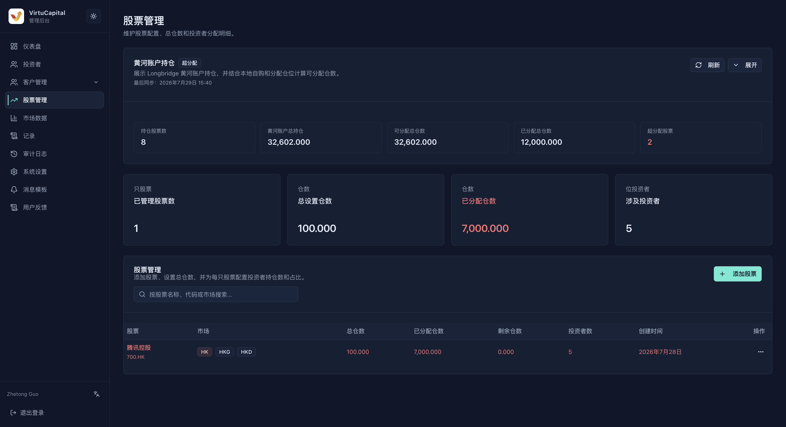
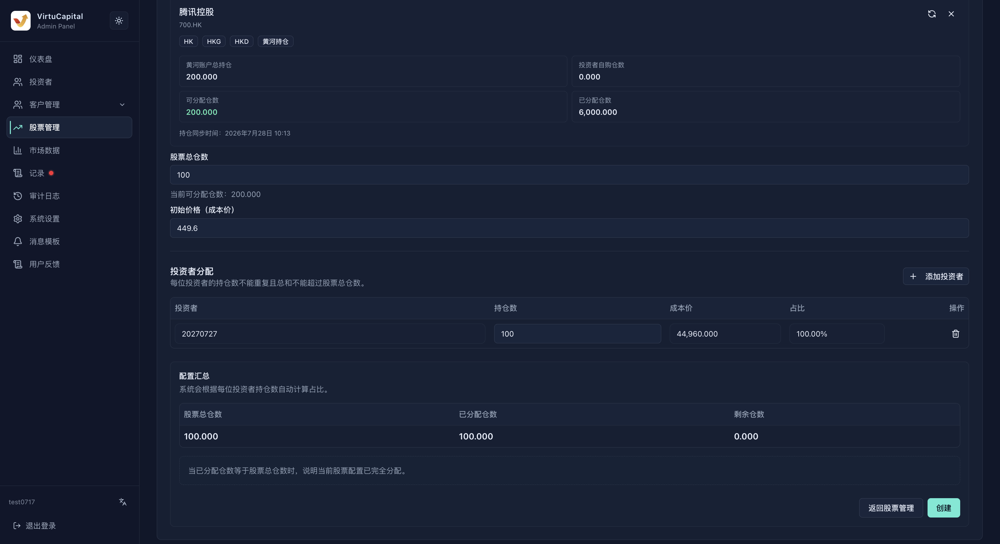

##

**Navigation**: Left sidebar → “Stock Management”

### Holdings Overview and Stock List

The page summarizes the number of stocks held, total configured quantity, allocated quantity, remaining quantity, number of investors, and any over-allocated stocks. If an over-allocation appears, verify the affected stock immediately.

Search the list by stock name, stock code, and market.

| Field | Description |
| --- | --- |
| **Stock** | Stock name and code |
| **Market** | Hong Kong, US, or another market supported by the page |
| **Total quantity** | Total quantity configured for the stock in the back office |
| **Allocated quantity** | Total quantity allocated to investors |
| **Remaining quantity** | Total quantity minus allocated quantity |
| **Investors** | Number of investors currently holding the stock |
| **Created at** | Time when the stock record was created |
| **Actions** | Management options available to the current role |

:::warning
If an “over-allocated” status appears, stop adding allocations and verify the stock’s total quantity and each investor’s quantity. Do not conceal the anomaly by creating another stock record.
:::

### Add and Allocate a Stock

Click “Add Stock,” then configure it in this order:

1. Search by region or stock code and select the stock.
2. Enter the total stock quantity and initial cost price.
3. Click “Add Investor” and enter the allocated quantity and cost price for one or more investors.
4. Verify the automatically calculated allocation percentage, allocated quantity, and remaining position.
5. Review the configuration summary, then create the stock.

| Validation Rule | Description |
|----------|------|
| **No duplicate investors** | The same investor cannot be added more than once for the same stock |
| **Quantity cannot exceed the limit** | The total quantity allocated to all investors cannot exceed the stock’s total quantity |
| **Percentage is calculated automatically** | Percentage = quantity allocated to the investor ÷ total stock quantity |
| **Available position updates dynamically** | After an allocation row is edited or deleted, the remaining position and summary update in real time |

### Complete the Allocation

When the allocated quantity equals the total stock quantity, the page shows that allocation is complete and the remaining position is 0. Even then, check every investor, quantity, and cost price before clicking Create.

> ⚠️ The initial cost price and investor cost prices affect the displayed holding cost. Verify them against actual settlement data before creation; do not substitute estimates.

### Pre-Creation Checklist

1. The stock code, name, and market agree.
2. The total stock quantity agrees with actual settlement or position records.
3. No investor with a similar name was selected by mistake; the VC User ID has been verified.
4. The sum of row quantities does not exceed the total quantity, and the cost-price currency is correct.
5. The unallocated quantity matches the business expectation.
6. After creation, return to the list and check the total quantity, allocated quantity, and investor count.

### Troubleshooting

- **Stock not found**: Check the market and code format, then confirm that market data has synchronized.
- **Cannot add an investor**: Confirm that the user exists, their status permits allocation, and they have not already been added.
- **Quantity exceeds the limit**: Reduce the allocated quantity or verify the total quantity first; do not bypass validation.
- **Data differs after creation**: Stop further allocations, record the stock code and operation time, and investigate with the audit log.
