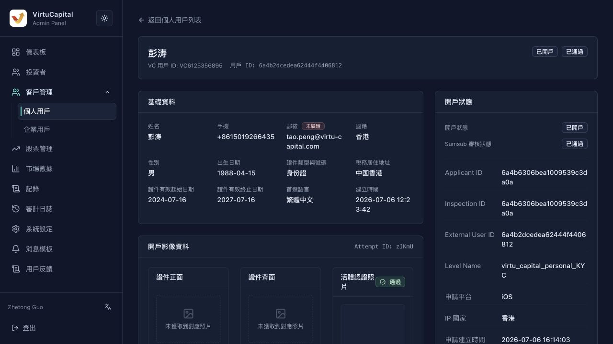

## Customer Management

**Operation path**: Left navigation bar → "Customer Management" → "Individual User/Enterprise User"

Customer management is used to view account opening information, KYC/KYB status and corporate account opening information. Compared with the "Investors" list, this module is more focused on account opening information, identity review materials, and customer type management.

### Individual users

Supports searching by name, mobile phone number, email, and VC user ID, and can be filtered by account opening status.

| Field | Description |
|------|------|
| **User information** | User name, VC user ID, internal user ID |
| **Contact information** | Mobile phone number and email address |
| **Language** | User preferred language |
| **Account opening status** | Unopened account / Opened account |
| **Sumsub Status** | Unsubmitted/Passed, etc. KYC status |
| **Data Preview** | Summary of nationality, document type, etc. |
| **Registration Time** | User Registration Time |
| **Operation** | View details |

**check the details**

After clicking "View Details", you can view:
-Basic information: name, mobile phone, email, nationality, certificate type, tax residence address, preferred language, etc.;
-Account opening image data: front and back of ID, live certification photo, upload time;
- Employment and financial information: occupation category, investment experience, annual income range, asset size;
- System information: user ID, VC user ID, role, customer type, last update time;
- Account opening status: account opening status, Sumsub review status, Applicant ID, Inspection ID, application platform, IP country, etc.

### Enterprise users

The enterprise user page is used to view company customer information and supports searching by **company name, registration number, contact person, email, mobile phone number, and VC user ID**.

| Field | Description |
|------|------|
| **Company Information** | Company name, registration number, VC user ID |
| **Contact information** | Corporate contact person, email, mobile phone number |
| **Type / Place of Registration** | Type of business and place of registration |
| **Data status** | Whether the company profile has been opened or is still in draft |
| **Account opening status** | Corporate account opening status |
| **Registration time** | Company profile creation time |
| **Operation** | View, continue to edit or create corporate account opening information based on status |

**Corporate Account Opening**

Click "Enterprise Account Opening" to enter the enterprise user account opening form. This function is used by administrators to manually open trading accounts for corporate customers and send password setting emails to contacts.

| Region | Field |
|------|------|
| **Basic information** | Company name, registration number, business type, registration place, establishment time, company address |
| **Associated users and contacts** | Select the names of associated users and corporate contacts |
| **Corporate Qualification Documents** | Business License/Business Registration Certificate, Company Seal Authorization Letter, Board Resolution, Beneficial Owner Certificate |

> 💡 **Note**: Business license/business registration certificate is a required document to create a business account; other qualification documents can be supplemented according to business needs. The page supports two operations: "Save Draft" and "Create Business Account".

---
---
title: Personal and business customer management
sidebar_position: 2
---
