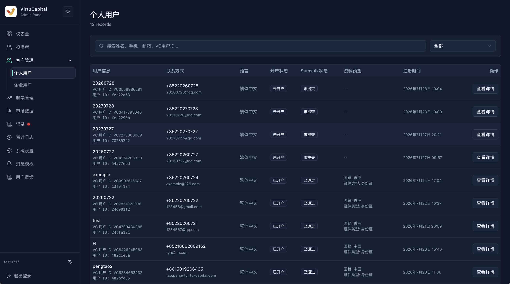
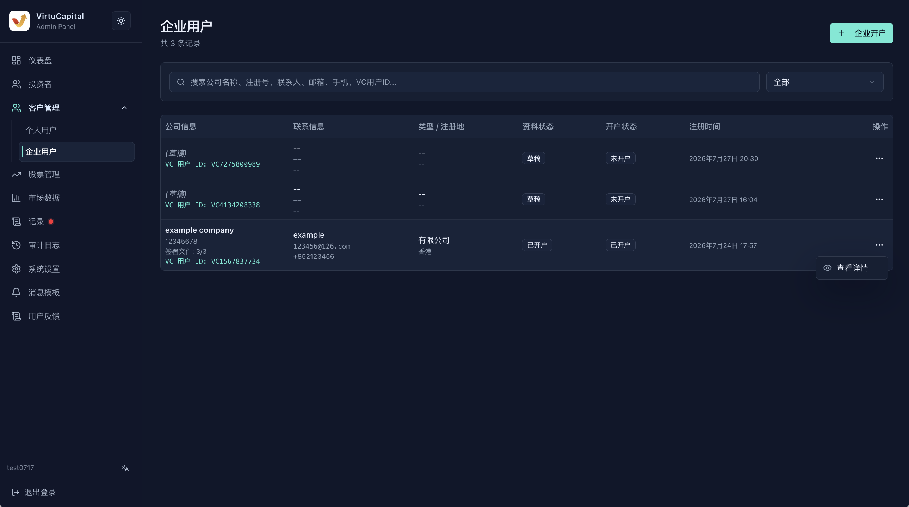

## Customer Management

**Navigation**: Left sidebar → “Customer Management” → “Individual Users / Enterprise Users”

Customer Management is used to view individual KYC, enterprise KYB, onboarding information, and onboarding progress. The “Investors” module focuses more on trading accounts and asset management.

### Individual User List

Search by name, mobile number, email, or VC User ID, and filter by onboarding status. The list shows user information, contact details, preferred language, onboarding status, Sumsub status, information preview, registration time, and a details entry point.

### Individual User Details

After opening the details page, verify the following sections:

| Section | What to Check |
| --- | --- |
| **Identity and account** | Name, contact details, nationality, document type, preferred language, and onboarding status |
| **KYC** | Sumsub status, Applicant ID, Inspection ID, application platform, and IP country |
| **Risk and supplementary information** | Risk-assessment results, supplementary questionnaires, and outstanding items |
| **Employment and finances** | Occupation, income, assets, source of funds, and investment experience |
| **Contracts and fees** | Agreement confirmations, onboarding information, and current fee configuration |
| **System information** | Internal user ID, VC User ID, role, customer type, and update time |

> ⚠️ Document images, contact details, and financial data are sensitive information. View and use them only when required for the business task.

### Enterprise User List

Search the enterprise list by company name, registration number, contact person, email, mobile number, or VC User ID, and filter by information status or onboarding status.

The list shows company information, contact details, enterprise type and jurisdiction of registration, information status, onboarding status, creation time, and an actions entry point. Confirm the record using the company name and registration number before opening the action menu.

Available actions depend on the record status:

- **View**: Open saved enterprise information.
- **Continue onboarding**: Resume from the last saved stage of a draft.
- **Delete draft**: Use only after confirming that onboarding will not continue, that no information needs to be retained, and that deletion has been authorized.

## Enterprise Onboarding Tutorial

### Preparation

Prepare approved enterprise information before starting. Do not use unauthorized real documents for demonstrations or testing.

- Legal company name, entity type, jurisdiction of registration, date of incorporation, and registration number;
- Registered, business, and correspondence addresses;
- Nature of business, principal-business description, and years in operation;
- Contact person, statement email, telephone number, and optional fax number;
- Directors, shareholders, ultimate beneficial owners, and ownership structure;
- Financial information, source of funds, tax status, account requirements, and compliance declarations;
- Enterprise evidence and signing authorizations required by the current page.

### Enter, Save, and Resume

1. In the “Enterprise Users” list, click “Enterprise Onboarding,” or select “Continue Onboarding” for an existing draft.
2. The step bar at the top shows the current stage: **Company Profile → Finance and Structure → Compliance and Accounts → Tax and Documents → Document Signing**.
3. “Save Draft” saves the content entered so far and is appropriate when leaving temporarily.
4. “Save & Next” validates the required fields in the current stage before moving to the next stage.
5. Save current changes before using “Previous” to go back.
6. After returning to the list, resume the same draft and first check whether the stage, fields, and uploaded files are complete.

Fields marked with `*` are required in the current stage. If validation fails, correct each item according to the page prompts; do not use meaningless characters to bypass validation.

### Step 1: Company Profile

Enter the enterprise’s identity, address, business, and contact information.

| Area | Visible Fields and Actions |
| --- | --- |
| **Entity information** | Legal name in English, optional Chinese name or “Confirm no Chinese name,” entity type, jurisdiction of registration, date of incorporation, company registration number, and optional business registration number |
| **Registered address** | Address line 1, city, province/state, postal code, and country or region |
| **Business address** | Full business address; even when it matches the registered address, confirm it as required by the page |
| **Correspondence-address source** | Select same as registered address, same as business address, or use another correspondence address |
| **Nature of business** | Nature of business, principal-business description, and years in operation |
| **Contact person** | Contact name, email, country/area code and telephone number, office telephone number, optional fax, statement email, and supplementary information |

### Step 2: Finance and Structure

This stage records the enterprise’s financial position and control structure. Complete the financial profile and sources of funds or wealth shown on the current page, then register each director, shareholder, and ultimate beneficial owner.

- When using “Add” controls to enter multiple people or multiple layers, use separate information for every entry.
- Total ownership or control percentages must agree with the enterprise’s structure documents.
- If the same natural person is a director, shareholder, and/or ultimate beneficial owner, disclose that person in each corresponding section as required by the page.
- Before deleting a duplicate entry, confirm that doing so will not break percentage, controller, or required-field validation.

<!-- screenshot-slot: customers-enterprise-onboarding-step-2-finance-and-structure; status: placeholder -->
> 📷 **Screenshot pending: Step 2, “Finance and Structure.”**

### Step 3: Compliance and Accounts

This stage records compliance declarations, the expected use of the account, and account-related selections. Read each question, answer it using approved information, and verify the account contact or settlement details.

- Do not guess when answering an uncertain compliance question.
- If the information involves sanctioned jurisdictions, politically exposed persons, regulated activities, or third-party funds, stop and refer the case to compliance personnel.
- “Account” selections in this stage are onboarding-application information; they do not mean that an account has been created or approved.

<!-- screenshot-slot: customers-enterprise-onboarding-step-3-compliance-and-accounts; status: placeholder -->
> 📷 **Screenshot pending: Step 3, “Compliance and Accounts.”**

### Step 4: Tax and Documents

Enter the tax residence, tax identification number, or tax declarations required by the page, and upload the enterprise documents listed in the current interface.

1. File names, company names, and validity periods must agree with the entity information.
2. Before uploading, confirm that each file is clear, complete, not protected by an unrelated password, and belongs to the enterprise.
3. Upload only authorized official documents. In a test environment, use only approved test files.
4. Move to the next stage only after the page shows that the file has been received or uploaded successfully.
5. When replacing a file, confirm whether the old file has been replaced so that conflicting versions are not retained together.

<!-- screenshot-slot: customers-enterprise-onboarding-step-4-tax-and-documents; status: placeholder -->
> 📷 **Screenshot pending: Step 4, “Tax and Documents.”**

### Step 5: Document Signing

The final stage is used to review documents awaiting signature and complete the authorized signing workflow.

- Verify the company name, signer identity, agreement version, and language.
- Confirm that the signer has valid authorization and that all prerequisite approvals are complete.
- If information is incorrect, return to the corresponding stage, correct it, and review it again.
- Without authorization, you may only view and save a draft; do not accept terms, sign, or complete final submission.

<!-- screenshot-slot: customers-enterprise-onboarding-step-5-document-signing; status: placeholder -->
> 📷 **Screenshot pending: Step 5, “Document Signing” (before signing and submission).**

<!-- enterprise-onboarding-submission-boundary: authorized-review-required -->
### Draft and Submission Boundaries

| Status | Handling |
| --- | --- |
| **Draft** | Resume with “Continue Onboarding”; check the stage, fields, and attachments before continuing |
| **Current-stage validation failed** | Remain in the current stage and complete required fields or correct formats according to the prompts |
| **Pending review / Submitted** | Follow the page status and organizational approval process; do not create another application |
| **Correction required** | First confirm whether the current status allows editing; if not, refer the case to an authorized person |

> ⚠️ Deleting a draft removes unsubmitted information. Final submission, agreement acceptance, and signing may have business or legal consequences and must be performed only by authorized personnel after review is complete.
