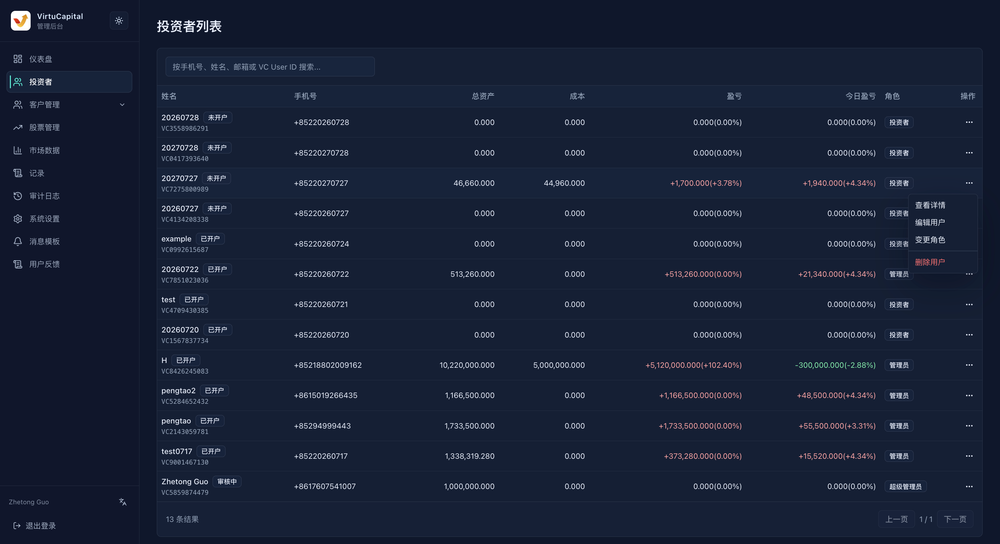

## Investor List

**Navigation**: Left sidebar → “Investors”

Use the search box to locate users by mobile number, name, email, or VC User ID. Before taking action, verify the name, mobile number, and VC User ID to avoid selecting the wrong account.

### List Information

| Field | Description |
| --- | --- |
| **Name / VC User ID** | User display name, onboarding indicator, and platform user number |
| **Mobile number** | Registered mobile number |
| **Total assets / Cost** | Current total assets and holding cost |
| **Profit/Loss / Today’s profit/loss** | Cumulative and current-day profit or loss amount and percentage |
| **Role** | Investor, administrator, or super administrator |
| **Actions** | View holdings, view details, edit user, change role, or delete user |

### View Holdings

Expand a user in the investor list to view the stocks they hold, market, holding quantity, cost price, current price, market value, and profit or loss. Open “View Details” when you need the complete account information.

## User Actions

Click the “Actions” button on the right of the target user and select the function you need.

### View Details

Click “Actions” → “View Details” on the right of the user to view the user’s information, role, assets, currency balances, and holdings. Use this page to verify account and asset information.

:::warning Sensitive information
The details page contains contact details, assets, and holding information. View and use it only when required for the business task.
:::

### Edit User

You can edit the name, email address, and mobile number. Verify that the information belongs to the current user before saving. Editing a user does not change their assets or role.

### Change Role

Select one of the roles available on the page and save. A role affects back-office access. Before taking action, verify the user and confirm that authorization has been granted.

### Delete User

The delete option is in the “Actions” menu on the right of the user. Before taking action, verify the name, mobile number, VC User ID, assets, and holdings again.

:::danger Do Not Delete Users Lightly
Deleting a user is not a routine cleanup operation. Do so only after confirming the target account, ensuring that the related assets and holdings have been handled properly, and obtaining explicit authorization. If anything is uncertain, cancel the operation and do not delete the user.
:::
