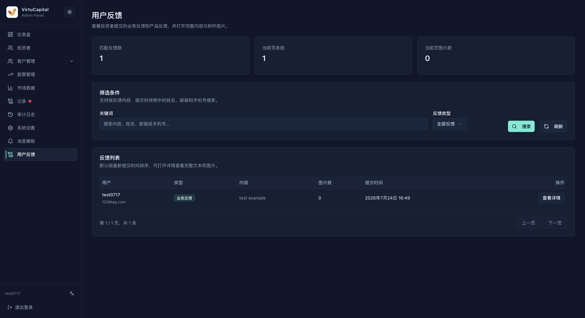

## 10. 用戶反饋處理

**操作路徑**：左側導航欄 → 「用戶反饋」

用戶反饋頁面用於檢索投資者提交的業務反饋和產品反饋，並查看完整內容與附件圖片。

### 10.1 檢索與列表

- 關鍵字支援匹配反饋內容、用戶姓名、電郵和手機號碼；
- 反饋類型可選全部、業務反饋或產品反饋；
- 點擊「搜尋」套用條件，點擊「重新整理」獲取最新記錄；
- 頁首顯示匹配總數、當前頁記錄數和當前頁圖片數。

列表展示用戶名稱與聯繫方式、反饋類型、內容摘要、圖片數、提交時間和詳情入口，並支援分頁瀏覽。

### 10.2 查看與處理

1. 點擊「查看詳情」，閱讀未截斷的反饋內容並逐張查看附件；
2. 核對提交用戶、反饋類型和提交時間；
3. 業務反饋轉交業務團隊，產品反饋轉交產品團隊評估；
4. 在內部流程中記錄處理意見，必要時透過客服或業務人員聯繫用戶。

> 💡 建議定期彙總高頻反饋；涉及帳戶、交易或資金的問題，應結合記錄和審計日誌一併排查。
