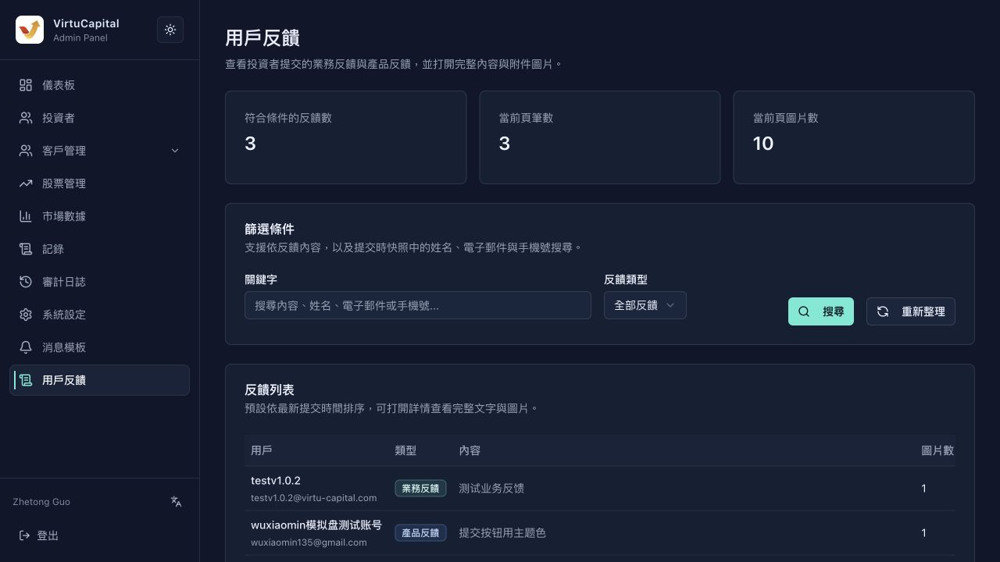

## 10. 用戶反饋處理

**操作路徑**：左側導航欄 → 「用戶反饋」

用戶反饋頁面用於查看投資者提交的業務反饋與產品反饋，並支持查看完整內容和附件圖片。

### 10.1 反饋列表

| 字段 | 說明 |
|------|------|
| **用戶名稱** | 提交反饋的投資者 |
| **反饋類型** | 業務反饋 / 產品反饋 |
| **反饋內容** | 用戶填寫的具體反饋文字 |
| **圖片數** | 用戶上傳的附件圖片數量 |
| **提交時間** | 反饋提交時間 |
| **操作** | 查看詳情 |

### 10.2 反饋處理流程

1. **篩選反饋**：可按反饋內容、姓名、電子郵件或手機號搜索，並選擇「全部反饋 / 業務反饋 / 產品反饋」
2. **查看詳情**：點擊「查看詳情」查看完整文字和附件圖片
3. **分類處理**：
   - **業務反饋** → 轉交業務團隊處理
   - **產品反饋** → 轉交產品團隊評估
4. **跟進結果**：在內部流程記錄處理意見，必要時通過客服或業務人員聯繫用戶

> 💡 **建議**：定期彙總用戶反饋，識別高頻問題，推動產品和流程優化。

---
---
title: 用戶反饋處理
sidebar_position: 2
---
