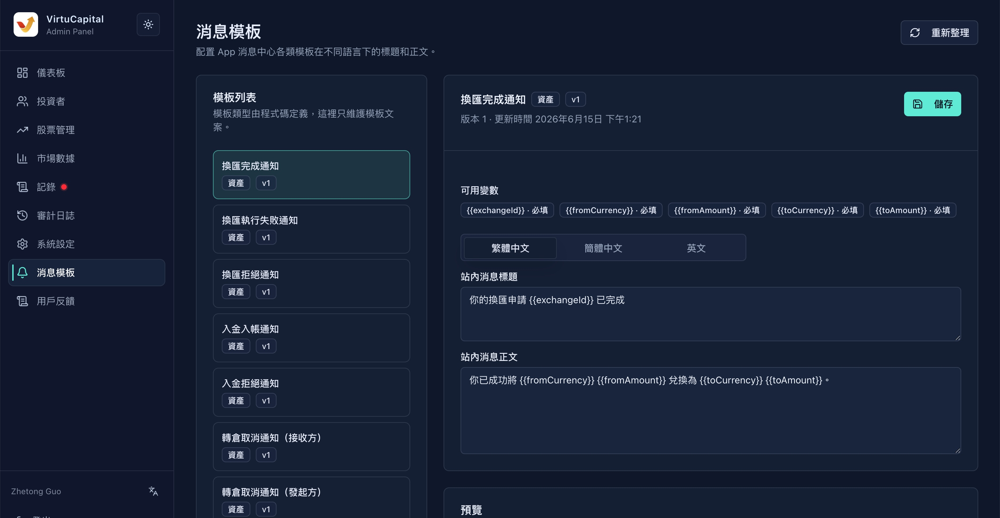

## 9. 消息模板管理

**操作路徑**：左側導航欄 → 「消息模板」

系統內置了多種業務場景的 App 消息中心模板，管理員可維護不同語言下的標題和正文。模板類型由系統代碼定義，後臺主要負責文案編輯、變量覈對和草稿預覽。

### 9.1 模板列表

| 模板名稱 | 觸發場景 |
|---------|---------|
| **換匯完成通知** | 幣種兌換成功 |
| **換匯執行失敗通知** | 幣種兌換失敗 |
| **換匯拒絕通知** | 幣種兌換申請被拒絕 |
| **入金入賬通知** | 入金審覈通過併到賬 |
| **入金拒絕通知** | 入金申請被拒絕 |
| **轉倉取消通知（接收方）** | 股票轉倉被取消（接收方） |
| **轉倉取消通知（發起方）** | 股票轉倉被取消（發起方） |
| **轉倉完成通知（接收方）** | 股票轉倉完成（接收方） |
| **轉倉完成通知（發起方）** | 股票轉倉完成（發起方） |
| **轉倉終審拒絕通知** | 轉倉申請終審被拒絕 |
| **轉倉待確認通知（接收方）** | 等待接收方確認轉倉 |
| **轉倉初審通過通知（發起方）** | 轉倉申請初審通過 |
| **轉倉初審拒絕通知** | 轉倉申請初審被拒絕 |
| **轉倉待終審通知** | 轉倉申請等待終審 |
| **轉倉拒收確認（接收方）** | 接收方確認拒收 |
| **轉倉拒收通知（發起方）** | 通知發起方被拒收 |
| **轉倉提交通知** | 轉倉申請已提交 |
| **出金通過通知** | 出金申請審覈通過 |
| **出金拒絕通知** | 出金申請被拒絕 |
| **電子郵件變更提醒** | 用戶修改郵箱 |
| **登入密碼變更提醒** | 用戶修改登錄密碼 |
| **交易密碼變更提醒** | 用戶修改交易密碼 |
| **系統公告** | 平臺發佈公告 |
| **訂單取消通知** | 交易訂單被取消 |
| **訂單成交通知** | 交易訂單成交 |
| **訂單拒絕通知** | 交易訂單被拒絕 |
| **股票轉讓通知** | 股票轉讓提交、初審、終審、完成、取消、拒收等節點 |
| **轉入股票通知** | 轉入股票流程的資料上傳、待補成本、完成、拒絕等節點 |

### 9.2 模板編輯

**操作步驟**：
1. 點擊模板名稱進入編輯頁
2. 選擇語言標籤（繁體中文 / 簡體中文 / 英文）
3. 修改站內消息標題和正文
4. 檢查「可用變量」列表，確認必填變量已保留
5. 在 Payload JSON 中輸入測試數據，點擊「預覽草稿」
6. 點擊「儲存」保存模板

> 💡 **變量說明**：模板中 `{變量名}` 的部分會在發送時自動替換爲實際值。

---
---
title: 消息模板管理
sidebar_position: 1
---
