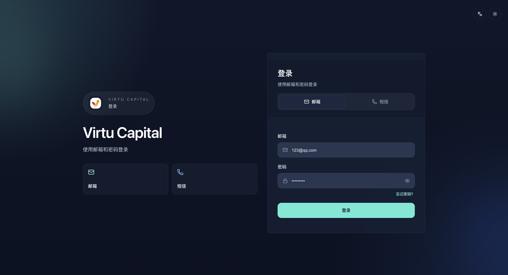

##

### 登入系統

**操作路徑**：開啟組織提供的管理員端網址 → 輸入管理員帳號和密碼 → 點擊「登入」

1. 確認網址、通訊協定和網域名稱均與組織提供的資訊一致，不要從陌生電郵或聊天連結進入；
2. 輸入分配給本人的管理員帳號和密碼；
3. 點擊「登入」，等待後台首頁完整載入；
4. 首次使用或權限剛變更時，檢查左側導航是否與獲批角色一致。

:::warning 帳號安全
管理員帳號不得共用。不要把密碼、瀏覽器會話、驗證碼或登入截圖發送給他人；離開設備前應鎖屏，使用完畢後應安全登出。
:::

### 登入失敗與會話異常

- **帳號或密碼錯誤**：檢查大小寫、輸入法和帳號是否屬於管理員角色；不要連續嘗試大量密碼。
- **登入後返回登入頁**：確認登入狀態是否過期，再重新登入；若反覆發生，記錄發生時間和目前網址後聯絡內部技術支援。
- **頁面長期停在載入狀態**：先重新整理一次；仍未恢復時保留錯誤文字和路由，不要重複提交業務操作。
- **權限選單缺失**：先確認目前帳號角色；角色剛調整時應登出後重新登入。

### 登入後基礎控制

| 功能 | 使用方法 |
| --- | --- |
| **語言** | 使用側邊欄底部的語言入口切換 English、繁體中文或簡體中文；切換後確認目前頁面的標題和欄位已更新 |
| **主題** | 使用側邊欄頂部的主題按鈕切換深色或淺色模式；該操作只改變顯示方式 |
| **目前帳號** | 側邊欄底部顯示目前登入名稱，用於確認沒有誤用他人的登入狀態 |
| **登出** | 完成工作後點擊側邊欄底部的「登出」，確認頁面回到登入狀態 |

### 安全登出檢查

1. 確認正在編輯的表單已按業務需要儲存為草稿或已明確放棄；
2. 關閉仍展開的客戶資料、附件和敏感詳情；
3. 點擊「登出」，不要只關閉瀏覽器標籤頁；
4. 在共享設備上同時關閉瀏覽器視窗，避免會話被恢復。
