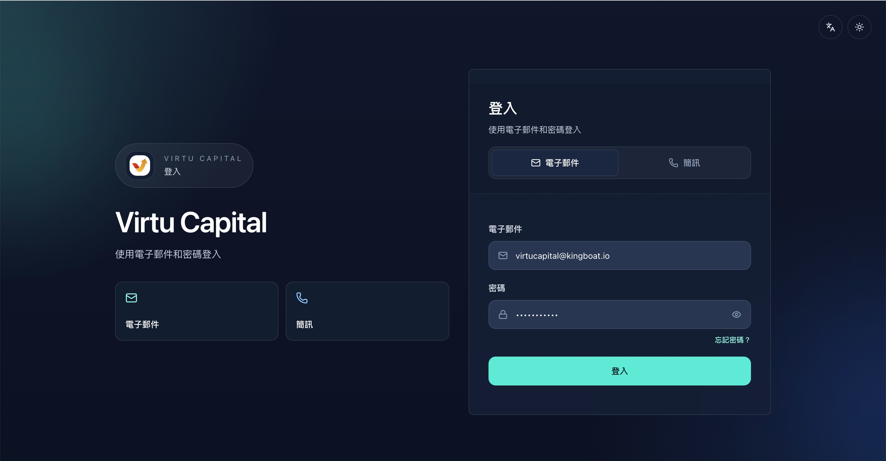

## 1. 系統登錄與基礎設置

### 1.1 登錄系統

**操作路徑**：訪問管理員端網址 → 輸入賬號密碼 → 點擊登錄

| 步驟 | 操作說明 |
|------|---------|
| 1 | 在瀏覽器中打開 Virtu Capital [管理員端地址](https://app.virtu-capital.com/zh-Hant/admin/users) |
| 2 | 輸入**郵件賬號**（如 admin@virtucapital.com） |
| 3 | 輸入**密碼** |
| 4 | 點擊「登錄」按鈕 |

> ⚠️ **安全提示**：首次登錄後請立即修改初始密碼，建議開啓雙因素認證（2FA）。

### 1.2 登錄後界面

登錄成功後，頁面左下角顯示：
- **管理員名稱**：當前登錄賬號的顯示名稱
- **登出按鈕**：點擊可安全退出系統

| 1 | 可選擇切換**語言**（支持English/繁體中文/簡體中文） |
|---|---|
| 2 | 可選擇切換**主題**（Dark / Light 模式） | |

---
---
title: 登錄與基礎設置
sidebar_position: 2
---
