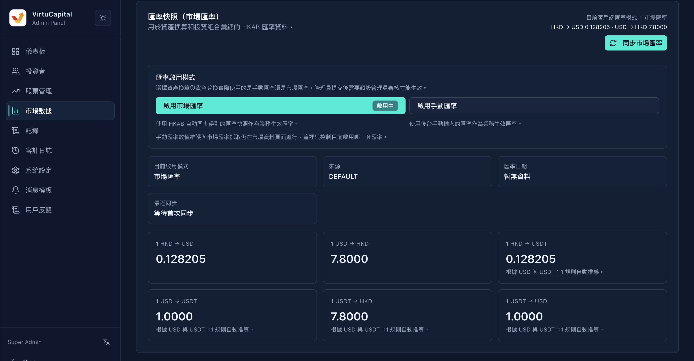

## 5. 市場數據管理

### 5.1 匯率快照

**操作路徑**：左側導航欄 → 「市場數據」→「匯率快照」

市場數據頁現在同時管理**市場匯率同步**、**手動匯率維護**和**匯率啓用模式**。管理員可選擇客戶端資產換算與貨幣兌換實際使用市場匯率或手動匯率；提交後需由超級管理員審覈。

#### 匯率列表

| 字段 | 說明 |
|------|------|
| **來源** | 匯率數據來源 |
| **匯率日期** | 當前匯率的生效日期 |
| **市場匯率｜固定匯率** | 切換匯率類型 |
| ├─ 自動刷新 | 系統自動從市場獲取最新匯率 |
| └─ 人工編輯 | 管理員手動輸入匯率（需提交審覈） |

#### 匯率啓用模式

| 模式 | 說明 |
|------|------|
| **市場匯率** | 使用 HKAB 自動同步得到的匯率快照作爲業務生效匯率 |
| **手動匯率** | 使用後臺手動輸入的匯率作爲業務生效匯率 |

**操作步驟**：
1. 在「匯率啓用模式」區域選擇市場匯率或手動匯率；
2. 點擊「提交審覈」；
3. 等待超級管理員審覈通過後生效。

> 💡 **說明**：市場匯率抓取與手動匯率數值維護仍在市場數據頁進行；「匯率啓用模式」只控制當前業務實際使用哪一套匯率。

#### 支持的匯率對

| 匯率對 | 說明 |
|--------|------|
| 1 HKD → USD | 港幣兌美元 |
| 1 USD → HKD | 美元兌港幣 |
| 1 HKD → USDT | 港幣兌USDT |
| 1 USD → USDT | 美元兌USDT |
| 1 USDT → HKD | USDT兌港幣 |
| 1 USDT → USD | USDT兌美元 |

> ⚠️ **審覈要求**：人工編輯的匯率需要提交審覈，審覈通過後生效。

#### 編輯匯率操作步驟

1. 在對應匯率行點擊「編輯」
2. 輸入新的匯率數值
3. 點擊「提交審覈」
4. 等待超級管理員審覈通過

### 5.2 股市數據

顯示各市場的數據同步狀態：

#### 港股市場信息

| 字段 | 示例值 | 說明 |
|------|--------|------|
| **交易所** | 1 | 交易所數量 |
| **股票** | 3,106 | 已同步的股票數量 |
| **指數** | 4 | 已同步的指數數量 |
| **上次同步** | 2026年5月25日 晚上7:53 | 最近一次同步時間 |
| **耗時** | 4.0s | 上次同步耗時 |
| **觸發來源** | api | 同步觸發方式 |
| **下次計劃** | 2026年5月25日 晚上8:00 | 下次自動同步時間 |
| **計劃識別碼** | 2026-05-24 | 同步任務標識 |

#### 支持的市場

- **中國A股**
- **港股**
- **美股**

> 💡 **說明**：股市數據通常由系統自動同步，管理員一般無需手動干預。如遇數據異常，可聯繫技術團隊處理。

---
