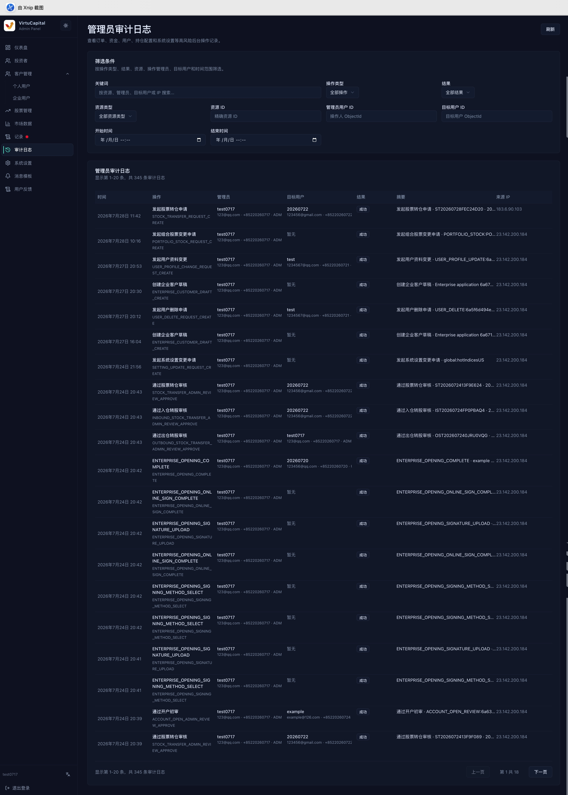

## 角色權限與操作邊界

下表彙總客戶端、管理員端中管理員和超級管理員的操作權限範圍。\
管理員處理業務時，先確認自己是發起、初審還是執行設定；標註「需超級管理員審核」的操作，完成後必須等待複審。

### 客戶端角色操作權限

### 管理員端角色操作權限

實際權限還會受到組織授權、帳號狀態和部署版本影響；\
頁面權限與圖片不一致時，以系統操作邊界為準。

:::warning 高風險操作
角色變更、系統設定、匯率和資金或持倉相關操作、初審和終審不得由同一人繞過審核流程完成。
:::

#### 審計與追溯

- 角色變更、審核和設定操作完成後，可以在審計日誌中核對記錄。
- 使用操作人、目標用戶、資源 ID、結果和時間範圍縮小查詢；
- 失敗記錄也應保留並調查原因。

##### 收回權限

- 出現職位變更、離職、帳號共用、異常登入或授權到期時，應立即透過組織審核流程降低權限。
- 不要透過刪除用戶來代替角色變更或收回權限。

## 聯絡支援

| 問題類型 | 聯絡方式 |
| --- | --- |
| 技術故障 | tech-support@virtucapital.com |
| 業務諮詢 | operations@virtucapital.com |
| 緊急事件 | 24 小時熱線：+852-xxxx-xxxx |

提交問題時建議提供：

- 發生時間、環境和目前路由；
- 目前帳號角色（不要提供密碼或驗證碼）；
- 可重現問題的步驟與頁面錯誤文字；
- 相關業務記錄 ID 或審計日誌 ID；
- 已脫敏的截圖或日誌。
