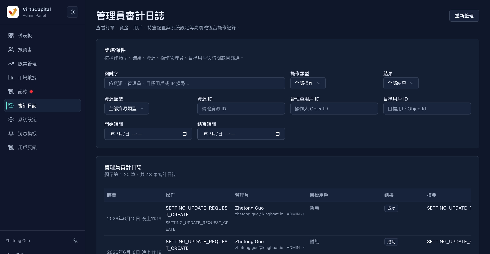
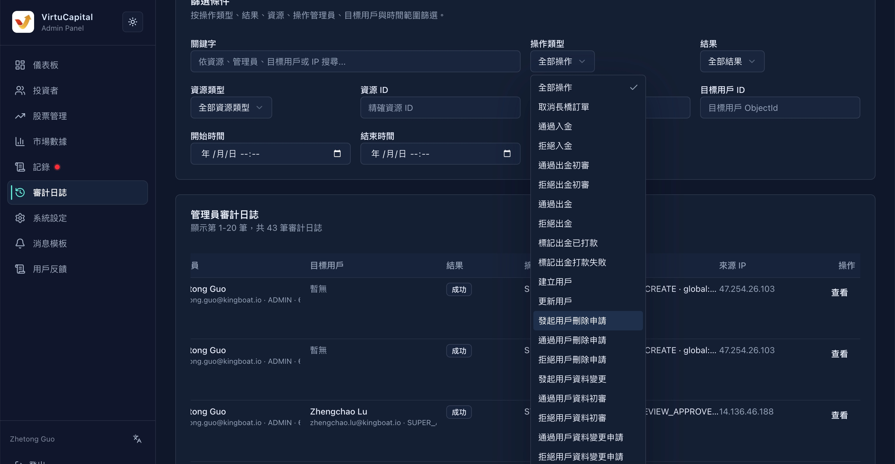

## 7. 審計日誌

**操作路徑**：左側導航欄 → 「審計日誌」

審計日誌記錄所有管理員的操作行爲，用於安全審計和問題追溯。

### 7.1 篩選條件

| 條件 | 說明 |
|------|------|
| **關鍵字** | 搜索操作內容中的關鍵詞 |
| **操作類型** | 創建 / 修改 / 刪除 / 審覈 等 |
| **結果** | 成功 / 失敗 |
| **資源類型** | 用戶 / 股票 / 訂單 / 配置 等 |
| **資源ID** | 具體資源的唯一標識 |
| **管理員用戶ID** | 執行操作的管理員 |
| **目標用戶ID** | 被操作影響的用戶 |
| **開始時間** | 篩選時間範圍起點 |
| **結束時間** | 篩選時間範圍終點 |

### 7.2 日誌表格

| 字段 | 說明 |
|------|------|
| **時間** | 操作執行時間 |
| **操作** | 具體操作描述 |
| **管理員** | 執行操作的管理員賬號 |
| **目標用戶** | 被操作影響的用戶（如適用） |
| **結果** | 操作是否成功 |
| **摘要** | 操作內容的簡要說明 |

> 💡 **用途**：當出現問題時，可通過審計日誌追溯是誰、在何時、做了什麼操作。

---
---
title: 審計日誌
sidebar_position: 2
---
