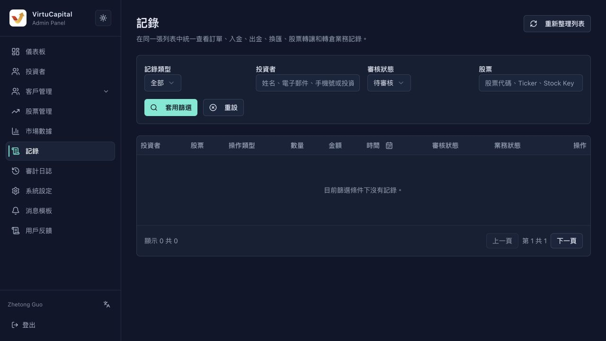
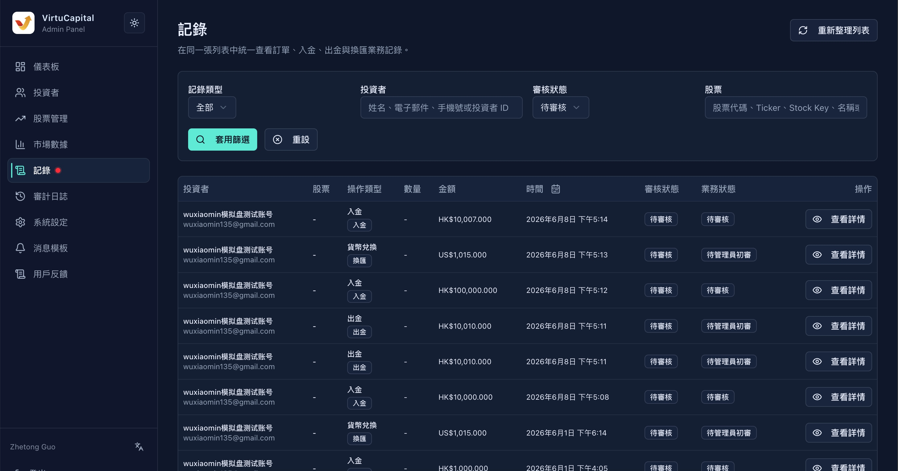
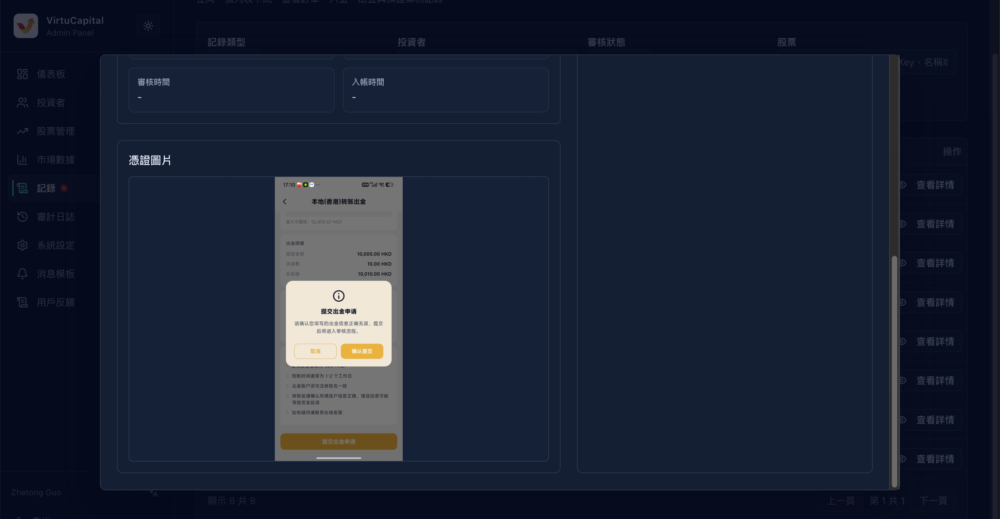

## 6. 記錄審覈

**操作路徑**：左側導航欄 → 「記錄」

記錄頁面用於在同一張列表中統一查看並審覈投資者提交的各類業務記錄，包括**訂單、入金、出金、換匯、股票轉讓和轉倉**。



> 🔔 **紅點提示**：當有「待審覈」記錄時，菜單會顯示紅點提醒。




### 6.1 檢索功能

支持多維度組合篩選：

#### 記錄類型

| 類型 | 說明 |
|------|------|
| **全部** | 顯示所有類型的記錄 |
| **訂單** | 股票買入/賣出訂單 |
| **入金** | 投資者充值記錄 |
| **出金** | 投資者提現記錄 |
| **換匯** | 幣種兌換記錄 |
| **轉倉** | 轉倉記錄 |
| **後臺操作** | 管理員在後臺執行的操作記錄 |

#### 投資者篩選

| 條件 | 說明 |
|------|------|
| **姓名** | 投資者姓名 |
| **電子郵件** | 註冊郵箱 |
| **手機號** | 註冊手機號 |
| **投資者ID** | 系統分配的唯一ID |
#### 審覈狀態篩選

| 條件 | 說明 |
|------|------|
| **無需審覈** | 不需要管理員審覈的記錄如訂單 |
| **待審覈** | 需要管理員審覈的記錄如出入金 |
| **待超級管理員審覈** | 需要超管理員審覈的操作如出金 |
| **已通過** | 審覈已通過 |
| **已拒絕** | 審覈已拒絕 |
| **已取消** | 投資者取消了原操作 |

#### 股票篩選

| 條件 | 說明 |
|------|------|
| **股票代碼** | 如 00700 |
| **Ticker** | 股票交易代碼 |
| **Stock Key** | 系統內部標識 |
| **名稱** | 股票名稱 |
| **訂單號** | 具體訂單編號 |

#### 其他篩選條件【暫定】

| 條件 | 說明 |
|------|------|
| **日期** | 按日期範圍篩選（接日期篩選組件） |
| **審覈狀態** | 無需審覈 / 待審覈 / 待超級管理員審覈 / 審覈通過 / 審覈拒絕 |
| **業務狀態** | 已提交 / 已撤銷 / 管理員已通過 / 超級管理員已通過 / 已拒絕 / 已入賬 / 已打款 |

> 💡 **操作**：設置好條件後，點擊「套用篩選」執行搜索，點擊「重設」清空條件。


### 6.2 表格結構

| 字段 | 說明 |
|------|------|
| **投資者** | 提交該記錄的投資者 |
| **股票** | 涉及的股票（如適用） |
| **操作類型** | 入金 / 出金 / 轉入 / 轉出 / 轉讓 / 資料變更 / 用戶刪除 |
| **數量** | 交易數量（如適用） |
| **金額** | 涉及金額 |
| **時間** | 記錄提交時間 |
| **審覈狀態** | 當前審覈進度 |
| **業務狀態** | 業務處理進度 |
| **查看詳情** | 查看完整信息並執行審覈操作 |

### 6.3 各類型記錄詳情與審覈

#### 入金記錄審覈

**入金詳細字段**：

| 字段 | 示例值 | 說明 |
|------|--------|------|
| **入金單號** | 6a159…… | 系統生成的唯一單號 |
| **使用者** | mi | 投資者賬號 |
| **入金方式** | 本地（香港）匯款 / 國際匯款 | 資金轉入方式 |
| **入金幣種** | HKD | 充值幣種 |
| **金額** | HK$100,000.00 | 充值金額 |
| **手續費** | HK$0.00 | 扣除的手續費 |
| **總額** | HK$100,000.00 | 實際到賬金額 |
| **入金時間** | 2026年5月26日 晚上9:07 | 用戶提交時間 |
| **審覈狀態** | 已通過 | 審覈進度 |
| **資金狀態** | 已入賬 | 資金到賬狀態 |
| **審覈時間** | 2026年5月26日 下午3:03 | 管理員審覈時間 |
| **入賬時間** | 2026年5月26日 下午3:03 | 資金實際入賬時間 |

**入金憑證**：
- 查看投資者上傳的轉賬截圖/憑證

**審覈操作**：

| 操作 | 說明 |
|------|------|
| **審覈通過** | 確認入金有效，資金入賬 |
| **拒絕原因** | 如拒絕，需填寫拒絕原因 |
| **拒絕申請** | 確認拒絕該入金申請 |

**關聯入賬流水**：
入賬流水關聯賬戶：黃河（暫定，後續是否改爲VC獨立的銀行賬戶？）

| 字段 | 說明 |
|------|------|
| **流水ID** | 系統生成的流水號 |
| **狀態** | 成功 / 失敗 / 處理中 |
| **幣種** | 流水幣種 |
| **金額** | 流水金額 |
| **入賬前餘額** | 入賬前賬戶餘額 |
| **入賬後餘額** | 入賬後賬戶餘額 |





#### 出金記錄審覈

審覈流程與入金類似，重點關注：
- 出金賬戶餘額是否充足
- 出金賬戶信息是否正確
- 手續費計算是否準確
- **並且，管理員審覈通過後，需要超級管理員二次審覈**

#### 買入/賣出/轉入/轉出/轉讓/訂單

- 檢查投資者持倉/資金是否充足，手續費和價格是否合理
- 確認市場是否開放交易
- **並且，轉倉需要管理員審覈、超級管理員二次審覈**

#### 資料變更審覈

- 覈對變更前後的信息
- 確認變更申請人爲本人
- 涉及敏感信息（如銀行卡）需額外驗證

#### 用戶刪除審覈

- 確認該用戶無未結清資產
- 確認刪除原因合理
- **此操作不可逆**，需特別謹慎

### 6.4 審覈狀態流轉

```
已提交
  ├── 已撤銷（用戶主動取消）
  ├── 待審覈 → 管理員已通過 → 超級管理員已通過 → 已入賬/已打款
  │              ├── 已拒絕（管理員拒絕）
  │              └── 待超級管理員審覈
  │                         ├── 超級管理員已通過
  │                         └── 已拒絕（超級管理員拒絕）
  └── 無需審覈（系統自動處理）
```

---
---
title: 記錄審覈
sidebar_position: 1
---
