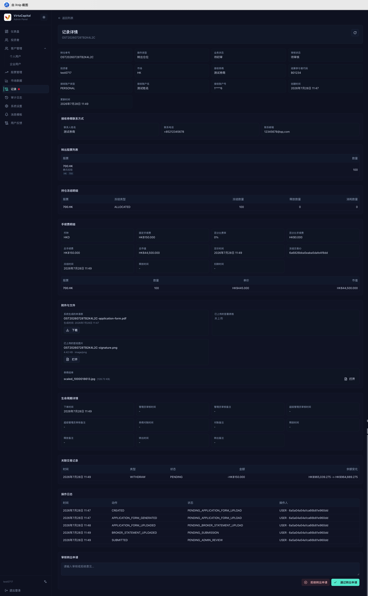
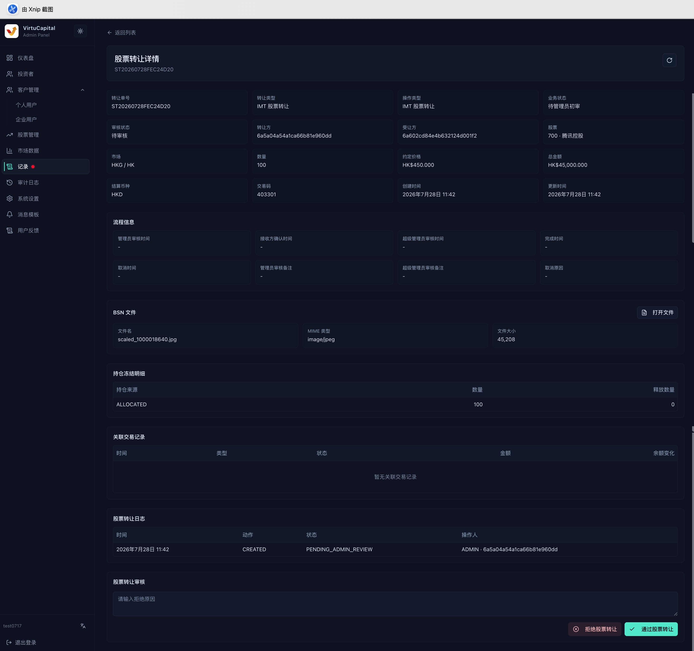

##

**操作路徑**：左側導航欄 → 「記錄」

記錄頁統一顯示訂單、入金、出金、換匯、股票轉讓和轉倉等業務。\
選單出現紅點時，表示存在待處理記錄。

## 搜尋與審核記錄

管理員的記錄列表預設審核狀態為「**待處理**」，\
方便管理員優先處理需要自己跟進的業務。\
**點擊查看詳情，可以審核自己需要處理的記錄。**\
如需查詢其他記錄，再按審核狀態、記錄類型、投資者和時間進行搜尋與篩選。

## 待處理記錄包括什麼

- **核心業務審核**：開戶審核、轉倉、股票轉讓、出金等需要管理員處理或繼續提交複審的事項；
- **用戶資料變更**：姓名、聯絡方式、身份資料等用戶資訊的修改；
- **系統資訊變更**：平台手續費、單個用戶手續費、訊息中心提示語、開戶協議、轉倉協議等設定或文件變更。

## 如何篩選其他記錄
點擊「套用篩選」執行查詢，「重設」清空條件，「重新整理」取得最新狀態。\
列表顯示投資者、股票、操作類型、待處理事項、數量、金額、時間、審核狀態、業務狀態和詳情入口，並支援分頁。

| 篩選條件 | 說明 |
|------|------|
| **審核狀態** | **待處理**（預設）、全部、無需審核、待審核、待超級管理員審核、已通過、已拒絕、已取消 |
| **記錄類型** | 開戶、訂單、入金、出金、換匯、轉倉、股票轉讓；用戶資料、手續費、官方帳戶、訊息中心提示語及開戶協議、轉倉協議等文件變更 |
| **投資者** | 按姓名、電郵、手機號碼或 VC User ID 搜尋，準確定位相關用戶 |
| **股票** | 按股票代碼、Ticker、Stock Key 或名稱搜尋 |
| **時間** | 設定開始時間和結束時間，按記錄發生時間篩選，定位特定時段的操作 |

## 如何進行審核
進入記錄詳情後，先確認自己擁有的操作權限，再按業務要求執行通過、拒絕、提交複審或其他可用操作。

### 通用審核原則
- 開啟詳情，核對申請人、金額或數量、附件及關聯帳戶；
- 檢查凍結資金或持倉是否足夠，手續費是否正確；
- 對照生命週期、關聯交易和操作日誌確認狀態一致；
- 審核通過前再次確認關鍵數據；拒絕時填寫明確原因；
- 出金和轉倉等高風險操作在管理員通過後，仍需超級管理員二次審核。

### 審核示例
#### 股票轉入審核
完整審核流程包括：用戶提交申請 → 管理員初審 → 超級管理員複審 → 與對方券商溝通轉倉 → 股票到帳後標記已轉倉

:::warning 審核要點
- 詳情頁顯示轉倉單號、操作類型、業務與審核狀態、投資者、目標券商、原始券商、來源帳戶、結算參與者代碼、轉入股票及數量、附件、生命週期、操作日誌和審核入口。
- 核對原券商轉出確認、來源帳戶、目標券商、股票代碼、數量和申請文件是否一致。
- 附件或資料不完整時不要通過；
- 填寫明確審核意見後執行通過或拒絕，並繼續檢查生命週期是否進入下一狀態。
- 標記已轉倉為最後一步。
:::

#### 股票轉出審核
完整審核流程包括：用戶提交申請 → 管理員初審 → 超級管理員複審 → 釋放股票轉出

:::warning 審核要點
- 詳情頁重點包括接收券商、接收帳戶、聯絡人、轉出股票與數量、凍結持倉、手續費、市值、申請附件、生命週期、關聯資金記錄和操作日誌。
- 審核時確認接收資料完整、凍結數量足夠、費用正確，且申請表、簽名和券商結單與申請一致。
- 管理員通過後按流程等待超級管理員複核；
- 最終狀態為持倉釋放。
:::

#### 股票轉讓審核
完整審核流程包括：用戶提交申請 → 管理員初審 → 超級管理員複審 → 系統發起轉讓股票 → 對方接收股票轉讓

:::warning 審核要點
股票轉讓詳情顯示轉出方與接收方、股票、數量、協定價格、協定金額、幣種、**BSN**、凍結持倉、關聯交易和操作日誌。
- 重點核對雙方身份、數量、價格及金額計算，確認轉出方持倉已正確凍結，且不存在重複或衝突交易，再執行通過或拒絕。
- 審查 BSN 是否存在，以及是否由管理員上傳。
:::

#### 出金審核
**目前業務出金功能為**：向客戶支付 USDT/USDC。管理員可設定轉賬計劃。\
**完整出金審核流程包括**：用戶提交申請 → 簽名確認錢包地址 → 管理員初審（設定轉賬計劃）→ 超級管理員複審 → 系統完成轉賬 → 管理員／系統標記已打款。

**設定轉賬計劃**

管理員初審時，可根據業務需要設定轉賬計劃：

- 總金額：本次出金的法幣總金額，金額固定。
- 分筆金額：將總金額拆分為多筆轉賬，每筆金額通常不低於 1 萬，最高可達數百萬元，具體金額可按實際情況調整。
- 轉賬筆數：由管理員自行設定分為多少筆，系統根據總金額和筆數產生轉賬計劃。
- 確認金額、筆數和收款資訊無誤後，點擊「**發送轉賬**」。

:::warning
- 目前業務出金功能為向客戶支付 USDT/USDC。管理員可設定轉賬計劃。
- 審核需要核對收款帳戶、可用餘額、凍結金額、手續費和附件；
- 出金審核通過並打款後，系統會保留 OSL 水單和鏈上轉賬記錄，管理員可以下載或再次發送給客戶。
:::

#### 資訊變更審核
客戶資料變更、市場匯率變更，以及官方帳戶、出入金手續費、市場指數、訊息模板等系統設定變更，由管理員修改後交由超級管理員複審。
- **資料變更**：比較變更前後資訊，敏感資料需額外驗證；
- **後台操作**：核對操作人、目標資源、變更摘要和執行結果。

#### 其他記錄
- **現金入金**：核對入金方式、幣種、金額、手續費、付款帳戶與憑證；通過後核對關聯入帳流水及餘額變化；
- **現金出金**：核對收款帳戶、可用餘額、凍結金額、手續費和附件。
- **訂單、買賣、換匯**：核對可用資金或持倉、價格、手續費和市場狀態；

:::tip
- 典型審核狀態為：已提交 → 待審核 → 管理員已通過 → 待超級管理員審核 → 已完成；
- 任一審核環節均可能因資料不符轉為已拒絕，用戶主動取消則顯示已取消。
:::
