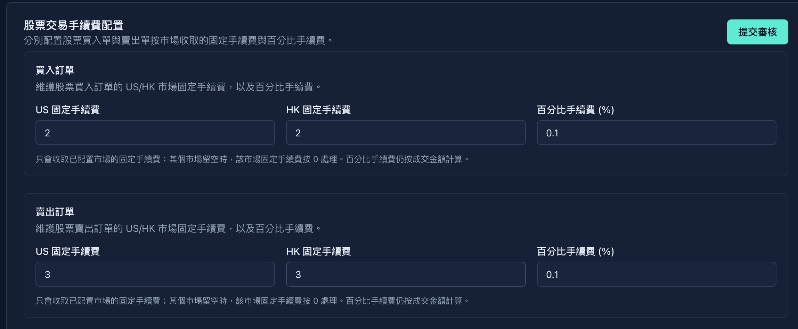
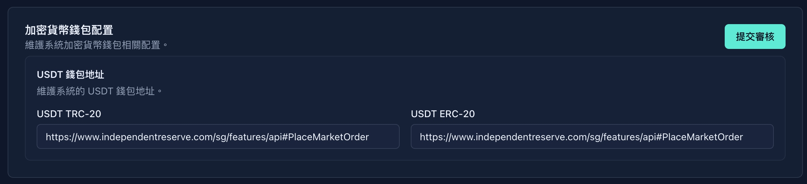
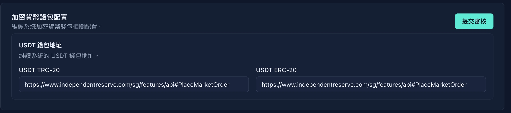
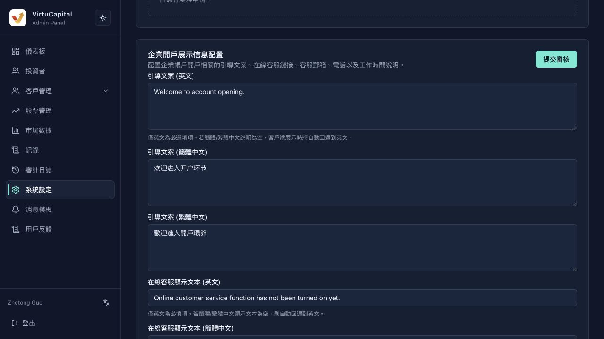

## 8. 系統設定

**操作路徑**：左側導航欄 → 「系統設定」

> ⚠️ **重要提示**：系統設定的所有修改都需要**提交審覈**，審覈通過後纔會生效。

### 8.1 貨幣兌換手續費

| 字段 | 說明 |
|------|------|
| **手續費百分比** | 幣種兌換時收取的手續費比例 |

**操作步驟**：
1. 輸入新的手續費百分比
2. 點擊「提交審覈」
3. 等待超級管理員審覈

### 8.2 股票交易手續費

#### 買入訂單手續費

| 字段 | 說明 |
|------|------|
| **US固定手續費** | 美股買入的固定手續費金額 |
| **HK固定手續費** | 港股買入的固定手續費金額 |
| **百分比手續費** | 按交易金額百分比收取的手續費 |

#### 賣出訂單手續費

| 字段 | 說明 |
|------|------|
| **US固定手續費** | 美股賣出的固定手續費金額 |
| **HK固定手續費** | 港股賣出的固定手續費金額 |
| **百分比手續費** | 按交易金額百分比收取的手續費 |

> 💡 **計算規則**：實際手續費 = max(固定手續費, 交易金額 × 百分比手續費)

### 8.3 入金配置

#### 國際電匯

| 字段 | 說明 | 示例 |
|------|------|------|
| **收款銀行** | 收款銀行名稱 | HSBC Hong Kong |
| **SWIFT代碼** | 銀行SWIFT代碼 | HSBCHKHHXXX |
| **賬戶名稱** | 收款賬戶名 | Virtu Capital Limited |
| **賬戶號碼** | 收款賬號 | 123-456789-001 |
| **手續費百分比** | 入金手續費比例 | 0% |
| **銀行地址** | 收款銀行地址 | 1 Queen's Road Central, HK |

#### 本地（香港）匯款

| 字段 | 說明 |
|------|------|
| **銀行代碼** | 香港銀行代碼（3位數字） |
| **分行代碼** | 分行代碼（3位數字） |
| **賬戶名稱** | 收款賬戶名 |
| **賬戶號碼** | 收款賬號 |
| **FPS轉數快識別碼** | FPS識別碼（支持快速轉賬） |
| **手續費百分比** | 入金手續費比例 |

#### USDT

| 字段 | 說明 |
|------|------|
| **手續費百分比** | USDT入金手續費比例 |

### 8.4 出金配置

| 出金方式 | 配置項 | 說明 |
|---------|--------|------|
| **國際電匯** | 手續費佔比 | 提現金額的手續費比例 |
| **本地（香港）轉賬** | 手續費佔比 | 本地轉賬的手續費比例 |
| **USDT** | 手續費佔比 | USDT提現的手續費比例 |

### 8.5 股票轉出配置

配置用戶發起股票轉出時按市場收取的固定手續費與百分比手續費。

| 市場 | 固定手續費幣種 | 百分比手續費 |
|------|----------------|--------------|
| **美股轉出** | USD | 按轉出訂單金額百分比收取 |
| **港股轉出** | HKD | 按轉出訂單金額百分比收取 |

> 💡 **說明**：固定手續費用於收取每筆轉出訂單的基礎費用，百分比手續費按成交或轉出金額計算。修改後點擊「提交審覈」，審覈通過後生效。

### 8.6 加密貨幣錢包配置

| 錢包類型 | 說明 |
|---------|------|
| **USDT TRC-20** | 波場鏈USDT錢包地址配置 |
| **USDT ERC-20** | 以太坊鏈USDT錢包地址配置 |

> ⚠️ **安全警告**：錢包地址配置錯誤可能導致資金永久丟失，請仔細覈對。

### 8.7 開戶協議配置

管理客戶端開戶時需要閱讀和同意的協議。管理員可上傳 Markdown 格式協議文件；上傳後需經超級管理員審覈通過，纔會對客戶端生效。

| 字段 | 說明 |
|------|------|
| **協議標識** | 協議唯一標識 |
| **協議標題** | 客戶端展示的協議名稱 |
| **語言版本** | 協議對應語言 |
| **是否必籤** | 是否爲開戶必讀必籤協議 |
| **排序** | 客戶端展示順序 |

### 8.8 企業開戶展示信息配置

配置企業賬戶開戶相關的引導文案、在線客服鏈接、客服郵箱、電話以及工作時間說明。

| 字段 | 說明 |
|------|------|
| **引導文案** | 支持英文、簡體中文、繁體中文；中文爲空時回退到英文 |
| **在線客服顯示文本** | 客戶端展示的客服入口文案 |
| **在線客服 DeepLink** | 跳轉客服聊天的直鏈或 App 自定義 Schema URL |
| **客服電話** | 展示給企業用戶的聯繫電話 |
| **工作時間** | 客服服務時間說明 |

### 8.9 熱門指數配置

配置APP市場頁展示股票市場指數的列表。
例如港股的恒生指數
例如美股的納斯達克指數
**操作步驟**：
1. 選擇要配置的市場
2. 搜索並添加推薦指數
3. 調整展示順序（拖拽排序）
4. 點擊「提交審覈」

### 8.10 推薦券商和股票推薦配置

| 配置項 | 說明 |
|--------|------|
| **熱門券商配置** | APP 市場頁展示的熱門券商，最多可配置 4 個 |
| **港股推薦配置** | 市場展示的港股推薦列表 |
| **美股推薦配置** | 市場展示的美股推薦列表 |
| **滬深股票推薦配置** | 市場展示的A股推薦列表 |
| **港股指數推薦配置** | 市場頁展示的港股指數列表 |
| **美股指數推薦配置** | 市場頁展示的美股指數列表 |

**操作步驟**：
1. 選擇要配置的市場
2. 搜索並添加推薦股票
3. 調整展示順序（拖拽排序）
4. 點擊「提交審覈」

---
