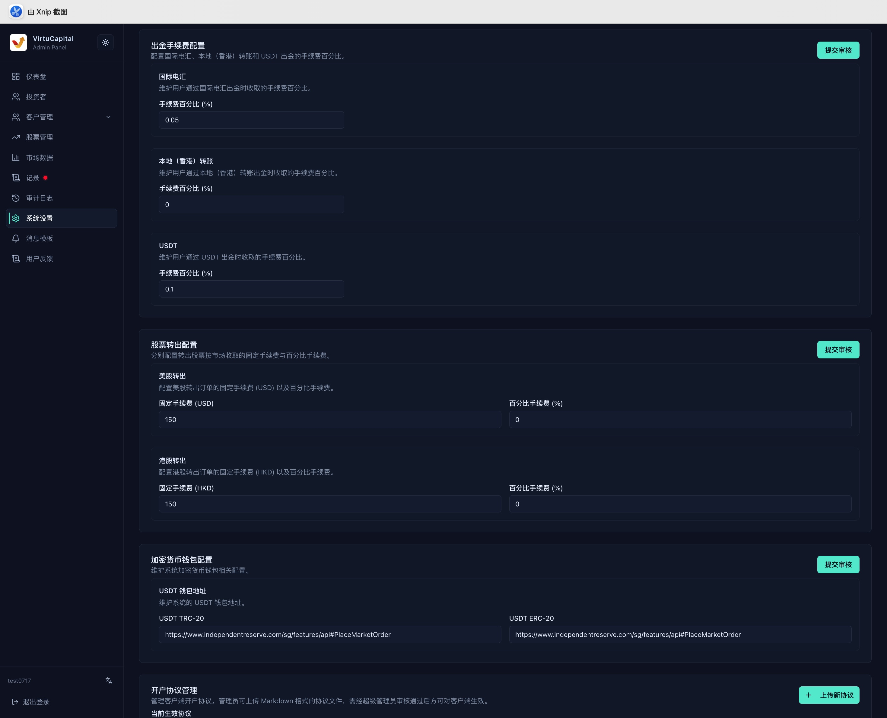

## 8. 系統設定

**操作路徑**：左側導航欄 → 「系統設定」

> ⚠️ 系統設定會影響全體用戶。修改後必須點擊「提交審核」，待超級管理員通過後才會生效。

### 8.1 匯兌、交易與入金設定

| 設定 | 可維護內容 |
|------|------------|
| **貨幣兌換手續費** | 換匯手續費百分比 |
| **買入訂單手續費** | 美股固定手續費、港股固定手續費、百分比手續費 |
| **賣出訂單手續費** | 美股固定手續費、港股固定手續費、百分比手續費 |
| **國際電匯入金** | 銀行名稱、SWIFT、帳戶名稱與號碼、銀行地址、手續費 |
| **香港本地入金** | 銀行與分行代碼、帳戶資料、FPS 識別碼、手續費 |
| **USDT 入金** | 入金手續費比例 |

交易手續費按系統頁面設定的固定費用與比例規則計算。銀行資料修改後，應由另一名管理員逐項複核。

### 8.2 出金、轉倉、錢包與協議

- **出金設定**：維護國際電匯、香港本地轉賬和 USDT 出金手續費；
- **股票轉出設定**：分別維護美股與港股的固定手續費和百分比手續費；
- **加密貨幣錢包**：維護 USDT TRC-20 與 ERC-20 收款地址；
- **開戶協議**：上傳協議文件，並設定協議識別碼、標題、語言、是否必簽及展示順序。

> 🚨 錢包鏈類型或地址錯誤可能造成資產永久損失。提交前應複製回查完整地址，並由第二人複核。

協議新增或替換後同樣需要審核。多語言協議應使用一致的協議識別碼，並檢查客戶端展示順序和必簽狀態。

### 8.3 企業開戶展示與市場內容

#### 企業開戶展示資訊

- 分別維護英文、簡體中文和繁體中文引導文案；
- 設定線上客服顯示文字與 DeepLink；
- 設定客服電郵、電話和工作時間；
- 中文未填寫時，客戶端可能改為顯示英文內容。

#### 推薦券商

可新增、編輯、刪除和調整券商順序。變更前確認名稱、圖示及跳轉資料準確，刪除前確認客戶端不再使用。

#### 推薦指數與市場內容

在港股、美股等標籤中搜尋並新增推薦指數，移除不再展示的項目並調整順序，最後提交審核。股票推薦設定同樣按市場維護；展示數量及順序以後台當前限制為準。

### 8.4 提交前檢查

1. 核對幣種、單位、比例和固定金額；
2. 核對銀行、錢包、客服連結及多語言文案；
3. 檢查推薦內容有無重複、缺失或順序錯誤；
4. 點擊「提交審核」，記錄變更原因；
5. 審核通過後回到頁面確認生效值，並在審計日誌中核對操作記錄。
