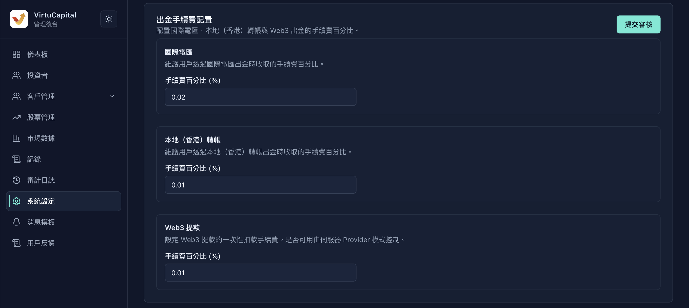
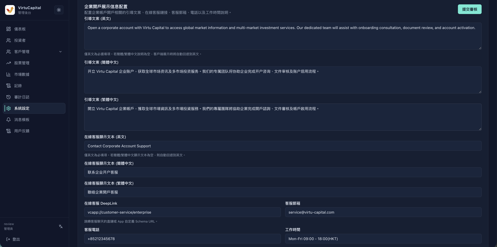
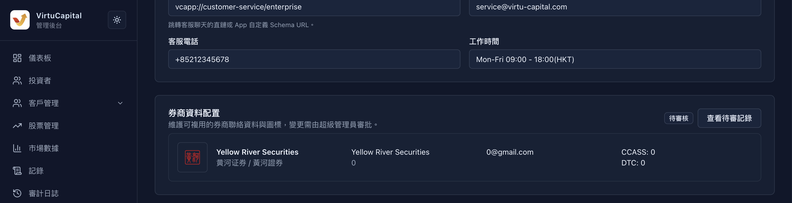

## 審核流程和導覽

**操作路徑**：左側導覽列 → 「系統設定」。

:::warning 角色與生效順序
1. **步驟 1：管理員**修改系統設定並點擊「提交審核」。管理員可維護設定和發起審核，但不能直接使變更生效。
2. **步驟 2：超級管理員**在待審核記錄中核對並審核通過；只有通過後，設定才會在客戶端生效。
:::

## 手續費與資金設定

### 貨幣兌換和股票交易手續費

此部分用於維護貨幣兌換，以及股票買入和賣出的 US、HK 固定手續費與百分比手續費。

填寫兌換手續費百分比；分別填寫買入和賣出訂單的 US 固定手續費、HK 固定手續費及百分比手續費，覆核後在對應卡片提交審核。

:::warning 百分比不是小數比例
欄位標籤為「手續費百分比 (%)」；例如輸入 `1.5` 代表收取 1.5%，不是 0.015%。固定手續費必須與對應的 US 或 HK 市場幣種一致。
:::

### 國際電匯入金資料

此部分用於填寫國際電匯的收款銀行、SWIFT 代碼、帳戶名稱、帳戶號碼、手續費百分比和銀行地址。

逐項更新收款資料與手續費百分比，核對無誤後點擊頁面右上角「提交審核」。

### 香港本地與 USDT 入金手續費

此部分用於維護本地（香港）匯款的銀行及 FPS 資料，並設定本地和 USDT 入金手續費。

填寫銀行代碼、分行代碼、帳戶資料、FPS 轉數快識別碼和本地手續費；在 USDT 區域填寫手續費百分比，再提交審核。

:::warning 銀行資料必須逐項覆核
收款銀行、SWIFT 代碼、銀行／分行代碼、帳戶號碼和 FPS 轉數快識別碼錯誤會使客戶向錯誤資料匯款。提交前由第二名管理員逐項核對，勿從截圖範例複製帳戶資料。
:::

### 出金手續費

此部分用於分別設定國際電匯、本地（香港）轉帳和 Web3 提款的「手續費百分比 (%)」。

為三種出金方式逐項填寫手續費百分比，覆核幣種和單位後點擊「提交審核」。

### 股票轉出手續費

此部分用於維護美股轉出的固定手續費（USD）與百分比手續費，以及港股轉出的固定手續費（HKD）與百分比手續費。

先填寫美股兩項費用，再填寫港股兩項費用；確認市場和幣種對應後提交審核。

### 加密貨幣錢包地址

此部分用於維護 USDT TRC-20 和 USDT ERC-20 的收款錢包地址。

分別貼上完整地址，複製回查後提交審核；「待審核」期間不得假定客戶端已使用新值。

:::warning 錢包網絡和地址不可混用
TRC-20 與 ERC-20 地址必須填入對應欄位。錯誤的網絡或地址可能造成資產永久損失；提交前複製回查完整地址，並由第二名管理員獨立覆核。
:::

## 開戶協議

### 開戶協議管理列表

此部分用於查看當前協議的協議標識、標題、語言版本、是否必簽和排序。

在列表逐項確認協議標識、標題、語言版本、是否必簽和排序，再確認客戶端生效結果。

### 上傳新開戶協議

此部分用於上傳新的 Markdown 開戶協議，並填寫協議標識、標題、版本和可選簡介。

點擊「上傳新協議」，填寫僅含小寫字母、數字和連字符的標識，選擇對應 Markdown 協議檔案（.md）後點擊「儲存」。

:::warning 替換協議前保留兼容性
錯誤的協議標識、語言版本或必簽狀態會影響客戶簽署流程。新增或替換前，確認標識、版本、Markdown 檔案和語言內容相互對應；不要覆蓋仍供客戶端使用的協議。
:::

## 企業開戶顯示與券商資料

### 企業開戶顯示資訊

此部分用於設定引導文案、線上客服顯示文本、DeepLink、客服電郵、電話和工作時間。

分別填寫頁面要求的多語言內容及客服資料，確認 DeepLink 為客服聊天直鏈或 App 自訂 Schema URL 後提交審核。

### 券商資料空列表

此部分用於查看券商資料列表，並從「新增券商」開始建立資料。

點擊「新增券商」進入表單；列表中可檢查已有記錄並使用頁面提供的操作按鈕。

### 新增券商表單

此部分用於新增券商圖標、三種語言名稱、聯絡人、電話、電郵及結算代碼。

上傳圖標，填寫所需資料，並至少填寫 CCASS 或 DTC 其中一項；完成後點擊「儲存到草稿」。

### 已儲存券商資料

此部分用於覆核已儲存券商的名稱、聯絡資料和結算代碼。

檢查儲存內容；需修改時使用編輯圖標，需移除時使用刪除圖標，並只使用頁面提供的上下移動操作。

### 券商待審核狀態

此部分用於確認券商資料已提交並處於「待審核」狀態。

點擊「提交審核」後，出現「待審核」及「查看待審記錄」時等待超級管理員通過，再確認客戶端顯示。

:::warning 刪除券商前確認沒有客戶端依賴
刪除操作會移除該券商資料。先確認客戶端、活動頁面和客服流程都不再引用該券商；草稿儲存並不等於已審核通過。
:::

## 推薦指數

### 港股推薦指數列表

此部分用於查看港股推薦指數及當前「已配置 x / 5」數量。

選擇「港股指數推薦配置」，核對數量、代碼、名稱和 `.HK` 市場標記。

### 新增港股推薦指數

此部分用於新增一個港股推薦指數。

點擊加號，在彈窗輸入指數標的代碼（範例為 `HSI.HK`），再點擊「新增」。

### 港股推薦指數待審核狀態

此部分用於確認港股指數變更已經提交審核。

覆核新增項目後點擊「提交審核」；出現「待審核」和提交提示後等待審核通過。

:::warning 不要超出推薦上限或重複新增
頁面明確顯示每個市場最多 5 個推薦指數。新增前核對代碼和市場標記，避免重複；介面未提供拖曳排序功能，請勿假定可以調整順序。
:::

### 美股推薦指數列表

此部分用於查看美股推薦指數及當前「已配置 x / 5」數量。

選擇「美股指數推薦配置」，核對數量、代碼、名稱和 `.US` 市場標記。

### 新增美股推薦指數

此部分用於新增一個美股推薦指數。

點擊加號，在彈窗輸入指數標的代碼（範例為 `SOX.US`），再點擊「新增」。

### 美股推薦指數待審核狀態

此部分用於確認美股指數變更已經提交審核。

覆核新增項目後點擊「提交審核」，狀態變為「待審核」後等待超級管理員通過並確認客戶端指數介面。

:::warning 按市場維護推薦指數
港股和美股的上限分別計算。請使用與所選市場相符的代碼和市場標記；頁面只顯示新增和移除操作，未顯示拖曳排序功能。
:::

## 提交前檢查

:::warning 提交前檢查
1. 覆核幣種、固定金額和所有「手續費百分比 (%)」欄位。
2. 覆核銀行資料、錢包網絡和完整地址，並完成第二人覆核。
3. 覆核協議標識、版本、語言檔案和必簽狀態，以及企業開戶的多語言內容與客服入口。
4. 覆核券商資料和推薦指數的代碼、市場標記、數量限制及「待審核」狀態。
5. 點擊相應區域的「提交審核」；超級管理員通過後，回到客戶端與審計日誌確認生效結果。
:::
