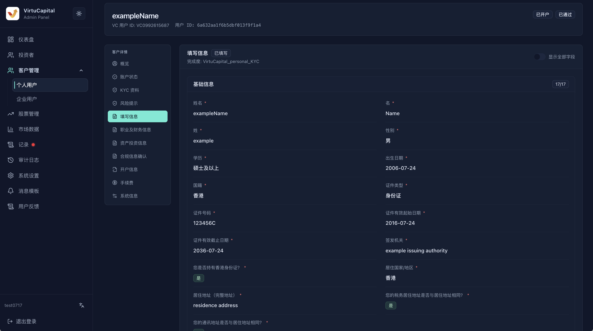
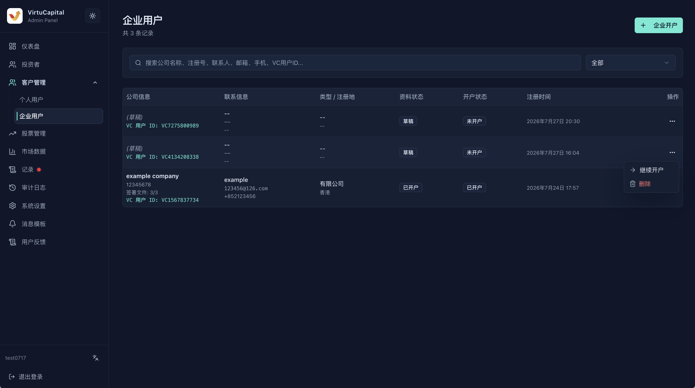
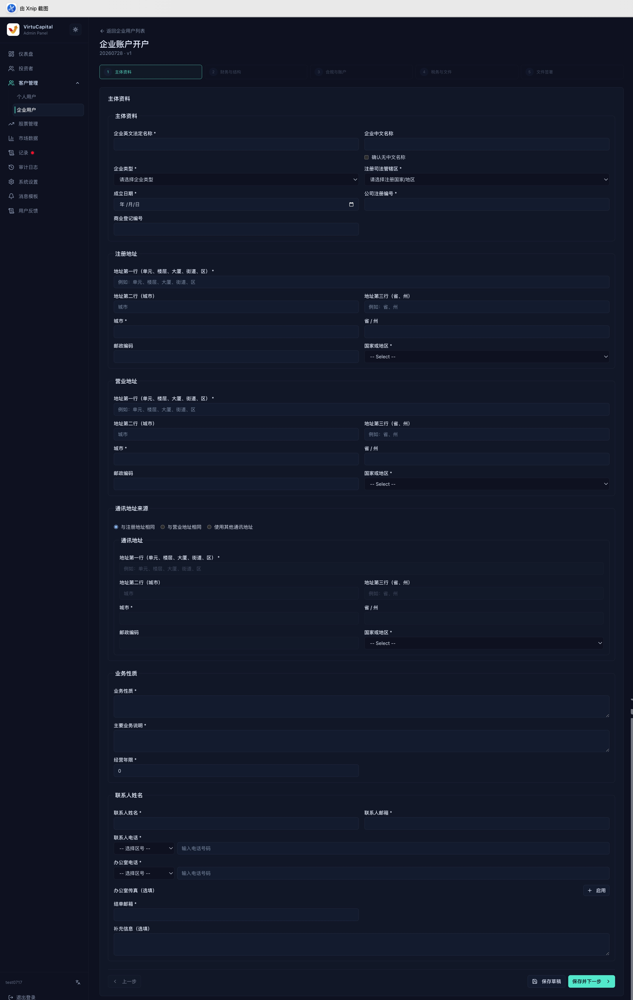

##

**操作路徑**：左側導航欄 → 「客戶管理」→「個人用戶 / 企業用戶」

客戶管理用於查看個人 KYC、企業 KYB、開戶資料和開戶進度；\
「投資者」模組則更偏向交易帳戶及資產管理。

## 個人用戶

可按姓名、手機號碼、電郵或 VC User ID 搜尋，並按開戶狀態篩選。\
列表顯示用戶資訊、聯絡方式、首選語言、開戶狀態、Sumsub 狀態、資料預覽、註冊時間和詳情入口。

### 個人用戶資料

開啟詳情後，可按頁面區塊核對：

| 區塊 | 核對重點 |
| --- | --- |
| **身份與帳戶** | 姓名、聯絡方式、國籍、證件類型、首選語言和開戶狀態 |
| **KYC** | Sumsub 狀態、Applicant ID、Inspection ID、申請平台和 IP 國家 |
| **風險與補充資料** | 風險評估結果、補充問卷及待補項目 |
| **就業與財務** | 職業、收入、資產、資金來源及投資經驗 |
| **文件簽署** | 個人版開戶申請表、CRS 稅務表、W-8BEN 稅務表簽名資料 |
| **手續費設定** | 查看及**修改**該用戶的各項手續費 |

> ⚠️ 證件影像、聯絡資料、財務數據等屬於敏感資訊，僅應在業務需要範圍內查看和使用。

## 企業用戶

### 企業用戶資料

企業列表支援按公司名稱、註冊號、聯絡人、電郵、手機號碼或 VC User ID 搜尋，並可按資料或開戶狀態篩選。

列表顯示公司資訊、聯絡方式、企業類型與註冊地、資料狀態、開戶狀態、建立時間和操作入口。先用公司名稱和註冊號確認記錄，再開啟操作選單。

可見操作以記錄狀態為準：

- **查看**：開啟已儲存的企業資料；
- **繼續開戶**：從草稿已儲存的階段繼續填寫；
- **刪除草稿**：僅在確認不再辦理、沒有需要保留的資料且已獲得授權時使用。

### 企業開戶流程

### 開始前準備

辦理前準備經過批准的企業資料。不要使用未授權的真實文件進行演示或測試。

- 企業法定名稱、類型、註冊司法管轄區、成立日期和註冊編號；
- 註冊、營業及通訊地址；
- 業務性質、主要業務說明和經營年限；
- 聯絡人、結單電郵、電話和可選傳真；
- 董事、股東、最終受益人及持股結構資料；
- 財務、資金來源、稅務身份、帳戶需求和合規聲明；
- 目前頁面要求的企業證明文件與簽署授權。

### 進入、儲存與恢復

1. 在「企業用戶」列表點擊「企業開戶」，或對已有草稿選擇「繼續開戶」；
2. 頂部步驟欄顯示目前階段：**主體資料 → 財務與結構 → 合規與帳戶 → 稅務與文件 → 文件簽署**；
3. 「儲存草稿」儲存目前已填內容，適合暫時離開；
4. 「儲存並下一步」先驗證目前階段的必填項，再進入下一階段；
5. 使用「上一步」返回時，先儲存目前修改；
6. 重新進入列表後，從同一草稿繼續，先檢查階段、欄位和已上傳文件是否完整。

帶 `*` 的欄位為目前階段必填項。驗證未通過時，應按頁面提示逐項修正，不要用無意義字符繞過驗證。

### 第 1 步：主體資料

填寫企業身份、地址、業務和聯絡人資料。

| 區域 | 可見欄位與操作 |
| --- | --- |
| **主體資料** | 企業英文法定名稱、可選中文名稱或「確認無中文名稱」、企業類型、註冊司法管轄區、成立日期、公司註冊編號、可選商業登記編號 |
| **註冊地址** | 地址第一行、城市、省/州、郵政編碼、國家或地區 |
| **營業地址** | 完整營業地址；與註冊地址相同時也應按頁面要求確認 |
| **通訊地址來源** | 選擇與註冊地址相同、與營業地址相同或使用其他通訊地址 |
| **業務性質** | 業務性質、主要業務說明和經營年限 |
| **聯絡人** | 聯絡人姓名、電郵、區號與電話、辦公室電話、可選傳真、結單電郵和補充資訊 |

### 第 2 步：財務與結構

該階段用於說明企業財務狀況及控制結構。按目前頁面填寫財務概況、資金或財富來源，並逐項登記董事、股東和最終受益人。

- 透過「新增」類控制項新增多人或多層結構時，每一項都應使用獨立資料；
- 持股或控制比例的合計應與企業結構文件一致；
- 同一自然人同時擔任董事、股東或最終受益人時，仍應按頁面要求在對應區塊申報；
- 刪除重複條目前先確認不會破壞比例、控制人或必填項驗證。

<!-- screenshot-slot: customers-enterprise-onboarding-step-2-finance-and-structure; status: placeholder -->
> 📷 **截圖待補：第 2 步「財務與結構」。**

### 第 3 步：合規與帳戶

該階段用於記錄合規聲明、預期帳戶用途和帳戶相關選擇。逐項閱讀問題，根據獲批資料作答，並核對帳戶聯絡人或結算資料。

- 不確定的合規問題不得憑猜測選擇；
- 涉及受制裁地區、政治公眾人物、受監管業務或第三方資金時，應暫停並交由合規人員處理；
- 此階段的「帳戶」選擇只是開戶申請資料，不代表帳戶已經建立或獲批。

<!-- screenshot-slot: customers-enterprise-onboarding-step-3-compliance-and-accounts; status: placeholder -->
> 📷 **截圖待補：第 3 步「合規與帳戶」。**

### 第 4 步：稅務與文件

填寫稅務居住地、稅號或頁面要求的稅務聲明，並上傳目前介面列出的企業文件。

1. 文件名稱、公司名稱和有效期應與主體資料一致；
2. 上傳前確認文件清晰、完整、未加無關密碼且屬於該企業；
3. 僅上傳獲授權的正式文件；測試環境只使用批准的測試文件；
4. 頁面顯示已接收或上傳成功後，再進入下一步；
5. 更換文件時確認舊文件是否已被替換，避免同時保留衝突版本。

<!-- screenshot-slot: customers-enterprise-onboarding-step-4-tax-and-documents; status: placeholder -->
> 📷 **截圖待補：第 4 步「稅務與文件」。**

### 第 5 步：文件簽署

最後階段用於複核待簽文件和執行獲授權的簽署流程。

- 核對企業名稱、簽署人身份、協議版本和語言；
- 確認簽署人具有有效授權，且所有前置審核已完成；
- 發現資料錯誤時返回對應階段修改並重新複核；
- 未獲授權時只能查看和儲存草稿，不得勾選同意、簽名或最終提交。

<!-- screenshot-slot: customers-enterprise-onboarding-step-5-document-signing; status: placeholder -->
> 📷 **截圖待補：第 5 步「文件簽署」（簽署與提交前）。**

<!-- enterprise-onboarding-submission-boundary: authorized-review-required -->
### 草稿與提交邊界

| 狀態 | 處理方式 |
| --- | --- |
| **草稿** | 可透過「繼續開戶」恢復；繼續前檢查步驟、欄位和附件 |
| **目前階段驗證失敗** | 留在目前階段，按提示補齊必填或修正格式 |
| **待複核 / 已提交** | 按頁面狀態和組織審核流程處理，不要重複建立另一條申請 |
| **需更正** | 先確認目前狀態是否允許返回編輯；不能編輯時交由授權人員處理 |

> ⚠️ 刪除草稿會移除未提交資料。最終提交、協議接受和簽署可能產生業務或法律後果，只能由獲授權人員在完成複核後執行。
