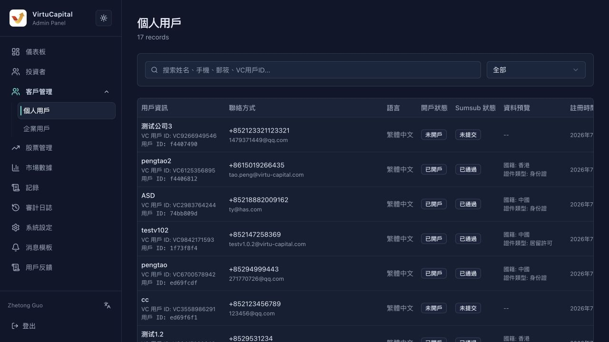
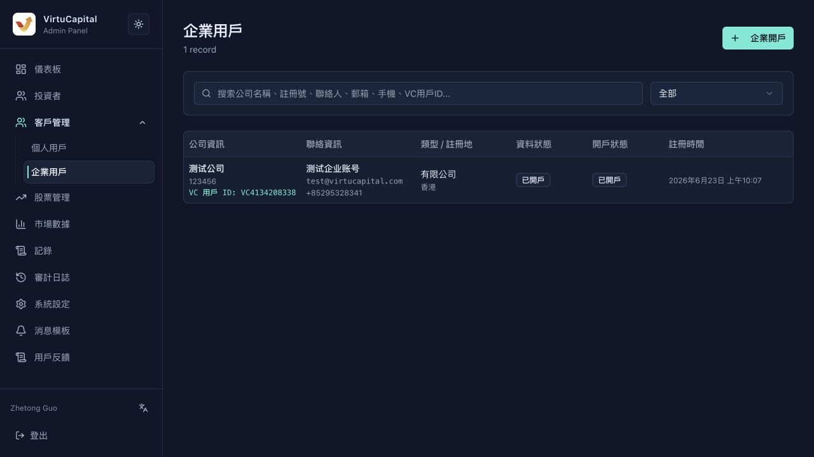

## 客戶管理

**操作路徑**：左側導航欄 → 「客戶管理」→「個人用戶 / 企業用戶」

客戶管理用於查看開戶資料、KYC / KYB 狀態和企業開戶資料。與「投資者」列表相比，本模塊更偏向開戶資料、身份審覈材料和客戶類型管理。

### 個人用戶

支持按**姓名、手機號、郵箱、VC 用戶 ID**搜索，並可按開戶狀態篩選。

| 字段 | 說明 |
|------|------|
| **用戶資訊** | 用戶姓名、VC 用戶 ID、內部用戶 ID |
| **聯絡方式** | 手機號與郵箱 |
| **語言** | 用戶首選語言 |
| **開戶狀態** | 未開戶 / 已開戶 |
| **Sumsub 狀態** | 未提交 / 已通過等 KYC 狀態 |
| **資料預覽** | 國籍、證件類型等摘要 |
| **註冊時間** | 用戶註冊時間 |
| **操作** | 查看詳情 |

**查看詳情**

點擊「查看詳情」後，可查看：
- 基礎資料：姓名、手機、郵箱、國籍、證件類型、稅務居住地址、首選語言等；
- 開戶影像資料：證件正反面、活體認證照片、上傳時間；
- 就業與財務資訊：職業類別、投資經驗、年收入範圍、資產規模；
- 系統資訊：用戶 ID、VC 用戶 ID、角色、客戶類型、最近更新時間；
- 開戶狀態：開戶狀態、Sumsub 審覈狀態、Applicant ID、Inspection ID、申請平臺、IP 國家等。

### 企業用戶

企業用戶頁用於查看公司客戶資料，支持按**公司名稱、註冊號、聯繫人、郵箱、手機號、VC 用戶 ID**搜索。

| 字段 | 說明 |
|------|------|
| **公司資訊** | 公司名稱、註冊號、VC 用戶 ID |
| **聯絡資訊** | 企業聯繫人、郵箱、手機號 |
| **類型 / 註冊地** | 企業類型與註冊地 |
| **資料狀態** | 企業資料是否已開戶或仍爲草稿 |
| **開戶狀態** | 企業賬戶開戶狀態 |
| **註冊時間** | 企業資料創建時間 |
| **操作** | 根據狀態查看、繼續編輯或創建企業開戶資料 |

**企業開戶**

點擊「企業開戶」進入企業用戶開戶表單。該功能用於管理員手動爲企業客戶開立交易賬戶，並向聯繫人發送設置密碼郵件。

| 區域 | 字段 |
|------|------|
| **基本資訊** | 公司名稱、註冊號、企業類型、註冊地、成立時間、公司地址 |
| **關聯用戶與聯繫人** | 選擇關聯用戶、企業聯繫人姓名 |
| **企業資質文件** | 營業執照 / 商業登記證、公司印章授權書、董事會決議、受益所有人證明 |

> 💡 **說明**：營業執照 / 商業登記證爲創建企業賬戶必填文件；其他資質文件可按業務需要補充。頁面支持「保存草稿」和「創建企業賬戶」兩種操作。

---
---
title: 個人與企業客戶管理
sidebar_position: 2
---
