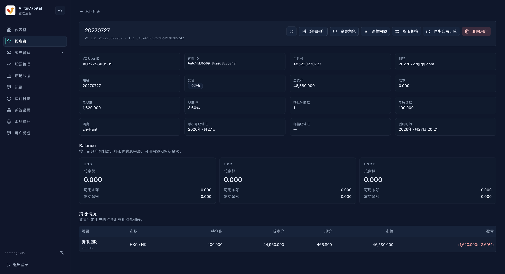
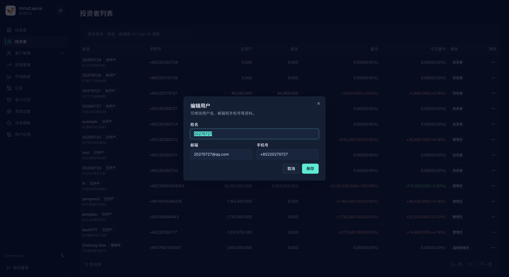

## 投資者列表

**操作路徑**：左側導航欄 → 「投資者」

使用搜尋框可按手機號碼、姓名、電郵或 VC User ID 搜尋用戶。操作前先核對姓名、手機號碼和 VC User ID，避免選錯帳號。

### 列表資訊

| 欄位 | 說明 |
| --- | --- |
| **姓名 / VC User ID** | 用戶名稱、開戶狀態和平台用戶編號 |
| **手機號碼** | 註冊手機號碼 |
| **總資產 / 成本** | 目前資產總額和持倉成本 |
| **盈虧 / 今日盈虧** | 累計及當日盈虧金額與比例 |
| **角色** | 投資者、管理員或超級管理員 |
| **操作** | 點擊查看持倉、查看詳情、編輯用戶、變更角色或刪除用戶 |

### 查看持倉

在投資者列表中展開用戶，可快速查看該用戶持有的股票、所在市場、持倉數、成本價、現價、市值和盈虧。需要查看完整帳戶資料時，再進入「查看詳情」。

## 用戶操作
點擊目標用戶右側的「操作」按鈕，選擇需要執行的功能。
### 查看詳情

點擊用戶右側的「操作」→「查看詳情」，可查看用戶資料、角色、資產、各幣種餘額和持倉情況。該頁面適合核對帳號及資產資訊。

:::warning 敏感資料
詳情頁包含聯絡方式、資產和持倉資訊，只在業務需要範圍內查看和使用。
:::

### 編輯用戶

可修改姓名、電郵和手機號碼。確認資料屬於目前用戶後再儲存；編輯用戶不會改變其資產或角色。

### 變更角色

可在頁面提供的角色中選擇並儲存。角色會影響後台存取權限，操作前必須核對用戶並確認已經獲得授權。

### 刪除用戶

刪除入口位於用戶右側的「操作」選單中。執行前必須再次核對姓名、手機號碼、VC User ID、資產和持倉情況。

:::danger 不要輕易刪除用戶
刪除用戶不是日常整理操作。只有在確認目標帳號、相關資產和持倉已經妥善處理，並取得明確授權後才可執行。無法確認時，立即取消，不要刪除。
:::
