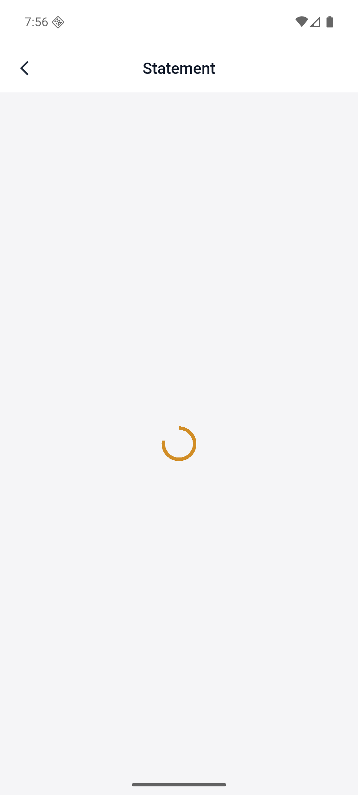

# Virtu Capital APP 用户指南

本文依据 Virtu Capital APP 的实际页面整理，介绍行情、自选、资产、资金和账户管理等常用功能。页面截图统一存放在 `docs/assets`，修改本文后网站会自动同步内容。

:::info 阅读提示
不同账户状态、所在地区和 APP 版本可能展示不同的功能入口。涉及资金和证券转移时，请以 APP 内的最新提示与审核结果为准。
:::

## 1. 登录与进入首页

首次打开 App 会看到欢迎页，点击 `Get started` 进入登录页。登录页支持手机号验证码方式：

1. 选择国家/地区码。
2. 输入手机号。
3. 点击 `Get code`。
4. 输入验证码。
5. 登录后进入底部四栏首页。

本次测试账号登录后默认展示 `Watchlist` 或恢复上次页面。

## 2. 底部导航

底部有四个主入口：

```text
Watchlist | Market | Assets | Profile
```

- `Watchlist`：自选股和基金。
- `Market`：行情、指数、热门证券。
- `Assets`：资产、余额、持仓、订单、资金业务。
- `Profile`：个人资料、协议、反馈、设置。

## 3. Watchlist 自选


用途：跟踪已加入自选的股票、基金和指数。

主要区域：

- 搜索框：输入股票名称、代码或基金名称。
- 市场筛选：`All`、`HK`、`US`。
- 更新时间：显示行情刷新时间。
- `Settings`：进入自选设置/排序。
- `Price` / `Change`：按价格或涨跌幅排序。
- 股票列表：每行展示名称、市场、代码、迷你走势图、价格和涨跌幅。
- `+ Add to watchlist`：添加新的自选标的。
- 右上角信封：消息中心，有红点表示未读消息。

使用方式：

1. 点击搜索框搜索标的。
2. 点击 `HK` 或 `US` 只看对应市场。
3. 点击某只股票进入详情页。
4. 点击 `+ Add to watchlist` 添加新标的。

## 4. Market 行情


用途：查看全市场行情、指数和热门股票。

主要区域：

- 搜索框：搜索股票/基金。
- `HK` / `US`：切换市场。
- 市场状态：例如 `Closed`。
- 指数卡片：展示指数名称、点位、涨跌、迷你走势。
- `Securities`：证券列表区。
- `Hot stocks`：热门股票。
- `Top gainers`：涨幅榜。

使用方式：

1. 在顶部搜索框查找股票或基金。
2. 点击 `HK` / `US` 切换市场。
3. 横向滑动指数卡片查看更多指数。
4. 点击指数或股票进入详情页。

## 5. 个股/指数详情


用途：查看单个股票或指数的行情、盘口、图表并发起交易。

主要字段：

- 标的名称：例如 `Hang Seng China Enterprises Index`。
- 代码：例如 `HSCEI`。
- 市场：例如 `HK`。
- 状态：例如 `Closed`。
- 最新价/点位。
- 涨跌额、涨跌幅。
- `Quote`：报价页。
- `Warrants`：窝轮/衍生品相关页。
- `Open`、`High`、`Low`、`Prev Close`。
- `Market cap`、`P/E`、`P/B`。
- `Volume`、`Turnover`。
- 图表周期：`Timeshare`、`Daily`、`Weekly`、`Monthly`。
- 右侧逐笔/时间成交列表。
- `Order Book`：买卖盘口。
- `Trade`、`Quick Buy`、`Quick Sell`。

使用方式：

1. 从 Watchlist 或 Market 点击标的进入详情。
2. 切换图表周期查看不同时间维度。
3. 下拉查看盘口。
4. 点击 `Trade` 进入完整交易页。
5. 点击 `Quick Buy` 或 `Quick Sell` 快速买卖。
6. 点击右上角 `+` 或勾选图标管理自选。

## 6. Assets 资产


用途：查看账户资产、余额、持仓和进入资金操作。

主要区域：

- `Total assets (CNY)`：总资产折合人民币。
- 眼睛图标：显示/隐藏资产金额。
- `Unrealized profit or loss`：未实现盈亏。
- `Return rate`：收益率。
- `Protected`：账户保护状态。
- 快捷入口：
  - `Deposit`
  - `Withdraw`
  - `Statement`
  - `Orders`
  - `Stock Transfer`
  - `Position Transfer`
- `Account balance`：多币种余额。
  - 币种：USD、HKD 等。
  - `Available`：可用余额。
  - `Frozen`：冻结金额。
- `Positions`：持仓。
  - 股票名称/代码。
  - 当前价。
  - 成本价。
  - 可用持仓。
  - 冻结持仓。
  - 市值。
  - 盈亏。
- `Today's Orders`：今日订单。

使用方式：

1. 进入 `Assets` 查看总资产。
2. 点击眼睛图标隐藏/显示金额。
3. 点击持仓卡片进入个股详情。
4. 点击快捷入口进入资金、订单或转仓功能。

## 7. Deposit 入金


用途：向 Virtu Capital 账户转入资金。

页面字段：

- `Deposit account`：入金账户。
- 用户头像、用户名、UID。
- `Funds protected`：资金保护提示。
- `Select a deposit method`：选择入金方式。
- `International wire`：国际电汇。
- `Local (Hong Kong) transfer`：香港本地银行转账。
- 到账时间：例如 `1-3 business days`、`1-2 business days`。
- 费用：例如 `Fee 0%`。
- `Tips`：入金注意事项。

使用方式：

1. 在 `Assets` 点击 `Deposit`。
2. 确认入金账户。
3. 选择 `International wire` 或 `Local (Hong Kong) transfer`。
4. 按页面提示填写金额、转账信息或上传凭证。
5. 提交后可通过右上角记录图标查看入金记录。

注意：

- 转账前确认收款地址、银行账户和网络。
- 首次入金可能需要 KYC。
- 大额入金建议先小额测试。

## 8. Withdraw 出金


用途：从 Virtu Capital 账户提取资金。

页面字段：

- `Withdrawal account`：出金账户。
- 用户头像、用户名、UID。
- `Funds protected`。
- `Select a withdrawal method`。
- `International wire`：国际电汇出金。
- `Local (Hong Kong) transfer`：香港本地银行转账出金。
- 到账时间。
- 费用：例如 `Fee 0.1%`。
- `Tips`：出金风控提示。

使用方式：

1. 在 `Assets` 点击 `Withdraw`。
2. 确认出金账户。
3. 选择出金方式。
4. 填写出金金额和收款信息。
5. 按要求输入交易密码或验证码。
6. 提交后进入审核流程，可从右上角记录入口查看状态。

注意：

- 首次出金或大额出金可能需要额外身份验证。
- 出金地址、网络、银行账户填写错误可能导致资金损失。
- 每日限额取决于账户等级。

## 9. Statement 账单



用途：查询、生成、下载或邮件发送账户账单。

可用能力：

- 日结单。
- 月结单。
- 账单日期查询。
- 下载账单。
- 发送到账户邮箱。

使用方式：

1. 在 `Assets` 点击 `Statement`，或在 `Profile` 点击 `My Statements`。
2. 选择账单类型和日期范围。
3. 生成或下载账单。
4. 如有邮箱功能，可选择发送到邮箱。

说明：测试时该页处于加载状态，功能项来自静态路由与接口分析补全。

## 10. Orders 订单


用途：查询历史订单、今日订单，并筛选订单状态。

页面字段：

- 搜索框：`Search by order ID, ticker...`
- `Search` 按钮。
- `Status: All`：状态筛选。
- `Side: All`：买入/卖出筛选。
- `Order type: All`：订单类型筛选。
- `Orders`：订单列表。

使用方式：

1. 在 `Assets` 点击 `Orders`。
2. 输入订单号或股票代码搜索。
3. 使用状态、买卖方向、订单类型筛选。
4. 点击订单查看详情。
5. 如订单允许撤销，可在详情或列表中撤单。

## 11. Stock Transfer 内部股票转让


用途：在平台内部向其他投资者转让股票。

页面字段：

- `Transfer to`：接收方。
- 搜索接收方：`Search investor UID / phone / email`。
- `Transfer stock`：要转让的股票。
- 股票搜索：`Enter stock code or name`。
- `Transferable xxx shares`：可转让数量。
- `Trade type`：交易类型。
- `Internal Manual Trade (IMT)`：内部手动交易。
- `Agreed price`：约定价格。
- 风险声明复选框。
- `Save`：保存草稿。
- `Submit stock transfer request`：提交转让申请。

使用方式：

1. 在 `Assets` 点击 `Stock Transfer`。
2. 搜索接收方 UID、手机号或邮箱。
3. 选择要转让的股票。
4. 选择交易类型。
5. 填写约定价格和数量。
6. 勾选风险声明。
7. 点击提交。

提交后系统会生成 6 位交易码并进入审核流程。

## 12. Position Transfer 外部券商转仓


用途：在 Virtu Capital 和其他券商之间转入/转出股票。

页面入口：

- `Transfer In Stocks`：从其他券商转入 Virtu Capital。
- `Transfer Out Stocks`：从 Virtu Capital 转出到其他券商。

页面提示：

- 转入股票：提前从原券商下载结单文件。
- 转出股票：提前从 VC 平台下载结单文件。
- 需要提前准备接收方和交割方券商信息。
- 字段包括：
  - Broker name
  - Broker CCASS code (HK) or DTC code (US)
  - Broker contact person

使用方式：

1. 在 `Assets` 点击 `Position Transfer`。
2. 选择 `Transfer In Stocks` 或 `Transfer Out Stocks`。
3. 按步骤填写市场、券商、股票、数量。
4. 下载或上传申请表/券商结单。
5. 完成签名并提交。
6. 通过右上角记录入口查看进度。

## 13. Profile 我的


用途：管理用户信息、协议、反馈和设置。

页面字段：

- 头像。
- 用户名：例如 `testv102`。
- UID：例如 `VC9842171593`。
- 复制 UID。
- 认证状态：`Verified`。
- 消息入口。

功能入口：

- `Account info`
- `My Statements`
- `User Agreement`
- `Privacy Policy`
- `Feedback`
- `Settings`

使用方式：

1. 点击头像区域查看账户基本状态。
2. 点击 UID 旁复制图标复制账户 ID。
3. 点击消息图标查看通知。
4. 进入各功能项管理账户。

## 14. Account info 账户信息


用途：查看和修改账户基本资料与安全密码。

页面字段：

- `Username`
- `Phone number`
- `Email`
- `Change login password`
- `Change trading password`

使用方式：

1. 在 `Profile` 点击 `Account info`。
2. 点击用户名、手机号或邮箱右侧箭头进行修改。
3. 点击 `Change login password` 修改登录密码。
4. 点击 `Change trading password` 修改交易密码。

## 15. Feedback 反馈


用途：向平台提交业务或产品反馈。

页面字段：

- `Feedback type`
- `Business feedback`
- `Product feedback`
- 文本框：最多 500 字。
- 图片上传：可选，最多 9 张。
- 图片总大小：不超过 10MB。
- `Submit`

使用方式：

1. 在 `Profile` 点击 `Feedback`。
2. 选择反馈类型。
3. 输入问题描述或建议。
4. 可点击 `+` 上传图片。
5. 点击 `Submit` 提交。

## 16. Settings 设置


用途：管理本地偏好和退出登录。

页面字段：

- `Language Settings`：语言设置。
- `Price color`：涨跌颜色偏好。
- `Version info`：版本信息，当前页面显示 `1.0.0`。
- `Clear cache`：清理缓存。
- `Log out`：退出登录。

使用方式：

1. 在 `Profile` 点击 `Settings`。
2. 修改语言或价格颜色。
3. 查看版本信息。
4. 缓存异常时点击清理缓存。
5. 点击 `Log out` 退出当前账号。

## 17. 消息中心

入口：

- Watchlist 右上角信封。
- Profile 右上角信封。

功能：

- 查看未读消息。
- 查看系统通知。
- 查看交易、入金、出金、转仓状态变更。
- 标记已读。

## 18. 开户与身份认证

该模块在当前账号已显示为 `Verified`，但 APK 中存在完整开户/KYC 流程。

功能包括：

- 个人开户。
- 企业开户。
- 开户协议阅读与确认。
- Sumsub 身份认证。
- 身份证件/材料提交。
- 审核中、补交材料、审核失败、审核成功等状态。

可能入口：

- 未开户账号的 Watchlist 或 Assets 首页。
- Profile 账户状态区域。

## 19. 安全建议

- 修改手机号、邮箱、密码后，部分资金功能可能有 24 小时限制。
- 交易密码用于交易、出金和资金相关操作，请独立于登录密码。
- 发现异常设备或异常登录后，应立即修改密码并联系客服。
- 出入金前必须核对地址、网络、银行账户和收款方信息。
