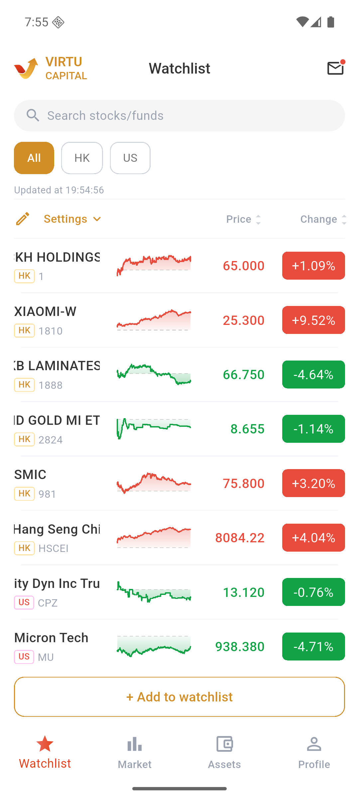
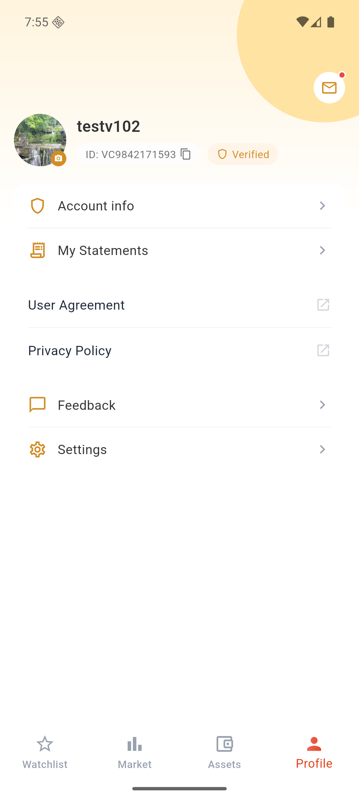
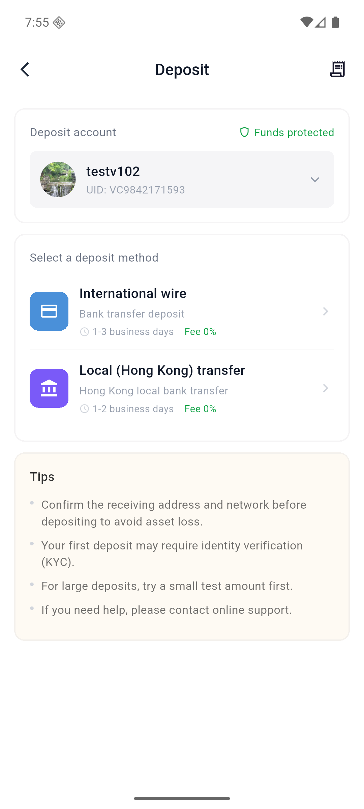
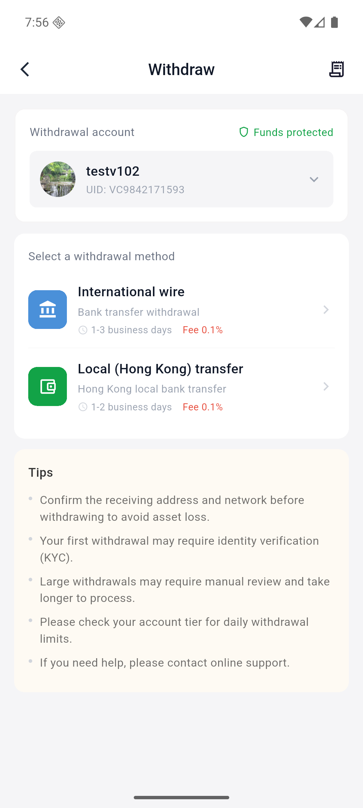
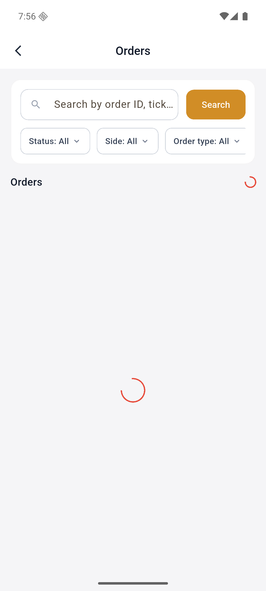
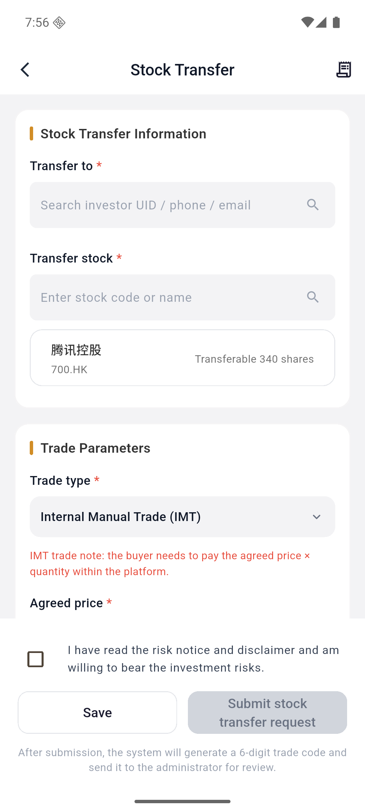

# Virtu Capital APP 功能树状思维导图

分析对象：`app-release-3030c701-20260707041036.apk`  
应用版本：`1.0.2` / `versionCode=8`  
包名：`com.virtucapital.android`  
技术形态：Flutter Android App

> 说明：以下功能树结合了动态登录后的页面截图、`AndroidManifest.xml`、Flutter AOT 字符串、资源文件、接口路径和页面路由推断。带 `静态发现` 的节点来自 APK 静态拆解，未必都在当前测试账号首屏直接展示。

## 总览树

```text
Virtu Capital
├── 0. 应用框架
│   ├── Splash / 欢迎页
│   │   ├── Logo: Virtu Capital
│   │   ├── CTA: Get started
│   │   └── Slogan: PRECISION IN EVERY TRADE
│   ├── 登录态首页
│   │   ├── Watchlist
│   │   ├── Market
│   │   ├── Assets
│   │   └── Profile
│   ├── 消息入口
│   │   ├── 未读红点
│   │   ├── Message Center
│   │   ├── Message Detail
│   │   └── Mark read / Read all
│   └── 通用组件
│       ├── WebView
│       ├── 文件选择器
│       ├── 图片选择器
│       ├── 安全存储
│       ├── 网络请求
│       └── 本地缓存
│
├── 1. 认证与账户登录
│   ├── 手机验证码登录
│   │   ├── Country code
│   │   ├── Phone number
│   │   ├── Verification code
│   │   ├── Get code
│   │   └── Sign in
│   ├── 手机号密码登录
│   │   ├── Phone number
│   │   ├── Password
│   │   ├── Forgot password
│   │   └── Other sign-in methods
│   ├── 注册
│   │   ├── Register phone
│   │   ├── Verification code
│   │   ├── Set password
│   │   ├── Invite code
│   │   └── Register info
│   ├── 忘记密码 / 重置密码
│   │   ├── Forgot password phone
│   │   ├── Verify phone
│   │   ├── New password
│   │   └── Confirm new password
│   ├── 登录态维护
│   │   ├── auth/login
│   │   ├── auth/me
│   │   ├── auth/refresh
│   │   ├── auth/send-code
│   │   └── auth/verify-code
│   └── 认证错误
│       ├── auth.phone_invalid
│       ├── auth.phone_already_exists
│       ├── auth.invalid_verification_code
│       ├── auth.verification_code_expired
│       └── auth.verification_code_not_found
│
├── 2. 开户与 KYC
│   ├── 开户入口
│   │   ├── WatchlistAccountOpeningCard
│   │   ├── PortfolioAccountOpeningSection
│   │   └── AccountOpeningBottomSheet
│   ├── 开户类型选择
│   │   ├── Personal account opening
│   │   ├── Enterprise account opening
│   │   └── openingType
│   ├── 开户协议
│   │   ├── Account opening agreements
│   │   ├── Agreement list
│   │   ├── Agreement detail
│   │   ├── Checkbox: read and agree
│   │   └── API: /api/account/opening-agreements
│   ├── KYC 身份认证
│   │   ├── Sumsub / Idensic SDK
│   │   ├── KycAccessToken
│   │   ├── Start verification
│   │   ├── Continue verification
│   │   ├── Retry verification
│   │   ├── Resume KYC
│   │   └── API: account/kyc/access-token
│   ├── 开户审核状态
│   │   ├── Awaiting Submission
│   │   ├── Verification materials processing
│   │   ├── Identity verification under review
│   │   ├── Identity verification passed
│   │   ├── Account opening review
│   │   ├── Account opening successful
│   │   ├── Account opening not approved
│   │   ├── Please resubmit your documents
│   │   └── PENDING_MANUAL_REVIEW
│   ├── 企业开户信息
│   │   ├── EnterpriseOpeningInfo
│   │   ├── Support phone
│   │   ├── Support email
│   │   ├── Working hours
│   │   ├── Online service hint
│   │   └── API: /api/account/enterprise-opening-info
│   └── KYC/开户材料
│       ├── Identity document
│       ├── Additional documents
│       ├── Account-opening materials
│       ├── Government-issued identification
│       └── Professional qualification certificate
│
├── 3. Watchlist 自选
│   ├── 页面字段
│   │   ├── Search stocks/funds
│   │   ├── All / HK / US
│   │   ├── Updated at
│   │   ├── Settings
│   │   ├── Price sort
│   │   ├── Change sort
│   │   └── Add to watchlist
│   ├── 自选列表项字段
│   │   ├── Stock name
│   │   ├── Market tag: HK / US
│   │   ├── Stock code
│   │   ├── Sparkline chart
│   │   ├── Latest price
│   │   └── Change percent
│   ├── 自选操作
│   │   ├── Add stock
│   │   ├── Delete stock
│   │   ├── Toggle watchlist
│   │   ├── Edit mode
│   │   ├── Sort default
│   │   ├── Sort alphabet ascending
│   │   └── Sort alphabet descending
│   ├── 消息入口
│   │   ├── Envelope icon
│   │   └── Unread dot
│   └── 接口/缓存
│       ├── /api/watchlist
│       ├── /api/watchlist/hot
│       ├── watchlist/
│       ├── watchlist/hot
│       ├── cache_watchlist_v1
│       └── cache_watchlist_category
│
├── 4. Market 行情
│   ├── 页面字段
│   │   ├── Search stocks/funds
│   │   ├── Region: HK / US
│   │   ├── Market status: Open / Closed
│   │   ├── Timestamp
│   │   ├── Collapse / Expand
│   │   └── Securities
│   ├── 市场指数
│   │   ├── Index name
│   │   ├── Index code
│   │   ├── Latest value
│   │   ├── Change
│   │   ├── Change percent
│   │   └── Sparkline
│   ├── 热门行情
│   │   ├── Hot stocks
│   │   ├── Top gainers
│   │   ├── Hot brokers
│   │   └── Market close recap
│   ├── 搜索
│   │   ├── Search stock code
│   │   ├── Search stock name
│   │   ├── Search result item
│   │   └── Open stock detail
│   └── 接口
│       ├── /api/market-data/
│       ├── market-data/index
│       ├── market-data/stocks/search
│       ├── market-data/stocks/icon
│       ├── market-data/hot-gainers
│       └── market-data/hot-brokers
│
├── 5. 个股/指数详情
│   ├── 顶部信息
│   │   ├── Stock / index name
│   │   ├── Code
│   │   ├── Market tag
│   │   ├── Market status
│   │   ├── Add / selected watchlist
│   │   └── Back
│   ├── Quote Tab
│   │   ├── Latest price
│   │   ├── Change
│   │   ├── Change percent
│   │   ├── Open
│   │   ├── High
│   │   ├── Low
│   │   ├── Previous close
│   │   ├── Market cap
│   │   ├── P/E
│   │   ├── P/B
│   │   ├── Volume
│   │   └── Turnover
│   ├── 图表
│   │   ├── Timeshare
│   │   ├── Daily
│   │   ├── Weekly
│   │   ├── Monthly
│   │   ├── Quarterly
│   │   ├── Candlestick
│   │   ├── Volume bar
│   │   └── Trade tick list
│   ├── Order Book
│   │   ├── Buy side
│   │   ├── Sell side
│   │   ├── Bid/ask ratio
│   │   └── Depth level: 5
│   ├── 交易入口
│   │   ├── Trade
│   │   ├── Quick Buy
│   │   └── Quick Sell
│   ├── 其他 Tab / 模块
│   │   ├── Warrants
│   │   ├── Overview
│   │   ├── News
│   │   ├── Announcements
│   │   └── Financials
│   └── 接口
│       ├── market-data/quote
│       ├── market-data/quote/intraday
│       ├── market-data/quote/candlestick
│       ├── market-data/quote/depth
│       ├── market-data/quote/capital-flow
│       ├── market-data/quote/capital-distribution
│       └── market-data/quote/warrant-list
│
├── 6. 交易
│   ├── Trade Page
│   │   ├── Buy
│   │   ├── Sell
│   │   ├── Stock code / name
│   │   ├── Select market
│   │   ├── Trade type
│   │   ├── Order type
│   │   ├── Validity
│   │   ├── Price
│   │   ├── Quantity
│   │   ├── Amount
│   │   ├── Available balance
│   │   ├── Fee summary
│   │   └── Submit order
│   ├── 快捷交易
│   │   ├── Quick Buy
│   │   ├── Quick Sell
│   │   ├── Quantity input
│   │   ├── Price input
│   │   └── Result dialog
│   ├── 订单类型/状态
│   │   ├── Limit Order
│   │   ├── Market Order
│   │   ├── Good till canceled
│   │   ├── tradeOrder.status.PARTIALLY_FILLED
│   │   ├── tradeOrder.status.REJECTED
│   │   ├── Protected Order Not Reported
│   │   └── Conditional Order Not Reported
│   ├── 风险/校验
│   │   ├── Trading password
│   │   ├── Insufficient available balance
│   │   ├── Quantity lot-size rule
│   │   ├── Price unavailable
│   │   ├── Market unsupported
│   │   └── Trade code invalid
│   └── 接口
│       ├── /api/trade/orders
│       ├── /api/trade/orders/today
│       ├── /api/trade/transactions
│       ├── /api/trade/fee-config
│       ├── trade/buy
│       ├── trade/sell
│       ├── trade/orders/cancel
│       ├── trade/orders/sync
│       └── trade/exchange
│
├── 7. Assets 资产
│   ├── 资产总览
│   │   ├── Total assets (CNY)
│   │   ├── Hide/show eye
│   │   ├── Unrealized profit or loss
│   │   ├── Return rate
│   │   └── Protected badge
│   ├── 快捷入口
│   │   ├── Deposit
│   │   ├── Withdraw
│   │   ├── Statement
│   │   ├── Orders
│   │   ├── Stock Transfer
│   │   └── Position Transfer
│   ├── Account balance
│   │   ├── Currency icon
│   │   ├── Currency name
│   │   ├── Currency code
│   │   ├── Available
│   │   └── Frozen
│   ├── Positions
│   │   ├── Stock name
│   │   ├── Stock code
│   │   ├── Current price
│   │   ├── Cost price
│   │   ├── Available holding
│   │   ├── Frozen holding
│   │   ├── Market value
│   │   ├── P/L
│   │   └── Position detail
│   ├── Today's Orders
│   │   ├── Order card
│   │   ├── Status
│   │   ├── Side
│   │   ├── Order type
│   │   └── Cancel order
│   └── 缓存/接口
│       ├── cache_portfolio_summary_v1
│       ├── cache_portfolio_today_orders_v1
│       ├── portfolioProvider
│       └── portfolioRepositoryProvider
│
├── 8. Deposit 入金
│   ├── 页面字段
│   │   ├── Deposit account
│   │   ├── UID
│   │   ├── Funds protected
│   │   ├── Select deposit method
│   │   ├── Tips
│   │   └── Deposit records icon
│   ├── 入金方式
│   │   ├── International wire
│   │   │   ├── Bank transfer deposit
│   │   │   ├── 1-3 business days
│   │   │   └── Fee 0%
│   │   ├── Local (Hong Kong) transfer
│   │   │   ├── Hong Kong local bank transfer
│   │   │   ├── 1-2 business days
│   │   │   └── Fee 0%
│   │   ├── USDT / USDC deposit
│   │   └── BTC deposit
│   ├── 入金提交字段
│   │   ├── Deposit currency
│   │   ├── Deposit network
│   │   ├── Deposit address
│   │   ├── QR code
│   │   ├── Deposit amount
│   │   ├── Tx Hash
│   │   ├── Transfer proof
│   │   └── Submit deposit request
│   ├── 入金记录
│   │   ├── Deposit records
│   │   ├── Deposit credited
│   │   ├── Pending review
│   │   ├── Failure reason
│   │   └── Date filters
│   └── 接口
│       ├── /api/assets/deposit-config
│       ├── /api/assets/deposits
│       ├── assets/deposit-config
│       ├── assets/deposits
│       └── error.deposit.submit.duplicate_tx_hash
│
├── 9. Withdraw 出金
│   ├── 页面字段
│   │   ├── Withdrawal account
│   │   ├── UID
│   │   ├── Funds protected
│   │   ├── Select a withdrawal method
│   │   ├── Tips
│   │   └── Withdrawal records icon
│   ├── 出金方式
│   │   ├── International wire
│   │   │   ├── Bank transfer withdrawal
│   │   │   ├── 1-3 business days
│   │   │   └── Fee 0.1%
│   │   ├── Local (Hong Kong) transfer
│   │   │   ├── Hong Kong local bank transfer
│   │   │   ├── 1-2 business days
│   │   │   └── Fee 0.1%
│   │   ├── USDT withdrawal
│   │   └── BTC withdrawal
│   ├── 出金提交字段
│   │   ├── Withdrawal currency
│   │   ├── Withdrawal network
│   │   ├── Withdrawal address
│   │   ├── Withdrawal amount
│   │   ├── Maximum withdrawable
│   │   ├── Minimum withdrawal
│   │   ├── Fee
│   │   ├── Exchange rate
│   │   ├── Receiving details
│   │   ├── Trading password
│   │   └── Submit withdrawal request
│   ├── 风控/提示
│   │   ├── First withdrawal may require KYC
│   │   ├── Large withdrawals require manual review
│   │   ├── Daily withdrawal limit
│   │   ├── New address test transfer
│   │   └── Address/network irreversible loss warning
│   └── 接口
│       ├── /api/assets/withdrawal-config
│       ├── /api/assets/withdrawals
│       ├── assets/withdrawals
│       └── /withdrawal-records
│
├── 10. Statement 账单
│   ├── 页面
│   │   ├── Statement
│   │   ├── My Statements
│   │   ├── Daily statements
│   │   ├── Monthly statements
│   │   ├── All statements
│   │   └── Statement period
│   ├── 字段/操作
│   │   ├── Statement account UID
│   │   ├── Statement date
│   │   ├── Period type
│   │   ├── Generate statement
│   │   ├── Download
│   │   ├── Save
│   │   └── Email statement
│   └── 接口
│       ├── /api/statements/daily-dates
│       ├── statements/daily-dates
│       ├── statements/export
│       └── statements/export/email
│
├── 11. Orders 订单
│   ├── 页面字段
│   │   ├── Search by order ID / ticker
│   │   ├── Search button
│   │   ├── Status filter
│   │   ├── Side filter
│   │   ├── Order type filter
│   │   └── Orders list
│   ├── 订单卡字段
│   │   ├── Order ID
│   │   ├── Stock name/code
│   │   ├── Side: Buy/Sell
│   │   ├── Order type
│   │   ├── Price
│   │   ├── Quantity
│   │   ├── Filled quantity
│   │   ├── Status
│   │   ├── Created time
│   │   └── Cancel action
│   └── 接口
│       ├── /api/trade/orders
│       ├── /api/trade/orders/today
│       ├── trade/orders/cancel
│       └── trade/transactions
│
├── 12. Stock Transfer 内部股票转让
│   ├── 页面字段
│   │   ├── Transfer to
│   │   ├── Search investor UID / phone / email
│   │   ├── Transfer stock
│   │   ├── Enter stock code or name
│   │   ├── Transferable shares
│   │   ├── Trade type
│   │   ├── Internal Manual Trade (IMT)
│   │   ├── Over-the-Counter Trade (OTCT)
│   │   ├── Agreed price
│   │   ├── Quantity
│   │   ├── Risk notice checkbox
│   │   ├── Save
│   │   └── Submit stock transfer request
│   ├── 结果/状态
│   │   ├── 6-digit trade code
│   │   ├── Admin review
│   │   ├── Transfer Request Submitted
│   │   ├── Transfer order canceled
│   │   ├── Transfer details
│   │   └── Stock Transfer Records
│   └── 接口
│       ├── /api/stock-transfers
│       ├── /api/stock-transfers/users/
│       ├── stock-transfers/holdings/search
│       ├── stock-transfers/confirm
│       └── /stock-transfers/:id
│
├── 13. Position Transfer 外部券商转仓
│   ├── 首页
│   │   ├── Transfer In Stocks
│   │   ├── Transfer Out Stocks
│   │   ├── Prepare your statement in advance
│   │   ├── Broker name
│   │   ├── Broker CCASS code (HK) / DTC code (US)
│   │   └── Broker contact person
│   ├── 转入股票
│   │   ├── Market
│   │   ├── Stock search
│   │   ├── Quantity
│   │   ├── Cost supplement
│   │   ├── Upload broker statements
│   │   ├── Application form
│   │   ├── Signature
│   │   └── Submit
│   ├── 转出股票
│   │   ├── Transfer-out market
│   │   ├── Transfer-out stocks
│   │   ├── Download Transfer Application Form
│   │   ├── Upload signed form
│   │   ├── Fee preview
│   │   ├── Progress page
│   │   └── Submit
│   ├── 记录/状态
│   │   ├── Position transfer records
│   │   ├── Inbound stock transfer
│   │   ├── Outbound stock transfer
│   │   ├── Pending transfer
│   │   ├── Completed
│   │   ├── Rejected
│   │   └── Canceled
│   └── 接口
│       ├── /api/inbound-stock-transfers
│       ├── /api/outbound-stock-transfers
│       ├── /api/outbound-stock-transfers/preview-fee
│       ├── /position-transfer-records
│       └── /position-transfer-records/:id
│
├── 14. Profile 我的
│   ├── 用户卡片
│   │   ├── Avatar
│   │   ├── Username
│   │   ├── UID
│   │   ├── Copy UID
│   │   ├── Verified badge
│   │   └── Message icon
│   ├── Account info
│   │   ├── Username
│   │   ├── Phone number
│   │   ├── Email
│   │   ├── Change login password
│   │   └── Change trading password
│   ├── Statements
│   │   └── My Statements
│   ├── Legal
│   │   ├── User Agreement
│   │   ├── Privacy Policy
│   │   ├── https://virtu-capital.com/terms
│   │   └── https://virtu-capital.com/privacy
│   ├── Feedback
│   │   ├── Business feedback
│   │   ├── Product feedback
│   │   ├── Content 0/500
│   │   ├── Images optional, up to 9
│   │   ├── Total image size <= 10MB
│   │   └── Submit
│   └── Settings
│       ├── Language Settings
│       ├── Price color
│       ├── Version info
│       ├── Clear cache
│       └── Log out
│
├── 15. 帮助中心与内容
│   ├── Help Center
│   ├── Help Detail
│   ├── Account opening FAQ
│   ├── Deposit and withdrawal FAQ
│   ├── Market content
│   ├── Crypto deposit and withdrawal guide
│   ├── Trading fees and withdrawal fee explanations
│   └── Article detail
│
├── 16. 安全与风控
│   ├── Device management
│   ├── Login devices
│   ├── Review suspicious devices
│   ├── Change password after suspicious activity
│   ├── Trading password
│   ├── Phone/email verification
│   ├── Fund security
│   ├── Client asset segregation
│   ├── Multi-signature approval
│   ├── AI risk-control monitoring
│   ├── Withdrawal address verification
│   └── 24h withdrawal restriction after security changes
│
└── 17. 系统权限与原生能力
    ├── INTERNET
    ├── CAMERA
    ├── ACCESS_COARSE_LOCATION
    ├── ACCESS_FINE_LOCATION
    ├── ACCESS_NETWORK_STATE
    ├── NFC
    ├── RECORD_AUDIO
    ├── READ_EXTERNAL_STORAGE
    ├── WRITE_EXTERNAL_STORAGE
    ├── WRITE_SETTINGS
    ├── ImagePickerFileProvider
    ├── WebViewActivity
    ├── Sumsub SNSAppActivity
    ├── ML Kit Face Detection
    └── CameraX
```

## 关键功能截图索引

- Watchlist 自选：
- Market 行情：
- Assets 资产：
- Profile 我的：
- Deposit 入金：
- Withdraw 出金：
- Orders 订单：
- Stock Transfer 内部股票转让：
- Position Transfer 外部转仓：
- Account info：
- Feedback：
- Settings：
- Stock detail：
