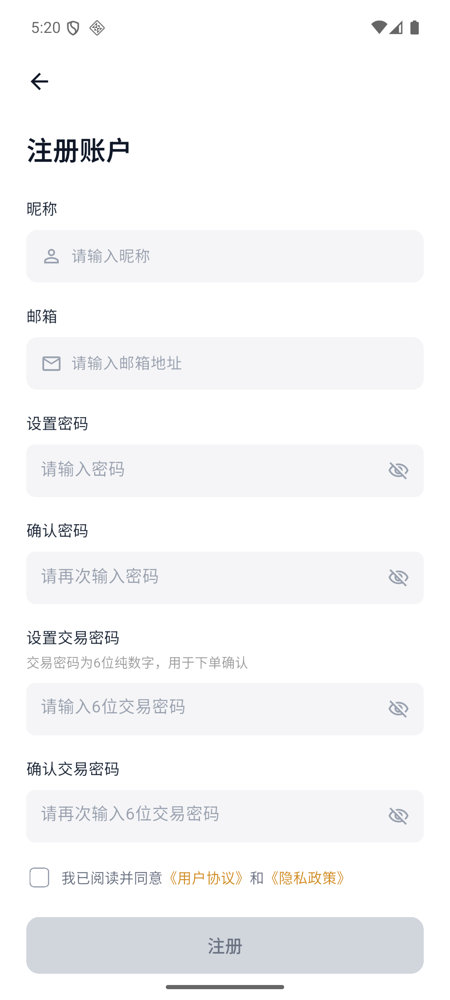

# 开户与身份认证

注册手机号验证成功后，先设置昵称、邮箱、登录密码和六位数字交易密码，然后阅读并同意用户协议与隐私政策。

账户注册完成后，继续按页面进入开户与身份认证流程：

1. 注册手机号并验证验证码。
2. 选择个人或企业账户。
3. 阅读并确认开户协议。
4. 上传身份证件并完成活体/身份验证。
5. 填写个人、职业和财务信息。
6. 提交审核并查看审核状态。

:::info 截图补充中
该页面保持为独立“开户”模块。证件选择、身份验证、职业与财务问卷等后续页面会继续按步骤补充，不会塞回 APP 新手指南长文档。
:::
