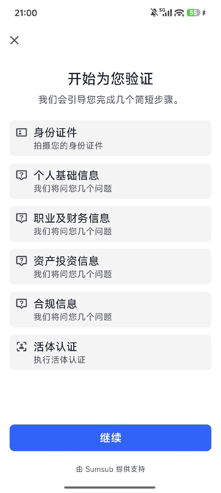
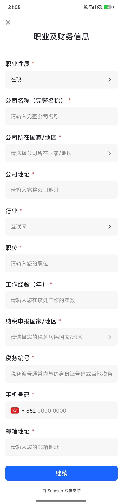
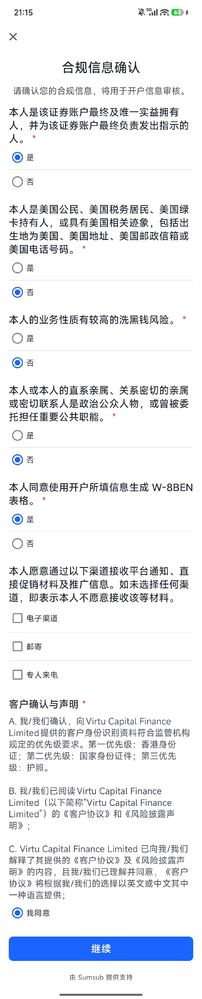

# 个人开户

完成 APP 账户注册后，可按页面提示申请开户。

## 开户前准备

开始前建议准备：

- 本人真实、有效且未过期的身份证或护照；
- 本人的居住地址、通讯地址及税务居民信息；

开户页面及字段可能随证件签发地、职业状态和账户情况变化，请以 APP 当前页面为准。

## 1. 进入开户并同意协议

在资产页面看到“开启您的投资账户”提示后，点击“立即开户”。进入“开户协议”页面后，打开并阅读开户协议，勾选“我已阅读并同意上述协议”，再点击“同意并继续”。

  <figure><figcaption>点击“立即开户”进入开户流程</figcaption></figure>
  <figure><figcaption>阅读并同意开户协议</figcaption></figure>

## 2. 完成身份验证和证件上传

### 2.1 查看身份验证流程

同意开户协议后会进入由 Sumsub 提供支持的身份验证总览。确认身份文件、个人基础信息、职业及财务信息、资产投资信息、合规信息和活体认证六项流程后，点击“继续”进入证件选择。

:::info 第三方验证页面
身份验证会在第三方服务页面内完成。请根据系统提示授权相机并提交资料，不要通过聊天工具或非官方链接发送证件照片。
:::

### 2.2 选择并拍摄身份证件

1. 选择证件的签发国家或地区；
2. 选择与本人证件一致的类型，例如身份证或护照；
3. 将证件完整放入取景框，按页面提示拍摄正面或其他所需页面；
4. 检查照片方向和清晰度。文字、头像及证件边缘均可辨认时，点击“文件可读”；否则选择“重拍照片”。

  <figure><figcaption>选择签发地和证件类型</figcaption></figure>
  <figure><figcaption>拍摄身份证件正面</figcaption></figure>
  <figure><figcaption>检查照片是否清晰可读</figcaption></figure>

:::warning 证件照片要求
必须上传本人真实有效的证件。请避免遮挡、裁边、模糊、反光或使用翻拍屏幕的图片；页面要求证件背面或护照资料页时，也要继续按提示完成。
:::

## 3. 核对并填写个人身份信息

- 姓名、姓、名、性别、学历和出生日期；
- 国籍、证件类型、证件号码、有效期及签发机关；
- 居住国家或地区、居住地址和通讯地址；
- 页面根据本人选择要求补充的税务及通讯地址资料。

  <figure><figcaption>核对并填写个人身份信息</figcaption></figure>
  <figure><figcaption>个人信息填写示例</figcaption></figure>

:::warning 姓名和地址
- 姓名、证件号码及出生日期应与证件一致。
- 居住地址、通讯地址和税务居民资料应填写真实信息；
- 请填写本人真实资料，不要复制示例姓名、号码或地址。
:::

## 4. 填写开户问卷

### 4.1 职业及财务信息

先选择当前职业性质。\
选择“在职”时，页面通常会要求填写公司完整名称、所在国家或地区、公司地址、行业、职位、工作年限、纳税申报国家或地区、税务编号、手机号和邮箱。

不同职业状态会显示不同字段。请选择与本人情况相符的选项，并填写页面实际出现的必填内容：

  <figure><figcaption>自雇：经营或任职资料</figcaption></figure>
  <figure><figcaption>待业：工作经验资料</figcaption></figure>
  <figure><figcaption>学生：学校及学习年限</figcaption></figure>
  <figure><figcaption>居家照顾者：税务及联系资料</figcaption></figure>
  <figure><figcaption>退休：税务及联系资料</figcaption></figure>

:::info 填写说明
在职、自雇、待业、学生、居家照顾者和退休页面要求的资料并不相同。切换职业性质后，请填写相应的全部必填字段。

**税务编号（TIN）填写提醒**

先按真实情况选择“纳税申报国家/地区”，再填写该国家或地区为本人签发的税务编号。下面只展示号码结构，遮罩符号及示例内容不可照抄：

- **香港个人**：在 CRS/AEOI 税务居民自我证明中，税务编号等同于香港身份证号码。卡面号码通常由一至两个英文字母、六位数字及括号内的校验位组成；填写时应包含实际校验位，但去掉括号。例如卡面结构为 `AB123456(C)`，表单输入结构为 `AB123456C`，其中 `C` 代表卡面括号内的实际校验字符，并非固定填写字母 C。不要误填个人报税表或“税务易”登录所显示的 TIN。
- **中国内地个人**：持有中国居民身份证时，以 18 位公民身份号码作为税务编号，末位校验字符可能为 `X`。遮罩示意：`11010119900101***X`。没有中国公民身份号码时，应填写税务机关实际赋予的税务编号，不要自行编造。
- **美国个人（如适用）**：填写本人实际的 SSN 或 ITIN；均为 9 位，常见显示结构为 `XXX-XX-XXXX`，其中 ITIN 以 `9` 开头。
- **其他国家或地区**：填写当地税务机关签发的 TIN。若当地未签发 TIN，应按页面提供的“无税号原因”处理，或先向当地税务机关、专业税务顾问或客户支持确认；不要默认以护照号码代替。

如同时属于多个税务管辖区的税务居民，应按页面要求分别申报各国家或地区及对应的 TIN。

规则参考：[香港税务局](https://www.ird.gov.hk/chs/tax/aeoi/res_tin.htm)、[国家税务总局](https://www.chinatax.gov.cn/chinatax/n810341/n810765/n3359382/201812/c4182780/content.html)及[美国国税局](https://www.irs.gov/tin/taxpayer-identification-numbers-tin)。
:::

### 4.2 资产及投资信息

先确认页面显示的开户账户类型，再按本人实际情况填写资金来源、财富来源、年收入、资产净值、投资目的、每月交易频率和风险承受能力，并分别填写股票、指数期权或期货、认股证或股票期权、外汇或黄金、结构性产品方面的真实投资经验，以及是否进行过衍生品交易。

部分选择会显示附加问题。例如选择有意进行衍生品交易时，页面可能继续要求确认相关知识或经验。

  <figure><figcaption>填写资产、经验及风险承受能力</figcaption></figure>
  <figure><figcaption>资产投资信息演示状态</figcaption></figure>

:::caution 信息用途
收入、资产、资金来源、投资目标、风险承受能力和投资经验会用于开户信息审核及适当性评估。
:::

### 4.3 确认合规信息

逐项阅读并回答合规问题，包括账户最终实益拥有人、美国相关身份、本人业务性质是否具有较高洗钱风险、政治公众人物或相关关系、W-8BEN 表格生成、推广信息接收渠道及客户声明等内容。

选择答案后再次检查，确认与本人身份和账户用途一致，再阅读客户确认与声明并点击“继续”。不确定某项声明的含义时，应先联系客户支持或专业顾问，不要猜测作答。

## 5. 完成活体认证和 KYC 核验

信息填写完成后，根据屏幕提示将脸部置于识别框内，并完成所需动作。提交后页面会进入证件和资料核验状态；核验完成时会显示“已完成”。

  <figure><figcaption>完成活体认证</figcaption></figure>
  <figure><figcaption>等待证件及 KYC 信息核验</figcaption></figure>
  <figure><figcaption>KYC 验证流程已完成</figcaption></figure>

:::warning KYC 完成不等于开户成功
“已完成”仅表示当前身份验证流程已经完成，不代表证券账户已通过最终审核。后续仍需预览并签署开户文件，并等待 Virtu Capital 人工审核。
:::

## 6. 预览并签署开户文件

### 6.1 进入待签署文件

返回资产页面后，如开户状态显示“待签署文件”，点击“去签署”。先预览生成的个人开户申请表，核对姓名、证件资料、账户信息、职业和财务申报等内容；确认无误后点击“去签署”。

  <figure><figcaption>从资产页进入待签署文件</figcaption></figure>
  <figure><figcaption>预览并核对开户文件</figcaption></figure>

:::info 签署前核对资料
签署前请核对本人文件中的账户号、证件号、出生日期、手机号、邮箱和地址。发现错误时不要继续签署。
:::

### 6.2 完成电子签名

签名页面会切换为横屏。请在签名框内使用与开户人一致的本人签名；需要重写时点击“清空”，签名正确后点击“提交”。\
完成一次签名后，系统会将签署结果应用到本次列出的三份必签文件。

  <figure><figcaption>横屏完成签名并点击提交</figcaption></figure>

### 6.3 确认签署结果并等待审核

返回文件列表，确认个人开户申请表、CRS 和 W-8BEN 等页面要求的文件均显示“已签署”。全部完成后，资产页面会显示“待人工审核”。

  <figure><figcaption>确认三份必签文件均已签署</figcaption></figure>
  <figure><figcaption>完成签署后等待人工审核</figcaption></figure>

审核进度和最终结果以 APP 当前状态或站内通知为准。审核人员要求补充或更正资料时，请从官方页面重新进入对应步骤处理，不要重复创建开户申请。

## 常见问题

### 为什么不同用户看到的字段不同？

证件签发地、证件类型、职业状态、税务身份和投资选择不同，都会改变后续字段。请填写本人页面实际显示的必填项。

### 证件照片无法通过怎么办？

检查相机权限、网络连接和证件有效期，并重新拍摄完整、清晰、无反光的照片。多次失败或页面状态不明确时，联系客户支持并说明当前步骤。

### KYC 已完成，为什么账户仍不能使用？

KYC 完成后还需要签署开户文件并等待人工审核。只有 APP 显示开户审核通过并开放相应功能后，证券账户才可按页面权限使用。
