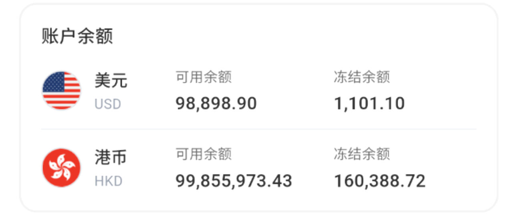
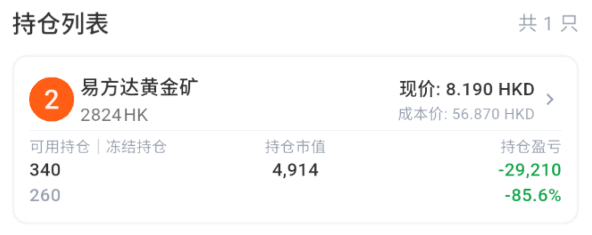

# 查看账户资产

### 1. 进入资产页

\
**查看资产概览**

:::tip
页面顶部可以切换资产计价币种
:::

| 页面字段 | 如何理解 |
| --- | --- |
| 总资产 | 按当前计价币种折算的账户资产合计 |
| 股票总价值 | 当前持仓股票按页面价格计算的总市值 |
| 当前可用资金 | 当前可用于交易或业务申请的资金 |
| 未实现盈亏 | 仍在持仓中的股票相对成本产生的浮动盈亏 |
| 今日盈亏 | 按页面统计口径计算的当日盈亏变化 |

### 2. 查看余额和持仓

在“账户余额”查看各币种的 **可用余额** 和 **冻结余额**。\
冻结余额通常与未完成订单或正在处理的业务有关，暂时不能重复使用。\

\
在“持仓列表”查看当前持仓的
- **股票代码**
- **可用股票数量**/**冻结股票数量**
- **成本价**、**现价**、**持仓市值**
- **持仓盈亏**。
\
点击持仓的股票可以继续查看股票详情。

### 3. 使用业务功能入口

从资产页的业务功能入口进入：

- **出金**：提交或查询出金申请。
- **流水**：查看买入、卖出、出金、股票转让等资金变化。
- **订单**：查询股票订单及成交状态。
- **股票转让**：在符合规则的 VC 客户之间转让股票。
- **转仓**：在 Virtu Capital 与其他券商之间转入或转出股票。

:::tip 结单功能
结单：查看交易日或月的账户资产结算。
 入口位于“我的 → 我的结单”。
:::

:::warning 入金功能状态
当前 APP 暂时不支持入金。资产页没有入金业务入口时，请勿根据旧截图或旧流程汇款；可以通过转入股票或平台内股票转让获得证券资产。
:::
